title: Planejamento de requisição de mudança
Description: Esta funcionalidade permite realizar o planejamento de execução da requisição de mudança.
# Planejamento de requisição de mudança

Esta funcionalidade permite realizar o planejamento de execução da requisição de mudança.

Pré-condições
---------------

1. Ter cadastrado uma requisição de mudança (ver conhecimento Cadastro de requisição de mudança).

Planejando requisições de mudança
-----------------------------------

!!! note "NOTA"

    Somente as Requisições de Mudança do tipo "Normal" são planejadas.
    
1. Acesse a funcionalidade de planejamento de requisição de mudança através da navegação no menu principal 
**Processos ITIL > Gerência de Mudança > Gerenciamento de Mudança**.

2. Na guia **Gerenciamento**, localize a requisição de mudança que deseja registrar o planejamento, clique no botão
"Ação" da mesma e logo em seguida em "Criar Atividade" conforme indicado na figura abaixo:

    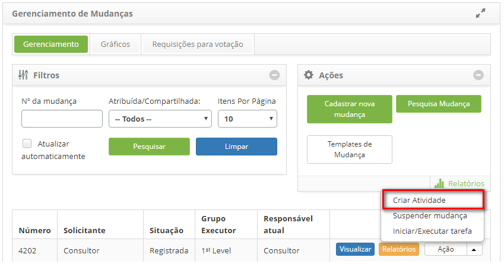
    
    **Figura 1 - Planejar execução da requisição de mudança**
    
3. Será apresentada a tela abaixo:

    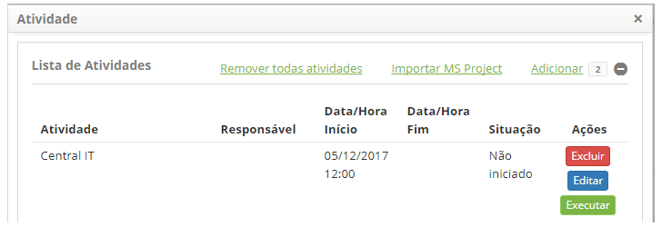
    
    **Figura 2 - Lista de atividades**
    
    - Para remover uma atividade da lista de atividades, basta clicar no botão "Excluir";
    - Para editar as informações da atividade, basta clicar no botão "Editar";
    - Para executar uma atividade, basta clicar no botão "Executar", será apresentada a tela abaixo:
    
    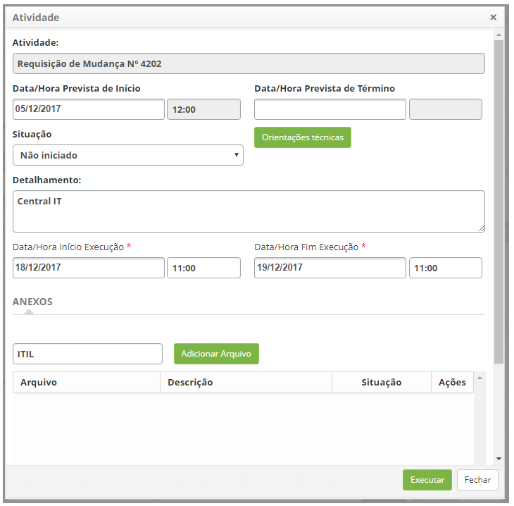
    
    **Figura 3 - Tela de execução de atividade**
    
    !!! info "IMPORTANTE"
    
        O responsável pela atividade deve preencher as informações de execução da atividade.
        
    - **Situação**: selecione a situação da atividade, para facilitar o gerenciamento da mudança;
    - Clique no botão "Orientações técnicas" para visualizar o que foi informado da descrição da requisição de mudança;
    - **Detalhamento**: informe os detalhes sobre a execução da atividade;
    - **Data/Hora Início Execução**: informe a data e o horário de início da execução da atividade;
    - **Data/Hora Fim Execução**: informe a data e o horário de término da execução da atividade;
    - Para anexar um arquivo à atividade, informe a descrição do anexo, clique no botão "Adicionar Arquivo", e selecione
    o arquivo que desejar;
    - Clique no botão "Executar" para salvar as informações preenchidas referente a atividade.
    
4. Para remover todas as atividades da lista de atividades, basta clicar no botão "Remover todas atividades";

5. Para importar atividades a partir de um arquivo padrão MS Project, basta clicar no botão "Importar MS Project" 
(acessar seção "Importando Cronogramas MS-Project para Atividades de Mudança" neste conhecimento);

6. Para cadastrar as atividades manualmente, clique em "Adicionar", será apresentada a tela para cadastrar a atividade:

    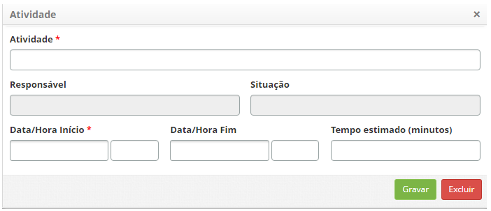
    
    **Figura 4 - Adicionar atividade**
    
- **Atividade**: informe o nome da atividade;

- **Responsável**: informe o responsável pela atividade;

- **Situação**: este campo será preenchido de acordo com a andamento da atividade;

- **Data/Hora Início**: informe a data e hora planejada para início da execução da atividade;

- **Data/Hora Fim**: informe a data e hora planejada para o fim da execução da atividade;

- **Tempo estimado (minutos)**: informe o prazo planejado para execução da atividade, em minutos.

Importando cronogramas MS-Project para atividades de mudança
--------------------------------------------------------------

1. Na "Lista de Atividades" é possível cadastrar as atividades manualmente ou utilizando o aplicativo Microsoft Project;

    - Para importar atividades cadastradas no aplicativo Microsoft Project, clique em "Importar MS Project";
        - Será apresentada a tela para importar o arquivo MS Project:
        
    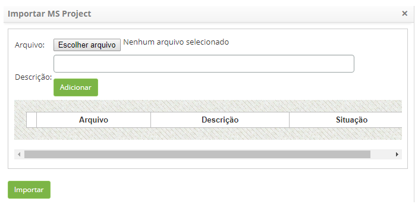
    
    **Figura 5 - Importar MS Project**
    
- Clique no botão "Escolher arquivo". Será apresentada uma janela, onde poderá selecionar o arquivo desejado;
- Selecione o arquivo;
- Informe a descrição do arquivo e clique no botão "Adicionar";
- Após adição do arquivo, clique no botão Importar e confirme a execução da importação.

Anexando plano reversão
--------------------------

1. Na tela de listagem de **Gerenciamento de Mudanças > botão Ação > Iniciar/Executar tarefa**;

    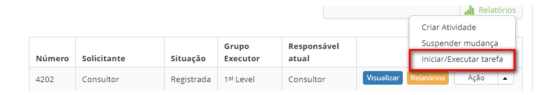
    
    **Figura 6 - Tela de gerenciamento de mudanças**
    
2. Informe o plano de reversão da mudança, clicando ao lado direito da tela de requisição de mudança, na opção **Plano
Reversão**;

    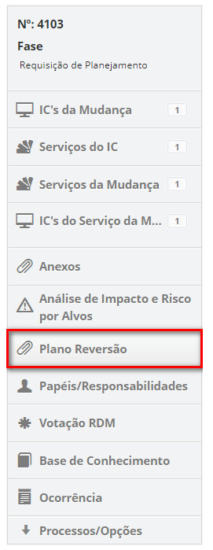
    
    **Figura 7 - Seleção de plano de reversão**
    
3. Será apresentada a tela de anexos de plano de reversão, conforme ilustrada na figura abaixo:

    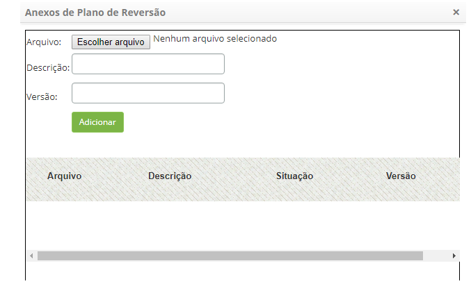
    
    **Figura 8 - Tela de anexos de plano de reversão**
    
    - Clique no botão "Escolher arquivo". Será apresentada uma janela, onde poderá selecionar o arquivo (plano de reversão);
    - Selecione o arquivo, informe a descrição e a versão do arquivo. Feito isso, clique no botão "Adicionar".
    
Lista de projetos
------------------

1. Na tela de listagem de **Gerenciamento de Mudanças > botão Ação > Iniciar/Executar tarefa**;

2. Na guia "Planejamento", clique no ícone 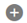 ;

3. Clique em Adicionar:

    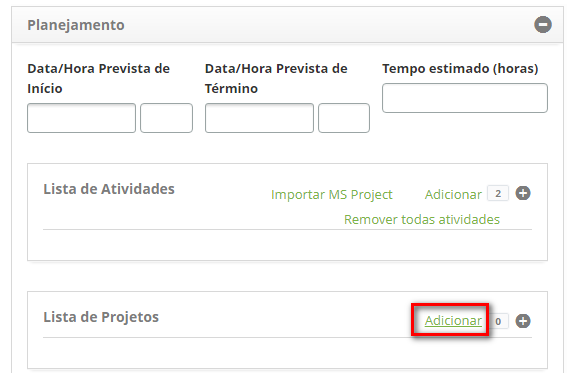
    
    **Figura 9 - Adicionar projeto à requisição de mudança**
    
    - Informe o(s) Projeto(s) vinculado(s) à requisição de mudança;
    - Será apresentada a janela para cadastrar e pesquisar projeto;
    - Na tela **Projeto**, na aba **Cadastro**, é apresentada a respectiva tela de cadastro, conforme ilustração abaixo:
    
    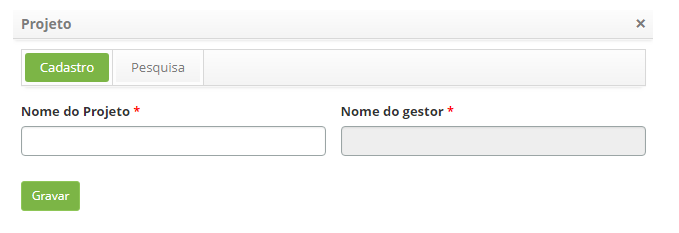
    
    **Figura 10- Vincular projeto**
    
    - **Nome do Projeto**: informe o nome do projeto;
    - **Nome do gestor**: informe o nome do gestor;
    - Clique no botão "Gravar" para efetuar o registro e o mesmo será apresentado na "Lista de Projetos".
    
4. Na tela **Projeto**, clique na aba **Pesquisa**, será apresentada a tela de pesquisa conforme ilustrada na figura abaixo:

    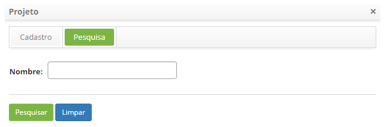
    
    **Figura 11 - Pesquisar projeto**
    
    - Informe o nome do projeto que deseja pesquisar e clique no botão "Pesquisar". Após isso, será exibido o 
    registro do projeto conforme o nome informado;
    - Caso deseje listar todos os registros de projeto, basta clicar diretamente no botão "Pesquisar";
    - Selecione o projeto que desejar e o mesmo será apresentado na "Lista de Projetos";
    - O botão "Limpar" quando acionado, limpa a pesquisa, preparando o ambiente para uma nova pesquisa;
    
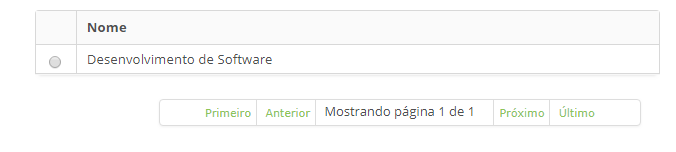

**Figura 12 - Lista de projetos**

Planejando a análise de impacto e risco por alvos
---------------------------------------------------

Pré-condições
--------------

1. Depende do tipo cadastrado em tipo de mudança (ver conhecimento Cadastro e pesquisa de Tipo de Mudança);

2. Informe a "análise de impacto e risco" envolvido na mudança, que pode ser "por alvo" ou "simplificado".

Análise de Impacto e Risco Por Alvos
--------------------------------------

1. Na tela de listagem de **Gerenciamento de Mudanças > botão Ação > Iniciar/Executar tarefa**;

    - Ao lado direito da tela de requisição de mudança, clique na opção "Análise de Impacto e Risco por Alvos":
    
    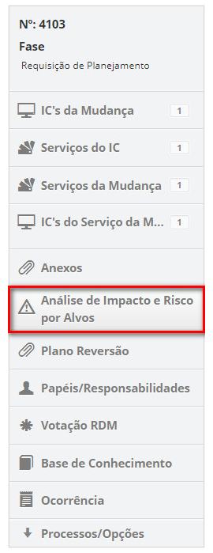
    
    **Figura 13 - Seleção de análise de impacto e risco por alvos**
    
    - Na aba Alvos, informe os alvos da mudança que serão considerados para análise de impacto e avaliação de riscos. 
    Os alvos podem ser Item de Configuração, Serviço e Função Vital.
    
    !!! info "IMPORTANTE"
    
        Para adicionar um alvo do tipo Função Vital, é necessário vincular um serviço da mudança que possua processo de 
        negócio com o tipo função vital.
        
    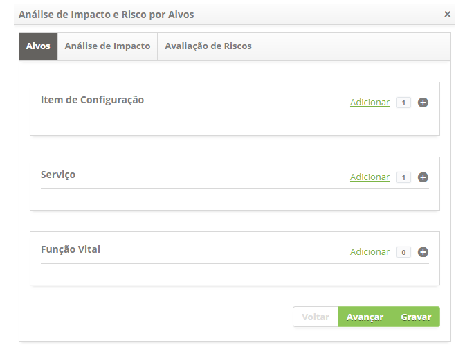
    
    **Figura 14 - Alvos**
    
    - Clique em "Adicionar";
    - Será apresentada a janela para pesquisa do(s) alvo(s);
    - Selecione o(s) alvo(s) desejado(s) e clique no botão "Enviar";
    - Se desejar anexar um arquivo ao alvo, clique no ícone , pesquise e adicione o arquivo;
    - Para salvar as informações preenchidas e prosseguir, clique em "Gravar".
    
    !!! warning "ATENÇÃO"
    
        É  obrigatório informar pelo menos um alvo para prosseguir com a análise de impacto e avaliação de riscos, lembrando 
        que o(s) alvo(s) do tipo "função vital", serão apresentados de acordo com o(s) serviço(s) da mudança que foi vinculado 
        à requisição de mudança.
        
    - Na aba **Análise de Impacto**, faça a análise de impacto para os alvos da mudança;
    
    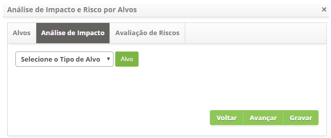
    
    **Figura 15 - Análise de impacto**
    
    - Selecione o tipo de alvo e clique no botão "Alvo", para pesquisar os alvos de acordo com o tipo de alvo escolhido;
    - Será apresentado somente o(s) alvo(s) que foram informados antecipadamente na aba "Alvos";
    - Selecione o alvo desejado para preencher a análise de impacto do mesmo, conforme indicado na imagem abaixo:
    
    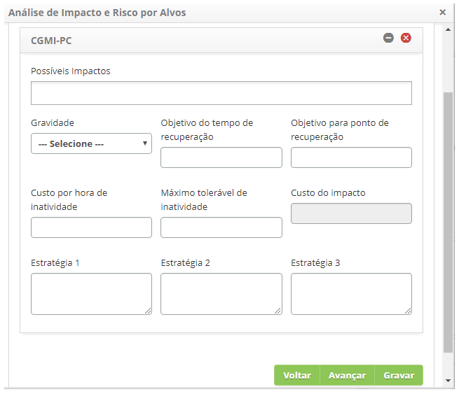
    
    **Figura 16 - Seleção de alvos**
    
        - **Possíveis Impactos**: informe os possíveis impactos do alvo para a mudança;
        - **Gravidade**: informe a gravidade do alvo para a mudança;
        - **Objetivo do tempo de recuperação**: informe o tempo esperado para recuperação do alvo durante a mudança;
        - **Objetivo para ponto de recuperação**: informe o tempo que começará a recuperação do alvo durante a mudança;
        - **Custo por hora de inatividade**: defina o custo por hora quando houver indisponibilidade desse alvo; dessa função
        vital;
        - **Máximo tolerável de inatividade**: informe o tempo máximo que o alvo poderá ficar inativo;
        - **Custo do impacto**: defina o custo por impacto quando houver indisponibilidade desse alvo, dessa função vital;
        - **Estratégia 1**: descreva a primeira estratégia para continuidade do serviço;
        - **Estratégia 2**: descreva a segunda estratégia para continuidade do serviço;
        - **Estratégia 3**: descreva a terceira estratégia para continuidade do serviço;
        
    - Na aba **Avaliação de Riscos**, faça a avaliação de riscos para os alvos da mudança;
    
    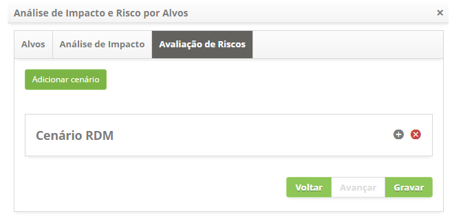
    
    **Figura 17 - Avaliação de riscos**
    
    - Clique no botão "Adicionar cenário" para preencher informações de cenários de riscos;
    
    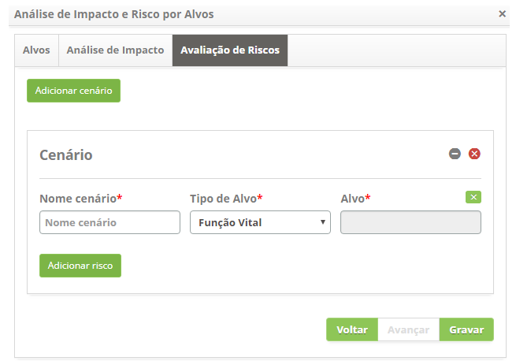
    
    **Figura 18 - Adicionar cenário**
    
        - **Nome cenário**: informe o nome do cenário;
        - **Tipo de Alvo**: selecione o tipo de alvo;
        - **Alvo**: selecione o alvo. Caso queira limpar o dado informado no campo, clique no 
        ícone 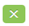;
        - Adicione os riscos à avaliação:
            - Clique no botão "Adicionar risco" e será apresentada a tela de cadastro e/ou pesquisa de 
            riscos, conforme ilustrada na figura abaixo:
            
    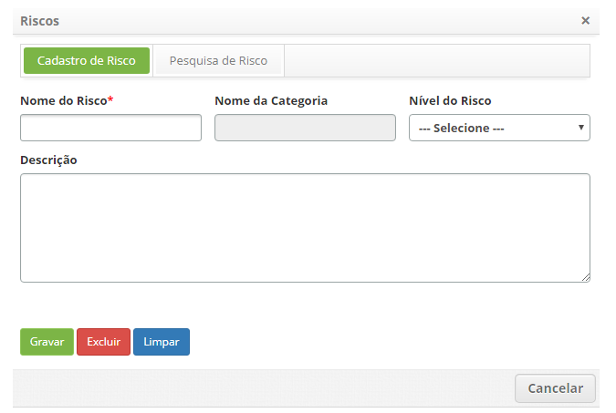
    
    **Figura 19 - Tela de cadastro e pesquisa de risco**
    
            - Realize a pesquisa e selecione o risco desejado. Após isso, será adicionado o risco na 
            tela, conforme exemplo ilustrado na figura abaixo:
            
    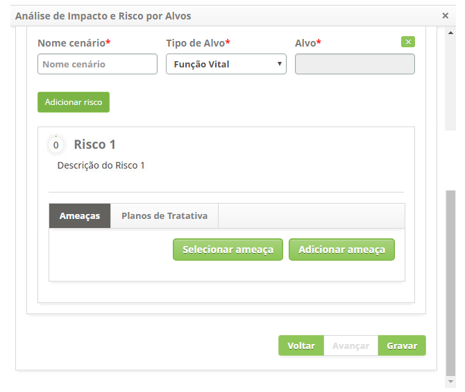
    
    **Figura 20 - Ameaças**
    
        - Clique no botão "Selecionar ameaça" para adicionar a ameaça do risco. Será apresentado o campo para 
        informar a ameaça. Após selecionar a ameaça clique no ícone para expandir a tela e informar a probabilidade, 
        o impacto da ameaça e justificativa sobre o risco;
        
    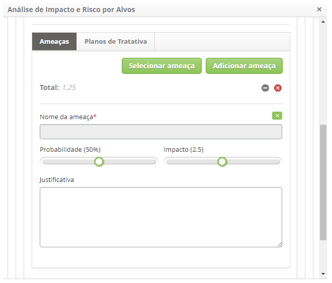
    
    **Figura 21 - Ameaças**
    
        - Após informar a(s) ameaça(s), clique na guia **Planos de Tratativa**. Será apresenta a tela de plano
        de tratativa conforme ilustrada na figura abaixo:
        
    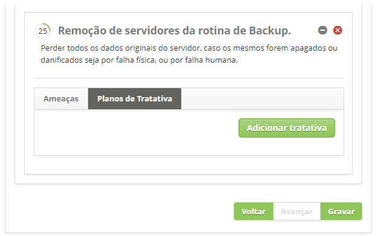
    
    **Figura 22 - Planos de tratativa**
    
        - Clique no botão Adicionar tratativa, para registrar a tratativa da ameaça. Será apresentado o campo para
        informar a descrição do plano de tratativa. Após informar o nome do plano clique no
        ícone  para expandir a tela e informar a probabilidade e o impacto
        da tratativa sobre a ameaça;
        
    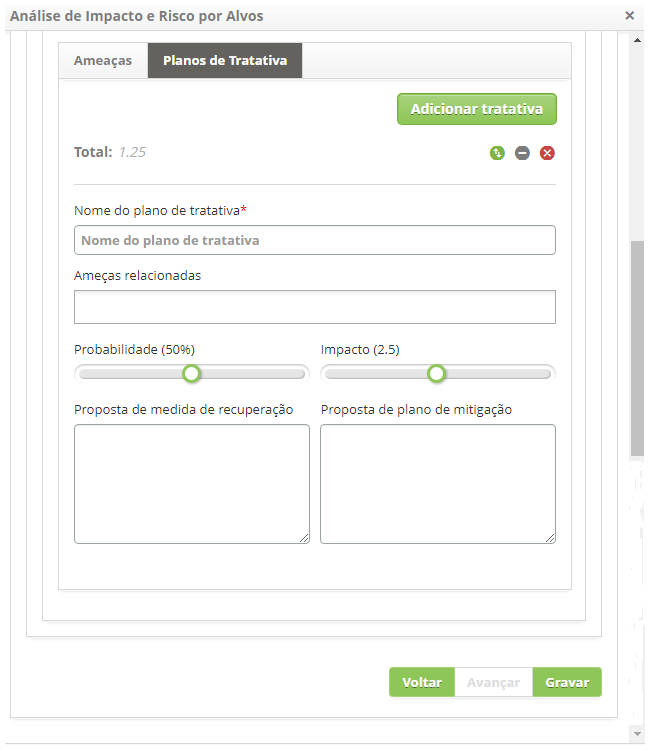
    
    **Figura 23 - Planos de tratativa**
    
        - **Nome do plano de tratativa**: informe no nome do plano de tratativa das ameaças;
        - **Ameaças relacionadas**: informe as ameaças relacionadas ao risco;
        - **Probabilidade**: informe a probabilidade de tratativa das ameaças;
        - **Impacto**: informe o impacto da tratativa sobre as ameaças;
        - **Proposta de medida de recuperação**: descreva a proposta da medida de recuperação;
        - **Proposta de plano de mitigação**: descreva a proposta do plano de mitigação;
        
    !!! note "NOTA"
    
        É possível, após registro dos dados do plano de tratativa, verificar o gráfico de avaliação de riscos.
        (ver conhecimento Execução de Requisição de Mudança), na seção Acompanhando o Desenvolvimento dos Riscos.
        
    - Após a definição de ameaças e planos de tratativa, a avaliação de risco estará completa, diante disso, 
    clique no botão "Gravar" para efetuar o registro, onde a data, hora e usuário serão gravados automaticamente para
    uma futura auditoria.
    
Análise de Impacto e Risco Simplificado
----------------------------------------

    - Ao lado direito da tela de requisição de mudança, clique na opção **Análise de Impacto e Risco Simplificado**;
    
    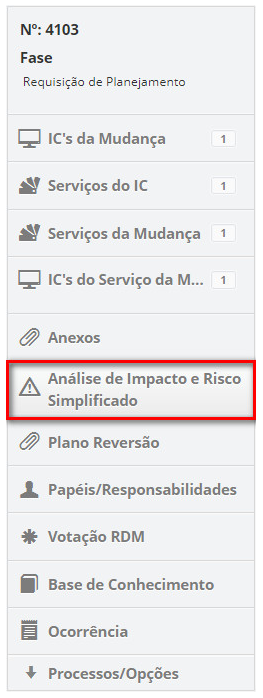
    
    **Figura 24 - Análise de impacto e risco simplificado**
    
    - Clique no ícone  para relacionar os riscos à requisição de mudança;
        - Será exibida uma janela para pesquisa de riscos. Realize a pesquisa e selecione o risco referente à
        mudança. Feito isso, o risco será relacionado a requisição de mudança;
        
    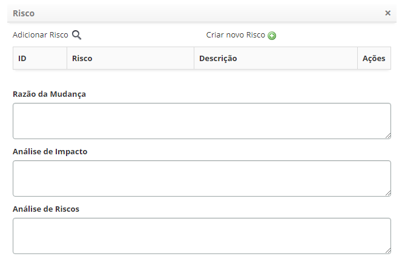
    
    **Figura 25 - Registro dos riscos envolvidos na mudança**
    
    - Caso queira registrar um novo risco a partir desta tela, clique no ícone  ;
    
        - **Razão da mudança**: descreva qual a razão para a mudança;
        - **Análise de impacto**: descreva os impactos que a mudança terá;
        - **Análise dos riscos**: descreva a análise dos riscos envolvidos na mudança.  
        
!!! tip "About"

    <b>Product/Version:</b> CITSmart | 7.00 &nbsp;&nbsp;
    <b>Updated:</b>07/12/2019 – Larissa Lourenço
