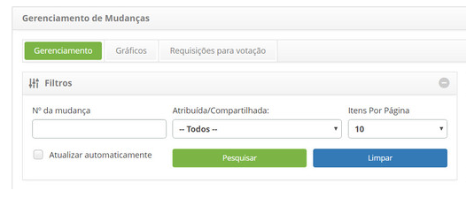

title: Suspensão de requisição de mudança
Description: Esta funcionalidade permite suspender requisição de mudança.
# Suspensão de requisição de mudança

Esta funcionalidade permite suspender requisição de mudança.

Como acessar
--------------

1. Acesse a funcionalidade de suspensão de requisição de mudança através da navegação no menu principal
**Processos ITIL > Gerência de Mudança > Gerenciamento de Mudança**. Na guia **Gerenciamento**, localize a requisição de
mudança que deseja suspender, clique no botão "Ação" e selecione a opção "Suspender mudança".

Pré-condições
---------------

1. Ter a justificativa de requisição de mudança cadastrada (ver conhecimento 
[Cadastro e Pesquisa de Justificativa de Requisição de Mudança](/pt-br/citsmart-platform-7/processes/change/change-justification.html))

Filtros
----------

1. Os seguintes filtros possibilitam ao usuário restringir a participação de itens na listagem padrão da funcionalidade, 
facilitando a localização dos itens desejados:

    - Número da mudança;

    - Atribuída/Compartilhada;

    - Itens por página.

    

    **Figura 1 - Tela de pesquisa de mudança**

Listagem de itens
-------------------

1. Os seguintes campos cadastrais estão disponíveis ao usuário para facilitar a identificação dos itens desejados na
listagem padrão da funcionalidade: Número, Solicitante, Criada em, Prioridade, Prazo, Prazo limite, Atraso, Situação,
Tarefa atual, Grupo Executor e Responsável atual.

2. Existem botões de ação disponíveis ao usuário em relação a cada item da listagem, são eles: "Visualizar", "Relatórios" 
e "Ação".

**Figura 2 - Tela de listagem de mudança**

Preenchimento dos campos cadastrais
------------------------------------

1. Não se aplica.

Suspendendo requisição de mudança
-----------------------------------

1. Na guia **Gerenciamento**, localize a requisição de mudança que deseja suspender, clique no botão "Ação" e selecione a opção
"Suspender mudança", conforme indicado na imagem abaixo:

    
    
    **Figura 3 - Botão suspender mudança**
    
2. Será exibida uma janela para registro da justificativa de suspensão da requisição de mudança:

    
    
    **Figura 4 - Registro de suspensão de requisição de mudança**
    
    - **Justificativa**: selecione a Justificativa da suspensão da requisição de mudança;
    - **Complemento da justificativa**: informe o complemento da justificativa de suspensão da requisição de mudança;
    - Após informar os dados, clique no botão "Gravar" e será exibida uma mensagem para confirmação da suspensão, clique em "OK" 
    para efetuar a operação, onde a data, hora e usuário serão gravados automaticamente para uma futura auditoria;
    - O botão "Cancelar", ao ser clicado, cancela a operação e retorna à tela de Gerenciamento de Mudanças.
    
3. Após a suspensão da requisição de mudança, a mesma será atualizada na lista de requisições de mudança, mudando a
situação para **Suspensa**, conforme indicado na imagem abaixo:

**Figura 5 - Requisição de mudança suspensa**

!!! tip "About"

    <b>Product/Version:</b> CITSmart | 7.00 &nbsp;&nbsp;
    <b>Updated:</b>07/12/2019 – Larissa Lourenço
