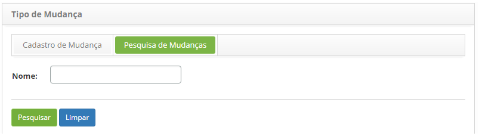
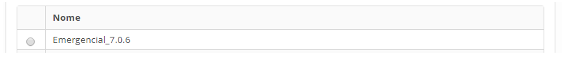
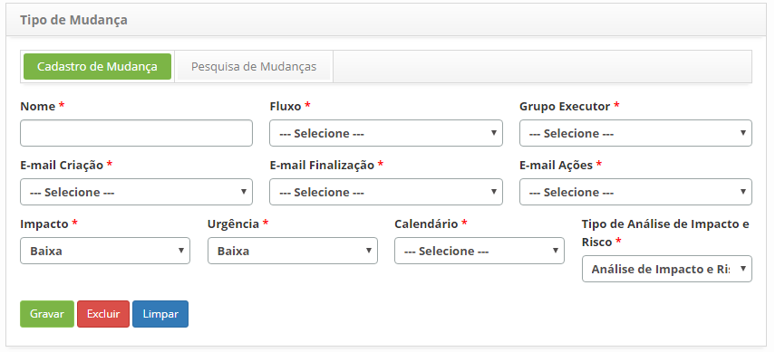

title: Cadastro e pesquisa de tipo de mudança
Description: Esta funcionalidade tem por objetivo registrar o tipo de mudança que será utilizado para definir toda a configuração do fluxo de trabalho que a requisição irá seguir.
# Cadastro e pesquisa de tipo de mudança

Esta funcionalidade tem por objetivo registrar o tipo de mudança que será utilizado para definir toda a configuração do fluxo de
trabalho que a requisição irá seguir.

Como acessar
--------------

1. Acesse a funcionalidade de tipo de mudança através da navegação no menu principal 
**Processos ITIL > Gerência de Mudança > Tipo de Mudança**.

Pré-condições
--------------

1. Ter o fluxo referente ao gerenciamento de mudança cadastrado (ver conhecimento Manutenção de fluxo de trabalho)

2. Configurar os modelos de e-mails (ver conhecimento Cadastro e pesquisa de configuração de modelo de e-mail)

3. Ter o grupo executor cadastrado (ver conhecimento Cadastro e pesquisa de grupo)

4. Ter o calendário cadastrado (ver conhecimento Cadastro e pesquisa de calendário)

Filtros
---------

1. O seguinte filtro possibilita ao usuário restringir a participação de itens na listagem padrão da
funcionalidade, facilitando a localização dos itens desejados:

    - Nome.
    
    
    
    **Figura 1 - Tela de pesquisa de tipo de mudança**
    
2. Realize a pesquisa de tipo de mudança. Informe o nome do tipo de mudança que deseja pesquisar e clique no botão 
"Pesquisar". Após isso, será exibido o registro do tipo de mudança conforme o nome informado;

    - Realize a pesquisa de tipo de mudança. Informe o nome do tipo de mudança que deseja pesquisar e clique no botão "Pesquisar". 
    Após isso, será exibido o registro do tipo de mudança conforme o nome informado;
    
Listagem de itens
-------------------

1. O seguinte campo cadastral está disponível ao usuário para facilitar a identificação dos itens desejados na
listagem padrão da funcionalidade: **Nome**.

    
    
    **Figura 2 - Listagem de tipo de mudança**
    
2. Após a pesquisa, selecione o registro desejado. Feito isso, será direcionado para a tela de cadastro exibindo
o conteúdo referente ao registro selecionado;

3. Para alterar os dados do registro de tipo de mudança, basta modificar as informações dos campos desejados e
clicar no botão "Gravar" para que seja gravada a alteração realizada no registro, onde a data, hora e usuário serão 
gravados automaticamente para uma futura auditoria.

Preenchimento dos campos cadastrais
-------------------------------------

1. Será apresentada a tela de cadastro de **Tipo de Mudança**, conforme ilustrada na figura abaixo:

    
    
    **Figura 3 - Tela de cadastro de tipo de mudança**
    
2. Preencha os campos conforme orientações abaixo:

    - **Nome**: informe o nome do tipo de mudança;
    
    - **Fluxo**: selecione o fluxo para que o mesmo seja associado ao tipo de mudança que está sendo cadastrado;
    
    - **Grupo Executor**: informe o grupo executor, o qual será o grupo padrão do tipo de mudança, responsável pela
    execução da requisição de mudança;
    
    - **E-mail Criação**: selecione o modelo de e-mail de registro de requisição de mudança que servirá para 
    notificar ao solicitante que a requisição de mudança foi registrada;
    
    - **E-mail Finalização**: selecione o modelo de e-mail de finalização da requisição de mudança que servirá 
    para notificar ao solicitante que a requisição de mudança foi finalizada;
    
    - **E-mail Ações**: selecione o modelo de e-mail de andamento da requisição de mudança que servirá para
    notificar ao solicitante sobre o andamento da requisição de mudança;
    
    - **Impacto**: informe o impacto do tipo de mudança;
    
    - **Urgência**: informe a urgência do tipo de mudança;
    
    - **Calendário**: informe o calendário do tipo de mudança;
    
    - **Tipo de Análise de Impacto e Risco**: selecione o tipo de análise de impacto e risco, simplificado ou por alvos;
    
    - Clique no botão "Gravar" para efetuar o registro, onde a data, hora e usuário serão gravados automaticamente
    para uma futura auditoria.
    
!!! tip "About"

    <b>Product/Version:</b> CITSmart | 7.00 &nbsp;&nbsp;
    <b>Updated:</b>07/11/2019 – Larissa Lourenço
