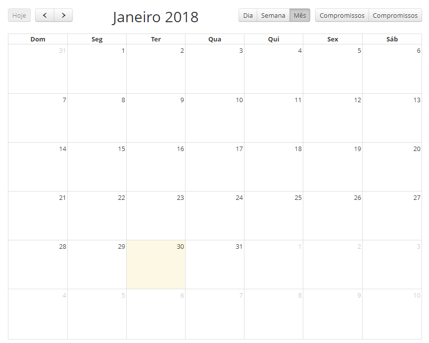
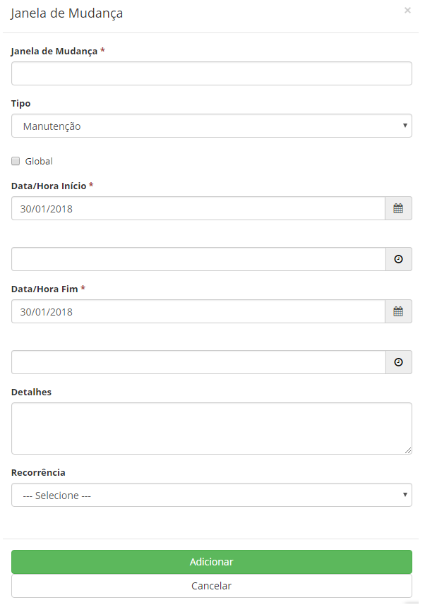

title: Janela de mudança
Description: Gerenciar os períodos em que a 
organização passa por um momento de manutenção ou blackout e assim ajudar no planejamento de uma mudança.
# Janela de mudança

Gerenciar os períodos em que a organização passa por um momento de manutenção ou
blackout e assim ajudar no planejamento de uma mudança.

Como acessar
-------------

1. Acesse a funcionalidade de janela de mudança através da navegação no menu principal 
**Processos ITIL > Gerência de Mudanças > Janela de Mudança**.

Pré-condições
---------------

1. Não se aplica.

Filtros
---------

1. Não se aplica.

Listagem de itens
-------------------

1. Não se aplica.

Preenchimento dos campos cadastrais
-------------------------------------

1. Será apresentada a tela de janela de mudança em formato de calendário, onde poderão ser
visualizados períodos de manutenção e blackout, conforme ilustrada na figura abaixo:

    
    
    **Figura 1 - Calendário de janela de mudança**
    
2. Para cadastrar nova janela de mudança, clique na data que desejar que será apresentada a tela para cadastro de 
janela de mudança, conforme ilustrado abaixo:

    
    
    **Figura 2 - Janela de mudança**
    
    - **Janela de Mudança**: informe a descrição para identificar a janela de mudança;
    - **Tipo**: selecione o tipo da janela de mudança:
        - **Manutenção**: estabelece períodos de tempo em que as mudanças no IC ocorrerão;
        - **Blackout**: estabelecem períodos de tempo em que as mudanças no IC não devem ocorrer.
    - **Global**: esse campo deve ser marcado para uma janela de manutenção que não pode ter IC's associados;
    
    !!! info "IMPORTANTE"
    
        Esse campo só deve ser marcado para janela de mudança do tipo "Manutenção".
        
    - **Data/Hora Início**: informe a data e o horário de início de interrupção para execução da janela de mudança;
    - **Data/Hora Fim**: informe a data e o horário final de interrupção para execução da janela de mudança;
    - **Detalhes**: informe os detalhes da janela de mudança, por exemplo, causa raiz, propósito etc;
    - **Recorrência**: se houver, informe a recorrência dessa janela de mudança, assim poderá reprogramar automaticamente
    a janela de mudança com as seguintes recorrências:
        - **Diária**: informe a data limite para a recorrência diária;
        - **Semanal**: informe a data limite para a recorrência semanal e selecione os dias da semana que desejar, além 
        do dia da semana que está sendo cadastrada a janela de mudança;
        - **Mensal**: informe a data limite para a recorrência mensal;
        - **Anual**: informe a data limite para a recorrência anual.
        
!!! tip "About"

    <b>Product/Version:</b> CITSmart | 7.00 &nbsp;&nbsp;
    <b>Updated:</b>07/12/2019 – Larissa Lourenço
       
