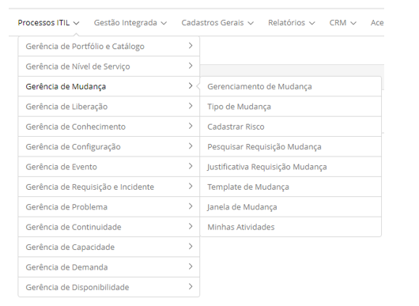

title: Módulo Gerenciamento de Mudança
Description: O Gerenciamento de Mudanças é o processo responsável por avaliar, coordenar e decidir sobre a realização de mudanças 
# Módulo Gerenciamento de Mudança

Objetivo do módulo
--------------------

O Gerenciamento de Mudanças é o processo responsável por avaliar, coordenar e decidir sobre a realização de
mudanças propostas a Itens de Configuração (ICs).

Segundo a ITIL, o principal objetivo desde processo é assegurar que mudanças sejam feitas de uma forma controlada,
e sejam avaliadas, priorizadas, planejadas, testadas, implantadas e documentadas.

As mudanças podem ser categorizadas da seguinte forma: Mudança Padrão, Mudança Normal e Mudança Emergencial.

- **Mudança Padrão**: pré-autorizada de baixo risco, ocorre com frequência. Inicia-se por um gatilho definido que segue
um procedimento ou instrução de trabalho para a realização das atividades - bastante conhecidas - possuem um orçamento
pré-determinado. Ex.: Instalação de um pacote padrão de aplicativos para desktop.

- **Mudança Normal**: qualquer alteração de serviços que não seja emergencial ou padrão. Segue as políticas, prazos e procedimentos
definidos pela organização.

- **Mudança Emergencial**: mudança que precisa ser realizada o quanto antes. Ex.: Mudança para resolver um Incidente Grave 
ou implementar uma correção de segurança. O processo de Gerenciamento de Mudança normalmente tem um procedimento específico
para tratar mudanças emergenciais.

Onde estão suas funcionalidades
---------------------------------

Acesse o menu principal **Processos ITIL > Gerência de Mudança**.

**Figura 1 - Menu do módulo gerência de mudança**

Principal funcionalidade (em destaque)
---------------------------------------

Na seção "Veja também" é possível acessar a(s) funcionalidade(s) principal(is) deste módulo, desta forma se pode obter 
um conhecimento mais detalhado.

!!! note "NOTA"

    Dependendo da sua permissão de acesso, é possível realizar uma série de ações nas requisições de mudança existentes, 
    sendo: visualizar as informações da requisição de mudança, agendar atividades referente à requisição de mudança, 
    suspender o atendimento da requisição de mudança, reativar a requisição de mudança que foi suspensa para atendimento, 
    capturar requisição de mudança para execução, executar requisição de mudança e entre outras.
    
Veja também
------------

- Cadastro de requisição de mudança.

!!! tip "About"

    <b>Product/Version:</b> CITSmart | 7.00 &nbsp;&nbsp;
    <b>Updated:</b>07/12/2019 – Larissa Lourenço
