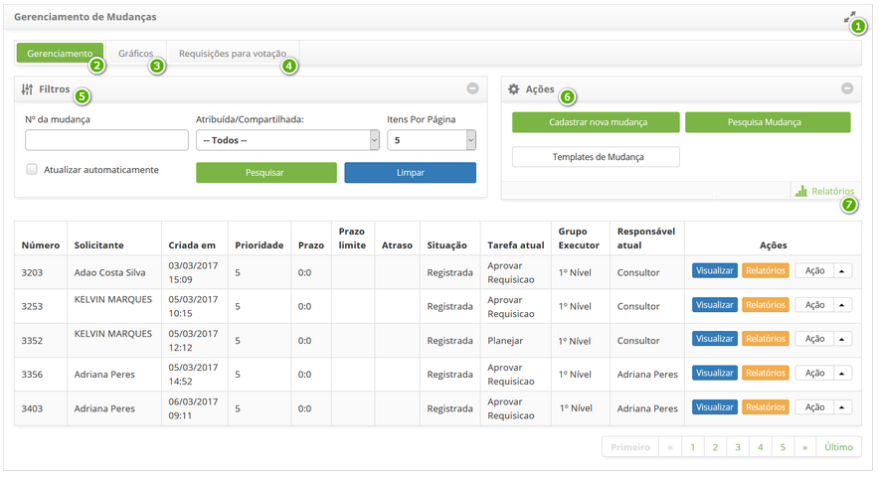
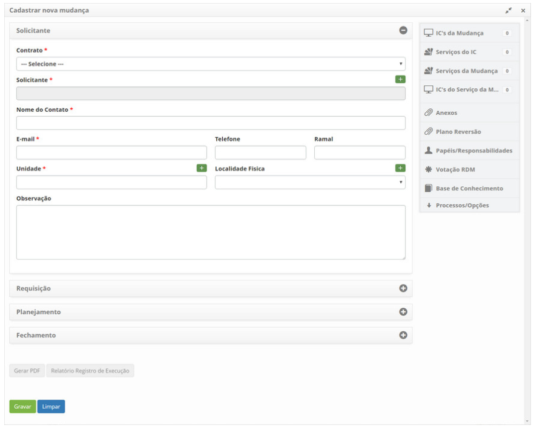
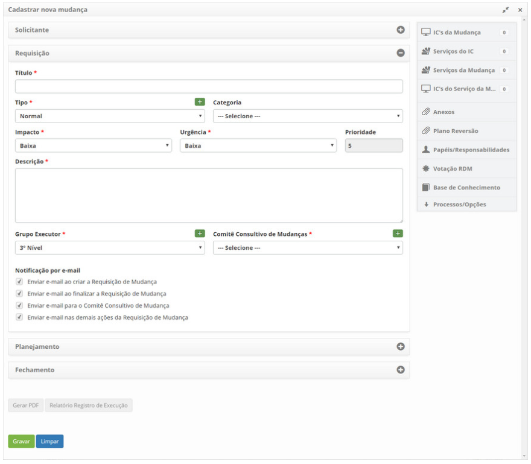

title: Cadastro de requisição de mudança
Description: Esta funcionalidade tem por objetivo registrar requisição de mudança.
# Cadastro de requisição de mudança

Esta funcionalidade tem por objetivo registrar requisição de mudança.

Antes de começar
--------------------

1. Acesse a funcionalidade de registro de requisição de mudança através da navegação no menu principal 
**Processos ITIL > Gerência de Mudança > Gerência de Mudança**. Na guia de Gerenciamento, clique no botão
"Cadastrar nova mudança".

Pré-condições
---------------

1. Ter o contrato cadastrado (ver conhecimento Cadastro e pesquisa de contrato)

2. Ter a unidade cadastrada (ver conhecimento Cadastro e pesquisa de unidade)

3. Ter solicitante cadastrado (ver conhecimento Cadastro e pesquisa de colaborador)

4. Ter o “Comitê Consultivo de Mudanças” cadastrado (ver conhecimento Cadastro e pesquisa de grupo)

5. Ter o tipo de mudança cadastrado, o qual deverá ter o vínculo com o fluxo referente a requisição de mudança
(ver conhecimento Cadastro e pesquisa de tipo de mudança)

6. Configurar os parâmetros abaixo (Regras de parametrização - mudança):

    - Parâmetro 47;
    - Parâmetro 279;
    - Parâmetro 280.
   
7. Ter o grupo vinculado ao contrato, associando os Solicitantes (colaboradores) já cadastrados a este grupo. 
Caso seja preciso criar um novo colaborador, é necessário incluí-lo ao Grupo de Solicitante no qual esteja 
relacionado ao contrato (ver conhecimento Como relacionar grupo ao contrato?);

8. Ter a unidade vinculada ao contrato (ver conhecimento Como relacionar unidade ao contrato?)

9. Ter a mudança cadastrada

10. Ter o questionário cadastrado (ver conhecimento Cadastro e pesquisa de questionários)

Filtros
----------

1. Não se aplica.

Listagem de itens
-------------------

1. Não se aplica.

Preenchimento de campos cadastrais
------------------------------------

1. Para ter uma melhor visão das opções da funcionalidade, segue imagem:

**Figura 1 - Tela de gerenciamento de mudança**

  : amplia a tela de Gerenciamento de Mudanças;

 **Gerenciamento**: apresentada os registros de requisições de mudança para atendimento e gerenciamento;

 **Gráficos**: apresenta os gráficos de informações das requisições de mudanças por situação 
(em andamento, suspensas e atrasadas), por prioridade e por grupo;

 **Requisições para votação**: apresentada os registros de requisições de mudança para aprovação;

 **Filtros**: apresenta os filtros para pesquisa de requisições de mudança;

 **Ações**: permite registrar novas requisições de mudança e realizar uma pesquisa rápida de
requisição de mudança;

 **Relatórios**: apresenta os relatórios dinâmicos referentes ao gerenciamento de mudança.

2. Após o acesso a funcionalidade, será apresentada a respectiva tela de "Cadastrar nova mudança", contendo uma série de passos a 
serem seguidos para realizar o registro:

    - Registre as informações do solicitante, conforme indicadas abaixo:
    
    
    
    **Figura 2 - Tela de cadastro de nova mudança**
    
    - **Contrato**: informe o contrato referente a requisição de mudança;
    - **Solicitante**: informe o solicitante, ou seja, a pessoa que está solicitando a mudança;
        - Clique no campo solicitante. Após isso, será exibida uma tela para pesquisa de solicitante, realize a pesquisa e selecione o solicitante;
        - Caso não encontre o registro do solicitante, é possível realizar um cadastro rápido clicando no 
        ícone .
    - **Nome do Contato**: informe o nome do contato;
    - **E-mail**: informe o e-mail do solicitante para contato;
    - **Telefone**: informe código de área (DDD) e o número de telefone do solicitante, para contato;
    - **Ramal**: informe o número do ramal do solicitante para contato;
    - **Unidade**: selecione a unidade do solicitante;
    - **Localidade Física**: informe a localização física do solicitante;
    - **Observação**: descreva as observações sobre o contato, caso seja necessário.
    
    - Registre as informações da requisição, conforme indicadas abaixo:
    
    
    
    **Figura 3 - Tela de cadastro de nova mudança**
    
    - **Título**: informe o título da requisição de mudança;
    - **Tipo**: informe o tipo de mudança que está sendo solicitada;
       - **Mudança Padrão**: é uma mudança que é previamente pré-aprovada pelo Gerenciamento de Mudança e já possui procedimentos aceitos e estabelecidos;
       - **Mudança Normal**: é uma mudança que segue um fluxo normal de avaliação, aprovação e autorização;
       - **Mudança Emergencial**: é uma mudança em um serviço que pretende reparar emergencialmente um erro no serviço de TI.
       
       !!! note "NOTA"
       
           Mudança Padrão e Mudança Emergencial não requer informações da categoria e comitê consultivo de mudança, pois as mesmas não participam do Votação da Requisição de Mudança.
           
    - Se o tipo de requisição de mudança informado for "Normal", informe a **Categoria**;
    - **Impacto**: informe o impacto da mudança;
    - **Urgência**: informe a urgência da mudança;
    - **Prioridade**: a prioridade será estabelecida pelo sistema, após informar o impacto e urgência;
    
