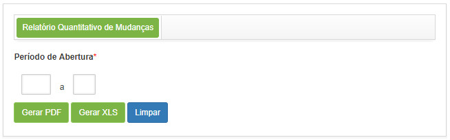

title:  Geração de relatórios - Gerência de Mudanças
Description: Este relatório tem o objetivo de apresentar a quantidade de requisição de mudanças. 
# Geração de relatórios - Gerência de Mudanças

Gerando relatório de quantitativo de mudança
-----------------------------------------------

Este relatório tem o objetivo de apresentar a quantidade de requisição de mudanças.

*Como acessar*

1. Acesse a funcionalidade de Relatório Quantitativo de Mudança através da navegação no menu principal 
**Relatórios > Gerência de Mudanças > Quantitativo de Mudança**.

*Pré-condições*

1. Não se aplica.

*Filtros*

1. Os seguintes filtros possibilitam ao usuário restringir a participação de itens na listagem padrão da funcionalidade, 
facilitando a localização dos itens desejados:

    - **Período de Abertura**: informe o período desejado.
    
2. Será apresentada a tela de **Geração de Relatório Quantitativo de Mudança**, conforme ilustrada na figura a seguir:

    
    
    **Figura 1 - Tela de geração do relatório quantitativo de mudanças**
    
3. Defina os filtros conforme sua necessidade;

4. Clique no botão "Gerar PDF" para gerar o relatório quantitativo de mudanças no formato PDF;

5. Clique no botão "Gerar XSL" para gerar o relatório quantitativo de mudanças no formato Excel.

*Listagem de itens*

1. Não se aplica.

*Preenchimento dos campos cadastrais*

1. Não se aplica.

!!! tip "About"

    <b>Product/Version:</b> CITSmart | 7.00 &nbsp;&nbsp;
    <b>Updated:</b>08/02/2019 - Larissa Lourenço
