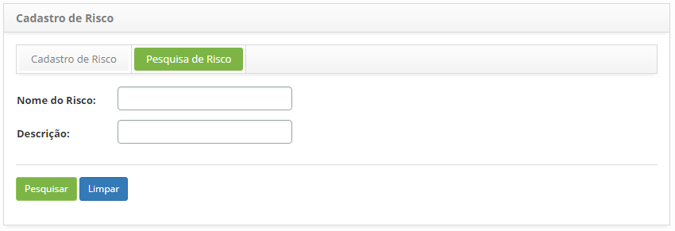
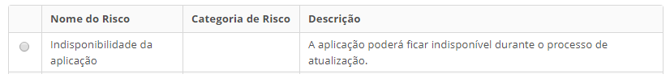
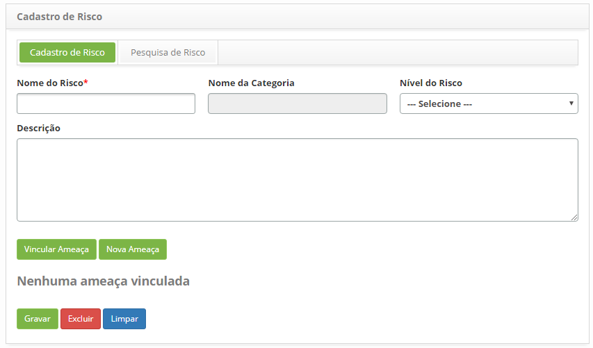
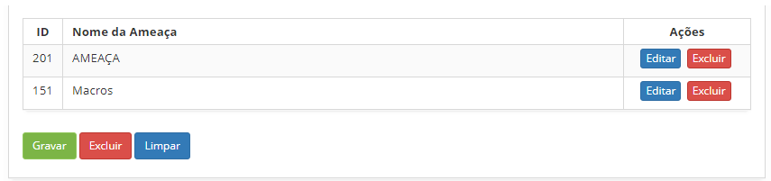

title: Cadastro e pesquisa de risco de mudança
Description: Esta funcionalidade tem por objetivo registrar os riscos envolvidos na mudança que serão utilizadas em outras rotinas do sistema.
# Cadastro e pesquisa de risco de mudança

Esta funcionalidade tem por objetivo registrar os riscos envolvidos na mudança que serão utilizadas em outras rotinas do sistema.

Como acessar
--------------

1. Acesse a funcionalidade de risco através da navegação no menu principal **Processos ITIL > 
Gerência de Mudança > Cadastrar Risco**.

Pré-condições
---------------

1. Ter a categoria de risco cadastrada (ver conhecimento Cadastro e Pesquisa de Categoria de Risco);

2. Ter a ameaça cadastrada (ver conhecimento Cadastro e Pesquisa de Ameaça).

Filtros
---------

1. Os seguintes filtros possibilitam ao usuário restringir a participação de itens na listagem padrão da funcionalidade, 
facilitando a localização dos itens desejados, conforme ilustrado na figura abaixo:

- Nome do risco

- Descrição

2. Na tela de **Risco**, clique na aba **Pesquisa Risco**. Será apresentada a tela de pesquisa conforme ilustrada na figura abaixo:

    
    
    **Figura 1 - Tela de pesquisa de risco**
    
3. Realize a pesquisa de risco:

    - Informe o nome e/ou descrição do risco que deseja pesquisar e clique no botão "Pesquisar". Após isso, será exibido
    o registro do risco conforme o nome informado;
    
    - Caso deseje listar todos os registros de risco, basta clicar diretamente no botão "Pesquisar";
    
Listagem de itens
------------------

1. Os seguintes campos cadastrais estão disponíveis ao usuário para facilitar a identificação dos itens desejados na listagem
padrão da funcionalidade: **Nome do Risco, Categoria de Risco** e **Descrição**.

    
    
    **Figura 2 - Tela de itens**
    
2. Após a pesquisa, selecione o registro desejado. Feito isso, será direcionado para a tela de cadastro exibindo o conteúdo
referente ao registro selecionado;

3. Para alterar os dados do registro de risco, basta modificar as informações dos campos desejados e clicar no botão "Gravar"
para que seja gravada a alteração realizada no registro, onde a data, hora e usuário serão gravados automaticamente para
uma futura auditoria.

Preenchimento dos campos cadastrais
-------------------------------------

1. Será apresentada a tela de **Cadastro de Risco**, conforme ilustrada na figura abaixo:

    
    
    **Figura 3 - Tela de cadastro de risco**
    
2. Preencha os campos conforme orientações abaixo:

    - **Nome da Categoria**: selecione a categoria do risco;
    
    - **Nível do Risco**: selecione o nível do risco;
    
    - **Descrição**: informe a descrição do risco;
    
Vnculando ameaças ao risco
-----------------------------

1. Vincule ameaça(s) ao risco:

    - Clique no botão "Vincular Ameaça". Feito isso, será exibida a tela de pesquisa de ameaça. 
    Realize a pesquisa, selecione a(s) ameaça(s) desejada(s) e clique no botão "Enviar" para efetuar a operação. 
    Caso não encontre o registro da ameaça e haja a necessidade de registrar uma ameaça para vincular ao risco,
    poderá registrá-la a partir dessa tela, basta clicar no botão "Nova Ameaça";
    
    - Após o vínculo da(s) ameaça(s) ao risco, a(s) mesma(s) será(ão) apresentada(s) na tela de registro de risco, 
    conforme exemplo ilustrado na figura abaixo:
    
    
    
    **Figura 4 - Ameaças vinculadas ao risco**
    
    - Para excluir o vínculo da ameaça com o risco, basta clicar no botão "Remover" da mesma.
    
2. Após os dados informados, clique no botão "Gravar" para efetuar o registro, onde a data, hora e usuário serão 
gravados automaticamente para uma futura auditoria.

!!! tip "About"

    <b>Product/Version:</b> CITSmart | 7.00 &nbsp;&nbsp;
    <b>Updated:</b>07/11/2019 – Larissa Lourenço
