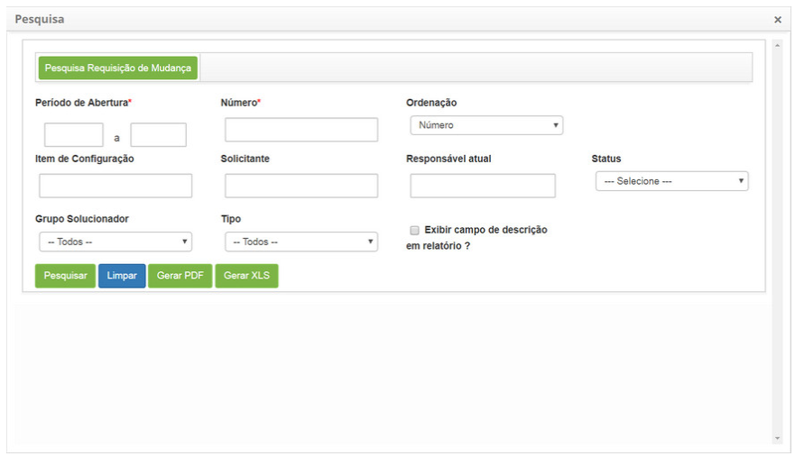
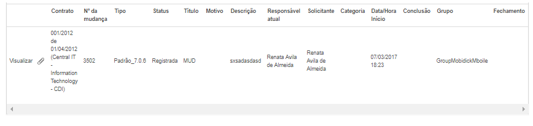

title: Pesquisa de requisição de mudança
Description: Realizar a pesquisa das requisições de mudança de acordo com filtros definidos pelo usuário.
# Pesquisa de requisição de mudança

Realizar a pesquisa das requisições de mudança de acordo com filtros definidos pelo usuário.

Como acessar
--------------

1. Acesse a funcionalidade de pesquisa de requisição de mudança através da navegação no menu principal
**Processos ITIL > Gerência de Mudanças > Pesquisar Requisição Mudança** ou **Processos ITIL > Gerência de Mudanças > Gerenciamento 
de Mudança** e clique no botão "Pesquisa Mudança".

Pré-condições
---------------

1. Não se aplica.

Filtros
---------

1. Os seguintes filtros possibilitam ao usuário restringir a participação de itens na listagem padrão da funcionalidade, 
facilitando a localização dos itens desejados:

    - **Período de Abertura**: informe o período desejado;
    - **Número**: informe o número de identificação da requisição de mudança;
    - **Ordenação**: selecione a ordenação;
    - **Item de Configuração**: informe o item de configuração referente à requisição de mudança que deseja pesquisar;
    - **Solicitante**: informe o solicitante referente à requisição de mudança que deseja pesquisar;
    - **Responsável atual**: informe o responsável referente à requisição de mudança que deseja pesquisar;
    - **Status**: selecione o status referente à requisição de mudança que deseja pesquisar;
    - **Grupo Solucionador**: selecione o grupo solucionador referente à requisição de mudança que deseja pesquisar;
    - **Tipo**: selecione o tipo de mudança;
    - **Caso queira que a descrição da requisição de mudança seja exibida no relatório, marque a opção 
    **Exibir Campo Descrição em Relatórios?**;
    
2. Será apresentada a tela de pesquisa de requisição de mudança contendo campos onde poderá definir os 
filtros necessários para sua pesquisa, conforme ilustração abaixo:

    
    
    **Figura 1 - Tela de pesquisa de requisição de mudança**
    
3. Preencha os campos conforme orientações abaixo:

- Após os filtros definidos, clique no botão "Pesquisar" para efetuar a operação;
- Serão listados os registros de requisição de mudança, conforme os filtros escolhidos, abaixo dos botões "Pesquisar",
"Limpar" e "Gerar Relatório".
- Ao lado de cada registro de requisição de mudança da lista, há ícones que permite realizar as seguintes ações:
visualizar as informações e os anexos da requisição de mudança;
    - Para visualizar as informações da requisição de mudança, clique em "Visualizar";
        - Será exibida a tela de registro da determinada requisição de mudança para visualização.
    - Para visualizar os anexos da solicitação de serviço, clique no ícone  ;
- Caso seja necessário, clique no botão "Gerar (PDF)" para gerar o relatório de requisição de mudança em formato PDF.
- Caso seja necessário, clique no botão "Gerar (XLS)" para gerar o relatório de requisição de mudança em formato Excel.

Listagem de itens
------------------

1. Os seguintes campos cadastrais estão disponíveis ao usuário para facilitar a identificação dos itens desejados 
na listagem padrão da funcionalidade: **Contrato, Número da mudança, Tipo, Status, Título, Motivo, Descrição,
Responsável atual, Solicitante, Categoria, Data/Hora Início, Conclusão, Grupo** e **Fechamento**.

2. Existem botões de ação disponíveis ao usuário em relação a cada item da listagem, são eles: "Visualizar" e "Visualizar Anexos".

**Figura 2 - Tela de itens**

Preenchimento dos campos cadastrais
------------------------------------

1. Não se aplica.

!!! tip "About"

    <b>Product/Version:</b> CITSmart | 7.00 &nbsp;&nbsp;
    <b>Updated:</b>07/12/2019 – Larissa Lourenço
