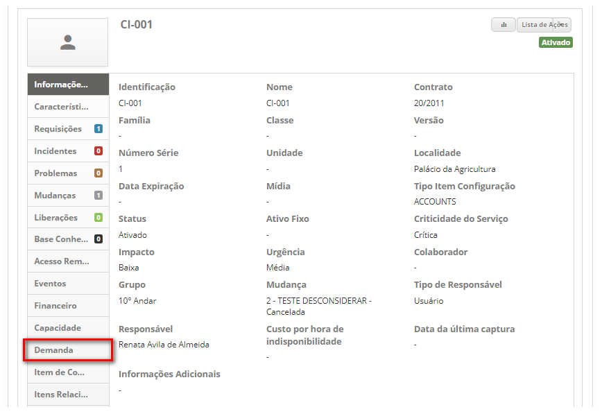
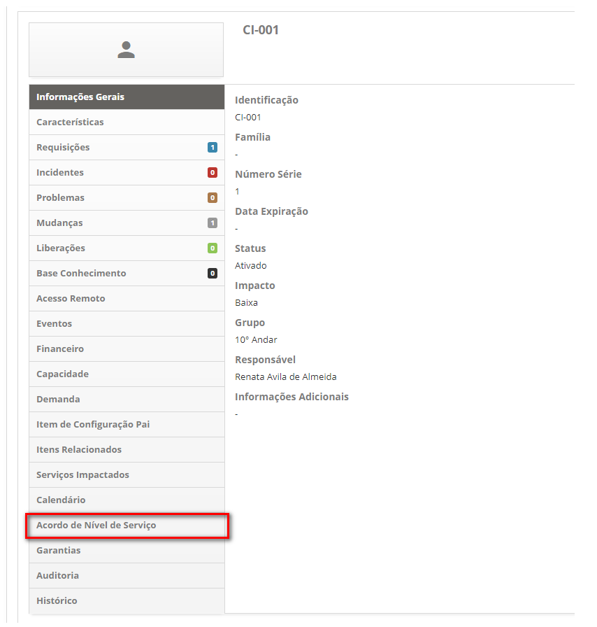
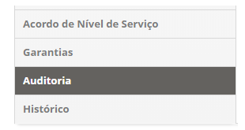
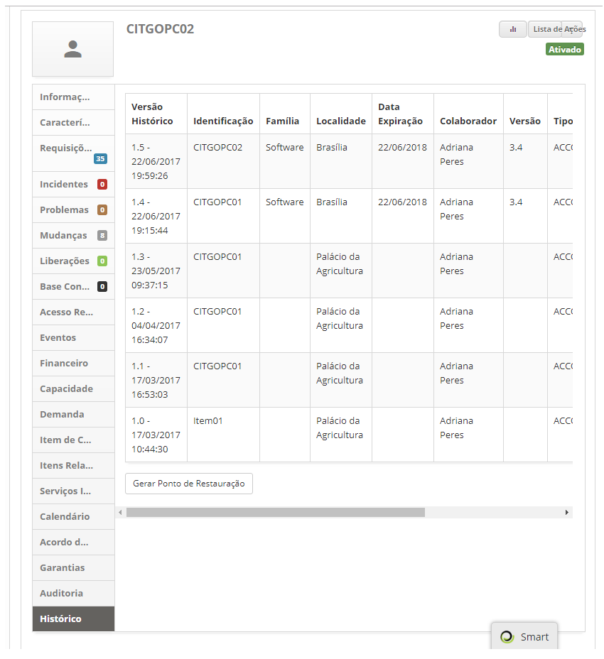

title: Gerenciamento de itens de configuração
Description: Esta funcionalidade permite identificar, registrar e gerenciar os Itens de Configuração presentes na organização.
# Gerenciamento de itens de configuração

Esta funcionalidade permite identificar, registrar e gerenciar os Itens de Configuração presentes na organização.

Pré-condições
--------------

1. Cadastrar Acordo de Nível de Serviço (Geral) do tipo "Disponibilidade" (ver conhecimento Cadastro e pesquisa de acordo
de nível de serviço geral);

2. Cadastrar localidade (ver conhecimento Cadastro e pesquisa de localidade);

3. Cadastrar colaborador (ver conhecimento Cadastro e pesquisa de colaborador);

4. Cadastrar grupo (ver conhecimento Cadastro e pesquisa de grupo);

5. Cadastrar contrato (ver conhecimento Cadastro e pesquisa de contrato);

6. Cadastrar tipo de Item de Configuração (ver conhecimento Cadastro e pesquisa de tipo de item de configuração);

7. Cadastrar ao menos um Item de Configuração principal caso necessite criar outro Item de Configuração relacionado (ver seção 
"Registrando item de configuração relacionado a um item de configuração").

Como acessar
--------------

1. Acesse a funcionalidade de Gerenciamento de Item de Configuração através da navegação no menu principal 
**Processos ITIL > Gerência de Configuração > Gerenciamento de Configuração**.

Gerenciamento de itens de configuração
----------------------------------------

1. Será apresentada a tela de **Gerenciamento de Item de Configuração**, conforme ilustrada na figura abaixo:

    
    
    **Figura 1 - Tela de gerenciamento de itens de configuração**
    
     : amplia a tela de Gerenciamento de Itens de Configuração;
    
     : permite visualizar o status de execução do inventário;
    
     **Dashboard**: apresenta os itens de configurações relacionados aos processos de Incidente,
    Problema, Mudança e Liberação;
    
     **Relatórios**: apresenta os relatórios dinâmicos referentes ao Gerenciamento de Configuração 
    e Ativos de Serviços;
    
     **Filtros**: apresenta os demais filtros para pesquisa dos Itens de Configuração;
    
     **Ações**: permite registrar novo Item de Configuração, criar, alterar e excluir grupo de Item
    de Configuração, vincular calendário, acordo de nível de serviço e custo por hora de indisponibilidade ao grupo de Item
    de Configuração, e exportar CMDB;
    
     **Banco de Dados de Gerenciamento de Configuração**: repositório usado para armazenar os registros
    de Itens de Configuração organizados em grupos.
    
2. Nesta tela de **Gerenciamento de Itens de Configuração**, é possível criar um novo grupo de IC, registrar um novo item de 
configuração, consultar os itens de configuração (IC) existentes, e ao selecionar um item de configuração existente também é 
possível editar suas informações, criar itens relacionado, consultar os itens relacionados e entre outras ações. Nos próximos
tópicos será abordado sobre como realizar essas ações.

Criando um novo grupo de item de configuração
-----------------------------------------------

!!! abstract "SAIBA MAIS"

    Existe uma outra maneira para se cadastrar e pesquisar um Grupo de Item de Configuração apresentado no conhecimento "Cadastro
    e pesquisa de grupo de item de configuração".
    
1. Na tela de **Gerenciamento de Itens de Configuração**, em **Ações**, clique no botão "Criar novo grupo":

    
    
    **Figura 2 - Botão criar novo grupo**
    
2. Será apresentada a tela de cadastro de grupo de item de configuração, conforme ilustrada na figura abaixo:

    
    
    **Figura 3 - Registro de grupo de item de configuração**
    
    - **Nome**: informe o nome do novo grupo de IC;
    - **Grupo pai**: informe o grupo pai, ou seja, grupo superior ao qual o grupo que está sendo criado faz parte;
    - **Ícone**: selecione um ícone para representar o novo grupo de IC;
    - **Cor de fundo**: essa função permite definir a cor de fundo do grupo de IC. Para selecionar uma cor, basta posicionar 
    o mouse na cor desejada e clicar na mesma;
    - **Cor do Ícone/Texto**: essa função permite definir a cor do ícone e do texto do grupo de IC. Para selecionar uma cor, 
    basta posicionar o mouse na cor desejada e clicar na mesma;
    - Feito isso, clique no botão "Gravar" para efetuar o registro. A figura abaixa apresenta os grupos de ICs depois de criados:
    
    
    
    **Figura 4 - Grupos de itens de configuração**
    
Alterando grupo de item de configuração
-----------------------------------------

1. Clique no grupo desejado e na área de **Ações**, clique no botão "Alterar grupo";

    
    
    **Figura 5 - Botão alterar grupo**
    
2. Será exibida a tela de registro do determinado grupo de IC;

3. Altere os dados do grupo e clique em "Gravar" para efetuar a alteração, onde a data, hora e usuário serão gravados 
automaticamente para uma futura auditoria.

Excluindo grupo de item de configuração
-----------------------------------------

!!! info "IMPORTANTE"

    Somente pode ser excluído o grupo que não item relacionados (grupos e/ou itens de configuração).
    
1. Clique no grupo desejado e na área de **Ações** clique no botão "Excluir grupo";

    
    
    **Figura 6 - Botão excluir grupo**
    
2. Será exibida uma mensagem para confirmação da exclusão do grupo;

3. Clique em "Confirmar" para efetuar a operação;

4. Será realizada com sucesso a exclusão do grupo de IC.

Vinculando calendário ao grupo de IC's
----------------------------------------

1. Na tela de **Gerenciamento de Itens de Configuração**, selecione o Grupo que deseja vincular o calendário. Feito isso,
em **Ações**, clique no botão "Vincular calendário", conforme indicado na figura abaixo:

    
    
    **Figura 7 - Botão Vincular Calendário**
    
2. Será apresentada a tela para vínculo do calendário, conforme ilustrada na figura abaixo:

    
    
    **Figura 8 - Tela de vínculo de calendário**
    
3. Pesquise e selecione o calendário que deseja vincular e após isso, clique no botão "Adicionar" para efetuar o vínculo
do calendário com o Grupo de ICs.

Vinculando acordo de nível de serviço ao grupo de IC's
--------------------------------------------------------

1. Na tela de **Gerenciamento de Itens de Configuração**, selecione o **Grupo** que deseja vincular o acordo de nível de serviço. 
Feito isso, em **Ações**, clique no botão "Vincular acordo de nível de serviço", conforme indicado na figura abaixo:

    
    
    **Figura 9 - Botão vincular acordo de nível de serviço**
    
2. Será apresentada a tela para vínculo do acordo de nível de serviço do tipo "disponibilidade", conforme ilustrada na figura 
abaixo:

    
    
    **Figura 10 - Tela de vínculo de ANS**
    
3. Pesquise e selecione o acordo de nível de serviço que deseja vincular e após isso, clique no botão "Adicionar" para efetuar 
o vínculo do acordo de nível de serviço com o Grupo de ICs.

Registrando custo por hora de indisponibilidade do grupo de IC's
------------------------------------------------------------------

1. Na tela de **Gerenciamento de Itens de Configuração**, selecione o Grupo desejado. Feito isso, em **Ações**, clique no botão 
"Custo por hora de indisponibilidade", conforme indicado na figura abaixo:

    
    
    **Figura 11 - Botão custo**
    
2. Será apresentada a tela de registro do custo por hora de indisponibilidade, conforme ilustrada na figura abaixo:

    
    
    **Figura 12 - Registro de custo por hora de indisponibilidade**
    
3. Informe o valor da hora de indisponibilidade do grupo de ICs. Após isso, clique no botão "Adicionar" para efetuar o registro.

Registrando um novo item de configuração
------------------------------------------

1. Na tela de **Gerenciamento de Itens de Configuração**, em **Ações**, clique no botão "Criar novo item de configuração";

    
    
    **Figura 13 - Botão criar novo item de configuração**
    
2. É apresentada a tela **Cadastro de Item de Configuração**, conforme ilustrada na figura abaixo:

    
    
    **Figura 14 - Tela de registro de item de configuração (IC)**
    
3. Preencha os campos conforme orientações abaixo:

    - **Identificação**: informe a identificação do novo item de configuração;
    - **Nome**: informe o nome do novo item de configuração;
    - **Contrato**: selecione o contrato ao qual o item de configuração pertence;
    - **Família**: informe a família a qual o item de configuração pertence;
    - **Classe**: informe o nome da classe do item de configuração;
    - **Versão**: informe a versão do item de configuração;
    - **Número Série**: informe o número de série do item de configuração;
    - **Unidade**: informe a unidade de negócio/departamento/lotação em que o item de configuração está alocado;
    - **Localidade**: informe o local onde o item de configuração se encontra;
    - **Data Expiração**: informe a data de expiração da licença do item de configuração;
    - **Mídia**: informe a mídia definitiva (local em que as versões definitivas e autorizadas de ICs de “softwares” são 
    armazenadas de maneira segura) do IC, se for necessário. Caso queira limpar o dado informado no campo, clique
    no ícone ;
    - **Tipo Item Configuração**: informe o tipo de item de configuração;

    !!! abstract "SAIBA MAIS"
    
        Ao ser informado o tipo de item de configuração, serão exibidas as características relacionadas na guia de 
        características, onde poderá ser registrado o valor para cada característica.
        
    - **Status**: selecione o estado do item de configuração;
    - **Ativo Fixo**: Se o IC for um ativo fixo (ativo de negócio tangível que tem uma vida útil de longa duração, por exemplo, 
    um servidor ou uma licença de software), informe a identificação do patrimônio do mesmo;
    - **Criticidade do Serviço**: informe a importância que o IC tem para a organização;
    - **Impacto**: informe o impacto que causa a ausência do funcionamento do IC dentro do ambiente organizacional;
    - **Urgência**: informe a urgência do restabelecimento do IC dentro do ambiente organizacional;
    - **Colaborador**: informe o colaborador que utiliza ou irá utilizar o item de configuração;
    - **Grupo**: informe o grupo de IC ao qual o IC fará parte;
        - **Mudanças**: relacione uma mudança ao IC, quando for necessário. Caso queira limpar o dado informado no campo, clique
        no ícone ;
        - **Tipo de Responsável**: selecione o tipo de responsável: usuário ou grupo;
        - **Responsável**: informe o responsável do item de configuração, de acordo com o tipo de responsável. Caso queira 
        limpar o dado informado no campo, clique no ícone ;
        - **Item de Configuração** Pai: se o IC que está sendo cadastrado faz parte de outro IC, informe-o. Caso queira limpar 
        o dado informado no campo, clique no ícone ;
        - **Custo por hora de indisponibilidade**: informe o valor da hora de indisponibilidade do IC;
        - **Informações Adicionais**: descreva as demais informações sobre o item de configuração, caso seja importante;
        
4. Após informar todos os dados, clique no botão "Gravar" para efetuar o registro do Item de Configuração, onde a data, hora e usuário serão gravados automaticamente para uma futura auditoria.

Registrando garantia do item de configuração
----------------------------------------------

1. Na tela de **Cadastro de Item de Configuração**, clique na guia **Garantias**, conforme ilustrada na figura abaixo:

    
    
    **Figura 15 - Tela de registro de garantias**
    
2. Clique no botão "Adicionar". Será apresentada a tela de pesquisa de Fornecedor, pesquise e selecione o mesmo e serão apresentados os campos para preenchimento, conforme ilustrado na figura abaixo:

    
    
    **Figura 16 - Tela de registro de garantias**
    
    - **Data de início**: informe a data inicial da garantia;
    - **Data fim**: informe a data final da garantia;
    - Caso queira excluir a garantia, basta clicar no ícone  da mesma.
    
3. Após os dados informados, clique no botão "Gravar".

Consultando os itens de configuração
--------------------------------------

1. Na tela de **Gerenciamento de Itens de Configuração**, é permitido realizar consultas de ICs nas seguintes formas:

    - **Por processo**: permite visualizar os itens de configuração relacionados com os processos: Incidente, Problema, Mudança 
    e Liberação;
    - **Por grupo**: permite visualizar os itens de configuração de um determinado grupo;
    - **Por filtros**: permite visualizar os itens de configuração de acordo com o filtro informado.

Consultando IC's por processo
-------------------------------

1. Na área de **Dashboard** são apresentados em cada processo a quantidade de ICs relacionados, conforme exemplo ilustrado na figura abaixo:

    
    
    **Figura 17 - Dashboard**
    
2. Clique em um processo para verificar os ICs relacionados. Feito isso, serão apresentados os ICs, os quais estão relacionados com o determinado processo. A figura abaixo ilustra um exemplo:

    
    
    **Figura 18 - IC (Item de Configuração) relacionado ao processo de incidente**
    
3. É permitido também verificar os ICs relacionados a dois ou mais processos, basta selecionar os processos que deseja e logo 
em seguida serão apresentadas os ICs que estão relacionados com os processos. A figura a seguir ilustra um exemplo:

!!! warning "ATENÇÃO"

    Serão apresentados somente os ICs que estão relacionados com os processos selecionados, por exemplo: caso tenha 
    selecionado dois processos e não é apresentado nenhum IC, isso significa que não existe IC relacionado com os processos.
    

**Figura 19 - IC relacionado aos processos de incidente e problema**

Consultando IC's por grupo
----------------------------

1. Na área de **Banco de Dados de Gerenciamento de Configuração** é apresentado por padrão três Grupos de ICs: 
"Desenvolvimento", "Homologação" e "Produção". Estes grupos têm como filhos outros Grupos de ICs e/ou Itens de Configuração;

2. Clique no(s) grupo(s) desejado(s) para visualização dos ICs. Feito isso, serão apresentados os ICs do determinado 
grupo, conforme o exemplo ilustrado na figura a seguir;

3. Após entrar em um grupo de IC e caso queira voltar para o grupo anterior, ou seja, o grupo superior, clique sobre a descrição
do mesmo apresentada na barra de navegação, localizada na parte superior da tela. O exemplo ilustrado na figura abaixo 
apresenta a barra de navegação, onde permite navegar entre os grupos de ICs.

**Figura 20 - Itens de configuração por grupo**

Consultando IC's por filtros
-----------------------------

1. Na área de **Filtros**, clique no ícone  da mesma para expandir a área. Feito isso,
serão apresentados os filtros para realizar a consulta do IC de acordo com sua necessidade, conforme ilustrado na figura abaixo:

    
    
    **Figura 21 - Filtros para consulta de IC**
    
    - **Status**: informe o status do IC para consulta dos ICs referente ao status;**
    - **Criticidade**: informe a criticidade para consulta dos ICs referente à criticidade;
    - **Identificação**: informe a identificação do IC para consulta de um IC específico;
    - **Pesquisar somente no grupo atual**: caso queira visualizar somente os ICs do grupo atual, ou seja, o grupo em que 
    está acessando no momento, habilite o filtro;
    - **Exibir itens filhos**: caso queira visualizar os ICs filhos, habilite o filtro;
    
2. Após os filtros definidos, clique no botão "Filtrar" para efetuar a operação. Feito isso, serão exibidos os ICs 
conforme os filtros definidos. A figura abaixo ilustra um exemplo:

**Figura 22 - Itens de configuração**

Alterando os dados do item de configuração
--------------------------------------------
   
1. Realize a consulta do Item de Configuração que deseja, conforme descrito no item **Consultando os Itens de Configuração**.
Após a consulta, clique sobre o item de configuração, será apresentada a tela de informações do determinado Item de
Configuração,conforme ilustrada na figura a seguir:

    
    
    **Figura 23 - Tela de informações de item de configuração**
    
2. Clique no botão "Lista de Ações" e logo em seguida clique em "Editar", conforme indicado na figura abaixo:

    
    
    **Figura 24 - Seleção da ação "Editar"**
    
3. Será apresentada a tela de registro do Item de Configuração, conforme exemplo ilustrado na figura abaixo:

    
    
    **Figura 25 - Tela de registro de item de configuração**
    
4. Altere os dados que desejar e clique no botão "Gravar" para que seja gravada a alteração realizada no registro de IC, onde
a data, hora e usuário serão gravados automaticamente para uma futura auditoria.

!!! abstract "SAIBA MAIS"

    As alterações de itens de configuração são gravadas em um histórico. Todas as vezes que o item é modificado, uma nova
    versão é inserida com as mudanças.
    
Registrando item de configuração relacionado a um item de configuração
------------------------------------------------------------------------

1. Realize a consulta do Item de Configuração que deseja, conforme descrito no item **Consultando os Itens de Configuração**. 
Após a consulta, clique sobre o item de configuração. Será apresentada a tela de informações do determinado Item de Configuração;

2. Clique no botão "Lista de Ações" e logo em seguida clique em "Criar item de configuração relacionado", conforme indicado na 
figura a seguir:

    
    
    **Figura 26 - Seleção da ação "Criar item de configuração relacionado"**
    
3. Será apresentada a tela de Cadastro de Item de Configuração para registro das informações do IC relacionado. Registre 
as informações conforme as orientações contidas no item **Registrando um novo Item de Configuração**.

!!! warning "ATENÇÃO"

    Os campos "Identificação", "Nome" e "Contrato" não estarão preenchidos, pois seu conteúdo difere do IC pai. Esse preenchimento automático estende-se à opção "Características" (menu lateral à esquerda).
    
Executando script referente ao item de configuração
-----------------------------------------------------

1. Realize a consulta do Item de Configuração que deseja, conforme descrito no item **Consultando os Itens de Configuração**. 
Após a consulta, clique sobre o item de configuração. Será apresentada a tela de informações do determinado Item de Configuração;

2. Clique no botão "Lista de Ações" e logo em seguida clique em "Executar script", conforme indicado na figura abaixo:

    
    
    **Figura 27 - Seleção da ação "Criar item de configuração relacionado"**
    
3. Será apresentada a tela de **Execução de Scripts** conforme ilustrada na figura abaixo:

    
    
    **Figura 28 - Tela de execução de scripts**
    
4. Descreva os scripts que deseja executar e clique no botão "Executar Script" para efetuar a operação.

Verificando os processos (requisição, incidente, problemas, mudanças, liberação e base de conhecimento) relacionados ao IC
----------------------------------------------------------------------------------------------------------------------------

1. Realize a consulta do Item de Configuração que deseja, conforme descrito no item **Consultando os Itens de Configuração**. 
Após a consulta, clique sobre o Item de Configuração. Será apresentada a tela de informações do determinado Item de Configuração.
Nessa tela é apresentado a quantidade de requisições, incidentes, problemas, mudanças, liberações e conhecimentos relacionados 
ao IC, conforme exemplo ilustrado na figura abaixo:

    
    
    **Figura 29 - Tela de informações de item de configuração**
    
2. Para verificar as requisições relacionadas ao IC, basta clicar na guia **Requisições**.

3. Para verificar os incidentes relacionados ao IC, basta clicar na guia **Incidentes**.

4. Para verificar os problemas relacionados ao IC, basta clicar na guia **Problemas**.

5. Para verificar as requisições de mudanças relacionadas ao IC, basta clicar na guia **Mudanças**.

6. Para verificar as liberações relacionadas ao IC, basta clicar na guia **Liberações**.

7. Para verificar ou relacionar conhecimentos ao IC, basta clicar na guia **Base de Conhecimento**.

Verificando ocorrências de eventos do IC
------------------------------------------

1. Realize a consulta do Item de Configuração que deseja, conforme descrito no item **Consultando os Itens de Configuração**.
Após a consulta, clique sobre o item de configuração. Será apresentada a tela de informações do determinado Item de Configuração;

2. Clique na guia de **Eventos**, conforme indicado na figura abaixo:

    
    
    **Figura 30 - Guia de eventos**
    
3. Serão apresentados os filtros para busca de eventos que foram gerados para o IC, conforme ilustrado na figura abaixo:

    
    
    **Figura 31 - Pesquisa de ocorrências de eventos do IC**
    
4. Defina os filtros de acordo com sua necessidade e clique no botão "Pesquisar".Feito isso, serão exibidos os eventos ocorridos.

Registrando o valor financeiro do IC
--------------------------------------

1. Realize a consulta do Item de Configuração que deseja, conforme descrito no item **Consultando os Itens de Configuração**.
Após a consulta, clique sobre o item de configuração. Será apresentada a tela de informações do determinado Item de Configuração;

2. Clique na guia de **Financeiro**, conforme indicado na figura abaixo:

    
    
    **Figura 32 - Guia financeiro**
    
3. Serão apresentados os campos para preenchimento com as informações do valor financeiro do Item de Configuração, conforme 
ilustrado na figura abaixo:

    
    
    **Figura 33 - Tela de registro de valor financeiro do IC**
    
    - **Data de início**: informe a data inicial do valor do IC;
    - **Data fim**: informe a data final do valor do IC;
    - **Valor do item de configuração**: informe o valor do IC;
    
4. Após os dados informados, clique no botão "Gravar". Feito isso, será gravado e apresentado na tela o valor financeiro do
Item de Configuração.

5. Caso queira alterar os dados o valor financeiro do IC, basta clicar no ícone  do mesmo.

6. Caso queira excluir o valor financeiro do IC, basta clicar no ícone  do mesmo.

Verificando indicadores de capacidade/performance ao IC
---------------------------------------------------------

1. Realize a consulta do Item de Configuração que deseja, conforme descrito no item **Consultando os Itens de Configuração**.
Após a consulta, clique sobre o item de configuração. Será apresentada a tela de informações do determinado Item de Configuração;

2. Clique na guia de **Capacidade**, conforme indicado na figura abaixo:

    
    
    **Figura 34 - Guia de capacidade**
    
3. Será apresentada a tela para vínculo de indicadores de capacidade ao Item de Configuração, conforme ilustrada na figura 
abaixo:

    
    
    **Figura 35 - Vínculo de indicadores de capacidade ao IC**
    
4. Clique no botão "Vincular indicadores de capacidade/performance". Feito isso, será exibida a tela de pesquisa de indicadores
de capacidade. Realize a pesquisa, selecione os indicadores e clique no botão "Adicionar" para efetuar a operação.

5. Caso queira excluir o vínculo de um indicador de capacidade com o IC, basta clicar no ícone
 do mesmo.

Vinculando atributos de demanda ao IC
---------------------------------------

1. Realize a consulta do Item de Configuração que deseja, conforme descrito no item **Consultando os Itens de Configuração**. 
Após a consulta, clique sobre o item de configuração. Será apresentada a tela de informações do determinado Item de Configuração;

2. Clique na guia de **Demanda**, conforme indicado na figura abaixo:

    
    
    **Figura 36 - Guia de demanda**
    
3. Será apresentada a tela para vínculo de atributos da demanda ao Item de Configuração, conforme ilustrada na figura abaixo:

    
    
    **Figura 37 - Vínculo de atributos da demanda ao IC**
    
4. Clique no botão "Vincular atributos da demanda". Feito isso, será exibida a tela de pesquisa de atributos. Realize a pesquisa, 
selecione os atributos e clique no botão "Adicionar" para efetuar a operação.

5. Caso queira excluir o vínculo de um atributo de demanda com o IC, basta clicar no ícone 
do mesmo.

Verificando item de configuração pai
--------------------------------------

1. Realize a consulta do Item de Configuração Pai que deseja, conforme descrito no item **Consultando os Itens de Configuração**.
Após a consulta, clique sobre o item de configuração. Será apresentada a tela de informações do determinado Item de Configuração;

2. Clique na guia de **Item de Configuração Pai**, conforme indicado na figura abaixo:

    
    
    **Figura 38 - Guia de item de configuração pai**
    
3. Será apresentado o Item de Configuração Pai que está relacionado ao Item de Configuração.

    
    
    **Figura 39 - Item de configuração pai**
    
Verificando itens de configuração relacionados a um item de configuração
--------------------------------------------------------------------------

1. Realize a consulta do Item de Configuração que deseja, conforme descrito no item **Consultando os Itens de Configuração**.  
Após a consulta, clique sobre o item de configuração. Será apresentada a tela de informações do determinado Item de Configuração;

2. Clique na guia de **Itens Relacionados**, conforme indicado na figura abaixo:

    
    
    **Figura 40 - Guia de itens relacionados**
    
3. Serão apresentados os Itens de Configuração que estão relacionados ao Item de Configuração.

    
    
    **Figura 41 - Itens relacionados**
    
4. Para verificar as informações do IC relacionado, basta clicar em "Visualizar".

5. Um dos tipos de relação entre IC é explicada no conhecimento sobre o "Mapa de Serviço". Abaixo segue exemplo de 2 
tipos de relação que os IC podem ter:

**Figura 42 - Detalhes das duas seções visíveis em itens relacionados (IC-filhos e relacionados pelo mapa de serviço)**

Realizando análise de impacto do item de configuração
-------------------------------------------------------

1. Realize a consulta do Item de Configuração que deseja, conforme descrito no item **Consultando os Itens de Configuração**. 
Após a consulta, clique sobre o item de configuração. Será apresentada a tela de informações do determinado Item de Configuração;

2. Clique na guia de **Serviços Impactados**, conforme indicado na figura abaixo:

    
    
    **Figura 43 - Guia de serviços impactados**
    
3. Será exibida uma tela apresentando os serviços que utilizam o IC, conforme exemplo ilustrado na figura abaixo:

    
    
    **Figura 44 - Serviços impactados**
    
4. Caso queira verificar o desenho do mapa de ativos do serviço, basta clicar no botão "Mapa" do serviço desejado.

Vinculando calendário ao item de configuração
-----------------------------------------------

1. Realize a consulta do Item de Configuração que deseja, conforme descrito no item **Consultando os Itens de Configuração**. 
Após a consulta, clique sobre o item de configuração. Será apresentada a tela de informações do determinado Item de Configuração;

2. Clique na guia de **Calendário**, conforme indicado na figura abaixo:

    
    
    **Figura 45 - Guia de calendário**
    
3. Será apresentada a tela para vínculo do calendário, conforme ilustrada na figura abaixo:

    
    
    **Figura 46 - Tela de vínculo de calendário**
    
4. Informe o calendário que deseja vincular e após isso, clique no botão "Adicionar" para efetuar o vínculo do calendário ao IC.

Vinculando acordo de nível de serviço ao item de configuração
---------------------------------------------------------------

1. Realize a consulta do Item de Configuração que deseja, conforme descrito no item **Consultando os Itens de Configuração**. 
Após a consulta, clique sobre o item de configuração. Será apresentada a tela de informações do determinado Item de Configuração;

2. Clique na guia de **Acordo de Nível de Serviço**, conforme indicado na figura abaixo:

    
    
    **Figura 47 - Guia de acordo de nível de serviço**
    
3. Será apresentada a tela para vínculo do acordo de nível de serviço do tipo "disponibilidade", conforme ilustrada na 
figura abaixo:

    
    
    **Figura 48 - Tela de vínculo de ANS**
    
4. Informe o acordo de nível de serviço que deseja vincular e após isso, clique no botão "Adicionar" para efetuar o vínculo do 
acordo de nível de serviço ao IC.

Verificando garantias relacionadas a um item de configuração
---------------------------------------------------------------

1. Realize a consulta do Item de Configuração que deseja, conforme descrito no item **Consultando os Itens de Configuração**. 
Após a consulta, clique sobre o item de configuração. Será apresentada a tela de informações do determinado Item de Configuração; 

2. Clique na guia de **Garantias**, conforme indicado na figura abaixo:

    
    
    **Figura 49 - Guia de itens relacionados**
    
3. Serão apresentadas as Garantias que estão relacionados ao Item de Configuração.

    
**Figura 50 - Garantias**
    
Realizando auditoria de item de configuração
----------------------------------------------

1. Realize a consulta do Item de Configuração que deseja, conforme descrito no item **Consultando os Itens de Configuração**.
Após a consulta, clique sobre o item de configuração. Será apresentada a tela de informações do determinado Item de Configuração;

2. Clique na guia de **Auditoria**, conforme indicado na figura abaixo:

    
    
    **Figura 51 - Guia de Auditoria**
    
3. Será apresenta uma tela para informação do período que deseja verificar os dados do item de configuração para auditoria. 
A figura abaixo ilustra essa tela:

    
    
    **Figura 52 - Auditoria de item de configuração**
    
    - **Data de início**: informe a data inicial de referência de auditoria;
    - **Data fim**: informe a data final de referência de auditoria.
    
4. Após o período informado, clique no botão "Pesquisar". Feito isso, será exibido o histórico do Item de Configuração de acordo 
com o período informado, permitindo realizar a auditoria.

Verificando o histórico do item de configuração
-------------------------------------------------

1. Realize a consulta do Item de Configuração que deseja, conforme descrito no item **Consultando os Itens de Configuração**. 
Após a consulta, clique sobre o item de configuração. Será apresentada a tela de informações do determinado Item de Configuração;

2. Clique na guia de **Histórico**, conforme indicado na figura abaixo:

    
    
    **Figura 53 - Guia de histórico**
    
3. Será apresentada a tela de histórico do item de configuração, conforme ilustrada na figura abaixo:

    
    
    **Figura 54 - Histórico de item de configuração (IC)**
    
4. O item de configuração poderá ter um ou mais ponto de restauração *(baselines)* gerado. E para gerar um ponto de restauração, 
basta clicar no botão "Gerar Ponto de Restauração".

5. Para restaurar o Item de Configuração para uma determinada versão, ou seja, recuperar de volta a configuração conhecida do IC, 
basta clicar no botão "Restaurar".

6. Para restaurar o Item de Configuração para uma versão específica, ou seja, recuperar a configuração CI conhecida, basta clicar 
no botão "Restaurar".

Verificando o status de execução do inventário de IC
------------------------------------------------------

Essa funcionalidade permite visualizar o status atual da execução do inventário através da aplicação CITSmart Inventory.

1. Na tela de **Gerenciamento de Itens de Configuração**, clique no ícone . Feito isso, será 
apresentada a respectiva tela para verificação do status de execução do inventário, conforme ilustração abaixo:

    
    
    **Figura 55- Tela de status de execução do inventário**
    
2. Para realizar uma pesquisa específica, informe o filtro conforme sua necessidade:

    - Conexão CITSmart Inventory
    - Identificação do IC
    - IP
    - Status, podendo assumir os seguintes valores:
        - **Inventariada**: o sistema capturou as informações do IC com sucesso;
        - **Inacessível**: o sistema não conseguiu inventariar a máquina, a mesma pode estar sem rede por exemplo, e o agente 
        não conseguiu estabelecer uma conexão para capturar os dados;
        - **Ignorada**: na conexão de inventário, caso o usuário tenha optado por Ignorar Máquinas Inventariadas, o sistema
        passa um período sem inventariar a mesma e atribui esse Status;
        - **Em execução**: o inventário está em andamento no momento;
        - **Não Inventariada**: o sistema ainda não capturou as informações do IC.
        
3. Clique no botão "Filtrar". Após isso, será apresentada a tela com os dados do inventário conforme o filtro informado;

4. Caso deseje fazer um inventário de um item de configuração específico, clique no botão "Inventariar Agora".

Exportando CMDB
-----------------

1. Na tela de **Gerenciamento de Itens de Configuração**, selecione o Grupo de ICs que deseja exportar as informações. Feito isso, em **Ações**, clique no botão "Exportar CMDB", conforme indicado na figura abaixo:

    
    
    **Figura 56 - Botão exportar CMDB**
    
2. O sistema exportará as informações do banco de dados em formato XML, conforme figura abaixo:

**Figura 57 - Exportação XML**

Veja também
-------------

- Como faço o desenho de ativos que compõem o meu serviço?

!!! tip "About"

    <b>Product/Version:</b> CITSmart | 7.00 &nbsp;&nbsp;
    <b>Updated:</b>07/16/2019 – Larissa Lourenço
