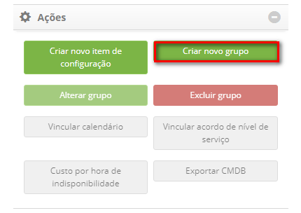

title: Gerenciamento de itens de configuração
Description: Esta funcionalidade permite identificar, registrar e gerenciar os Itens de Configuração presentes na organização.
# Gerenciamento de itens de configuração

Esta funcionalidade permite identificar, registrar e gerenciar os Itens de Configuração presentes na organização.

Pré-condições
--------------

1. Cadastrar Acordo de Nível de Serviço (Geral) do tipo "Disponibilidade" (ver conhecimento Cadastro e pesquisa de acordo
de nível de serviço geral);

2. Cadastrar localidade (ver conhecimento Cadastro e pesquisa de localidade);

3. Cadastrar colaborador (ver conhecimento Cadastro e pesquisa de colaborador);

4. Cadastrar grupo (ver conhecimento Cadastro e pesquisa de grupo);

5. Cadastrar contrato (ver conhecimento Cadastro e pesquisa de contrato);

6. Cadastrar tipo de Item de Configuração (ver conhecimento Cadastro e pesquisa de tipo de item de configuração);

7. Cadastrar ao menos um Item de Configuração principal caso necessite criar outro Item de Configuração relacionado (ver seção 
"Registrando item de configuração relacionado a um item de configuração").

Como acessar
--------------

1. Acesse a funcionalidade de Gerenciamento de Item de Configuração através da navegação no menu principal 
**Processos ITIL > Gerência de Configuração > Gerenciamento de Configuração**.

Gerenciamento de itens de configuração
----------------------------------------

1. Será apresentada a tela de **Gerenciamento de Item de Configuração**, conforme ilustrada na figura abaixo:

    
    
    **Figura 1 - Tela de gerenciamento de itens de configuração**
    
     : amplia a tela de Gerenciamento de Itens de Configuração;
    
     : permite visualizar o status de execução do inventário;
    
     **Dashboard**: apresenta os itens de configurações relacionados aos processos de Incidente,
    Problema, Mudança e Liberação;
    
     **Relatórios**: apresenta os relatórios dinâmicos referentes ao Gerenciamento de Configuração 
    e Ativos de Serviços;
    
     **Filtros**: apresenta os demais filtros para pesquisa dos Itens de Configuração;
    
     **Ações**: permite registrar novo Item de Configuração, criar, alterar e excluir grupo de Item
    de Configuração, vincular calendário, acordo de nível de serviço e custo por hora de indisponibilidade ao grupo de Item
    de Configuração, e exportar CMDB;
    
     **Banco de Dados de Gerenciamento de Configuração**: repositório usado para armazenar os registros
    de Itens de Configuração organizados em grupos.
    
2. Nesta tela de **Gerenciamento de Itens de Configuração**, é possível criar um novo grupo de IC, registrar um novo item de 
configuração, consultar os itens de configuração (IC) existentes, e ao selecionar um item de configuração existente também é 
possível editar suas informações, criar itens relacionado, consultar os itens relacionados e entre outras ações. Nos próximos
tópicos será abordado sobre como realizar essas ações.

Criando um novo grupo de item de configuração
-----------------------------------------------

!!! abstract "SAIBA MAIS"

    Existe uma outra maneira para se cadastrar e pesquisar um Grupo de Item de Configuração apresentado no conhecimento "Cadastro
    e pesquisa de grupo de item de configuração".
    
1. Na tela de **Gerenciamento de Itens de Configuração**, em **Ações**, clique no botão "Criar novo grupo":

    
    
    **Figura 2 - Botão criar novo grupo**
    
2. Será apresentada a tela de cadastro de grupo de item de configuração, conforme ilustrada na figura abaixo:

    
    
    **Figura 3 - Registro de grupo de item de configuração**
    
    - **Nome**: informe o nome do novo grupo de IC;
    - **Grupo pai**: informe o grupo pai, ou seja, grupo superior ao qual o grupo que está sendo criado faz parte;
    - **Ícone**: selecione um ícone para representar o novo grupo de IC;
    - **Cor de fundo**: essa função permite definir a cor de fundo do grupo de IC. Para selecionar uma cor, basta posicionar 
    o mouse na cor desejada e clicar na mesma;
    - **Cor do Ícone/Texto**: essa função permite definir a cor do ícone e do texto do grupo de IC. Para selecionar uma cor, 
    basta posicionar o mouse na cor desejada e clicar na mesma;
    - Feito isso, clique no botão "Gravar" para efetuar o registro. A figura abaixa apresenta os grupos de ICs depois de criados:
    
    
    
    **Figura 4 - Grupos de itens de configuração**
    
Alterando grupo de item de configuração
-----------------------------------------

1. Clique no grupo desejado e na área de **Ações**, clique no botão "Alterar grupo";

    
    
    **Figura 5 - Botão alterar grupo**
    
2. Será exibida a tela de registro do determinado grupo de IC;

3. Altere os dados do grupo e clique em "Gravar" para efetuar a alteração, onde a data, hora e usuário serão gravados 
automaticamente para uma futura auditoria.

Excluindo grupo de item de configuração
-----------------------------------------

!!! info "IMPORTANTE"

    Somente pode ser excluído o grupo que não item relacionados (grupos e/ou itens de configuração).
    
1. Clique no grupo desejado e na área de **Ações** clique no botão "Excluir grupo";

    
    
    **Figura 6 - Botão excluir grupo**
    
2. Será exibida uma mensagem para confirmação da exclusão do grupo;

3. Clique em "Confirmar" para efetuar a operação;

4. Será realizada com sucesso a exclusão do grupo de IC.

Vinculando calendário ao grupo de IC's
----------------------------------------

1. Na tela de **Gerenciamento de Itens de Configuração**, selecione o Grupo que deseja vincular o calendário. Feito isso,
em **Ações**, clique no botão "Vincular calendário", conforme indicado na figura abaixo:

    
    
    **Figura 7 - Botão Vincular Calendário**
    
2. Será apresentada a tela para vínculo do calendário, conforme ilustrada na figura abaixo:

    
    
    **Figura 8 - Tela de vínculo de calendário**
    
3. Pesquise e selecione o calendário que deseja vincular e após isso, clique no botão "Adicionar" para efetuar o vínculo
do calendário com o Grupo de ICs.

Vinculando acordo de nível de serviço ao grupo de IC's
--------------------------------------------------------

1. Na tela de **Gerenciamento de Itens de Configuração**, selecione o **Grupo** que deseja vincular o acordo de nível de serviço. 
Feito isso, em **Ações**, clique no botão "Vincular acordo de nível de serviço", conforme indicado na figura abaixo:

    
    
    **Figura 9 - Botão vincular acordo de nível de serviço**
    
2. Será apresentada a tela para vínculo do acordo de nível de serviço do tipo "disponibilidade", conforme ilustrada na figura 
abaixo:

    
    
    **Figura 10 - Tela de vínculo de ANS**
    
3. Pesquise e selecione o acordo de nível de serviço que deseja vincular e após isso, clique no botão "Adicionar" para efetuar 
o vínculo do acordo de nível de serviço com o Grupo de ICs.

Registrando custo por hora de indisponibilidade do grupo de IC's
------------------------------------------------------------------

1. Na tela de **Gerenciamento de Itens de Configuração**, selecione o Grupo desejado. Feito isso, em **Ações**, clique no botão 
"Custo por hora de indisponibilidade", conforme indicado na figura abaixo:

    
    
    **Figura 11 - Botão custo**
    
2. Será apresentada a tela de registro do custo por hora de indisponibilidade, conforme ilustrada na figura abaixo:

    
    
    **Figura 12 - Registro de custo por hora de indisponibilidade**
    
3. Informe o valor da hora de indisponibilidade do grupo de ICs. Após isso, clique no botão "Adicionar" para efetuar o registro.

Registrando um novo item de configuração
------------------------------------------

1. Na tela de **Gerenciamento de Itens de Configuração**, em **Ações**, clique no botão "Criar novo item de configuração";

    
    
    **Figura 13 - Botão criar novo item de configuração**
    
2. É apresentada a tela **Cadastro de Item de Configuração**, conforme ilustrada na figura abaixo:

    
    
    **Figura 14 - Tela de registro de item de configuração (IC)**
    
3. Preencha os campos conforme orientações abaixo:

    - **Identificação**: informe a identificação do novo item de configuração;
    - **Nome**: informe o nome do novo item de configuração;
    - **Contrato**: selecione o contrato ao qual o item de configuração pertence;
    - **Família**: informe a família a qual o item de configuração pertence;
    - **Classe**: informe o nome da classe do item de configuração;
    - **Versão**: informe a versão do item de configuração;
    - **Número Série**: informe o número de série do item de configuração;
    - **Unidade**: informe a unidade de negócio/departamento/lotação em que o item de configuração está alocado;
    - **Localidade**: informe o local onde o item de configuração se encontra;
    - **Data Expiração**: informe a data de expiração da licença do item de configuração;
    - **Mídia**: informe a mídia definitiva (local em que as versões definitivas e autorizadas de ICs de “softwares” são 
    armazenadas de maneira segura) do IC, se for necessário. Caso queira limpar o dado informado no campo, clique
    no ícone ;
    - **Tipo Item Configuração**: informe o tipo de item de configuração;

    !!! abstract "SAIBA MAIS"
    
        Ao ser informado o tipo de item de configuração, serão exibidas as características relacionadas na guia de 
        características, onde poderá ser registrado o valor para cada característica.
        
    - **Status**: selecione o estado do item de configuração;
    - **Ativo Fixo**: Se o IC for um ativo fixo (ativo de negócio tangível que tem uma vida útil de longa duração, por exemplo, 
    um servidor ou uma licença de software), informe a identificação do patrimônio do mesmo;
    - **Criticidade do Serviço**: informe a importância que o IC tem para a organização;
    - **Impacto**: informe o impacto que causa a ausência do funcionamento do IC dentro do ambiente organizacional;
    - **Urgência**: informe a urgência do restabelecimento do IC dentro do ambiente organizacional;
    - **Colaborador**: informe o colaborador que utiliza ou irá utilizar o item de configuração;
   
