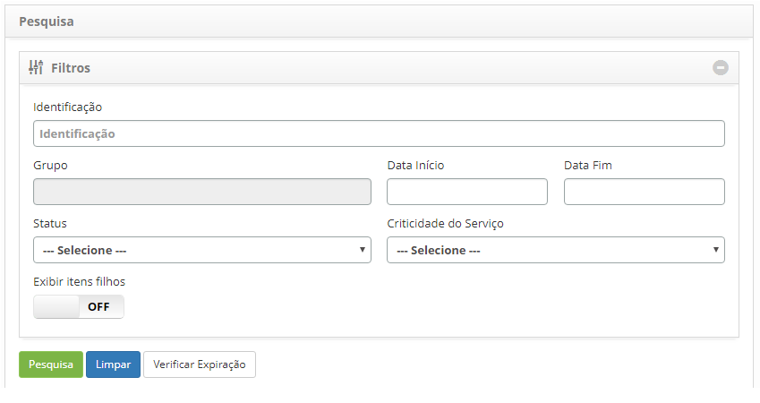
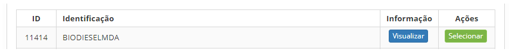

title: Pesquisa de itens de configuração
Description: Esta funcionalidade tem por objetivo realizar a busca de Itens de Configuração de acordo com filtros definidos.
# Pesquisa de itens de configuração

Esta funcionalidade tem por objetivo realizar a busca de Itens de Configuração de acordo com filtros definidos.

Como acessar
-------------

1. Acesse a funcionalidade de Pesquisa de Item de Configuração através da navegação no menu principal
**Processos ITIL > Gerência de Configuração > Pesquisa Item Config**.

Pré-condições
---------------

1. Não se aplica.

Filtros
---------

1. Os seguintes filtros possibilitam ao usuário restringir a participação de itens na listagem padrão da funcionalidade, facilitando
a localização dos itens desejados, conforme ilustrado na figura abaixo:

    - **Identificação**: informar a identificação do IC que deseja consultar;
    - **Grupo**: informar o grupo para consulta os ICs;
    - **Data Início**: informar a data inicial do registro IC;
    - **Data fim**: informar a data final do IC;
    - **Status**: informar o status do IC para consulta dos ICs referente ao status;
    - **Criticidade do Serviço**: informar a criticidade para consulta dos ICs referente à criticidade;
    - **Exibir itens filhos**: caso queira visualizar os ICs filhos, habilite o filtro.
    
2. Acesse a funcionalidade, após isso, será apresentada a tela de **Pesquisa de Item de Configuração**, conforme ilustrada na 
figura abaixo:

    
    
    **Figura 1 - Tela de filtros**
    
3. Defina os filtros conforme sua necessidade;

4. Após os filtros definidos, clique no botão "Pesquisar" para efetuar a busca dos ICs;

5. O botão "Verificar Expiração", ao ser acionado, verifica a data de expiração de licenças dos ICs e envia um e-mail de 
notificação para os responsáveis dos mesmos.

Listagem de itens
-------------------

1. Os seguintes campos cadastrais estão disponíveis ao usuário para facilitar a identificação dos itens desejados na listagem 
padrão da funcionalidade: **ID** e **Identificação**;

2. Existem botões de ação disponíveis ao usuário em relação a cada item da listagem, são eles: "Visualizar" e "Selecionar", 
conforme ilustrado abaixo:

    
    
    **Figura 2 - Tela de listagem de itens de configuração**
    
Preenchimeno dos campos cadastrais
-----------------------------------

1. Não se aplica.

!!! tip "About"

    <b>Product/Version:</b> CITSmart | 7.00 &nbsp;&nbsp;
    <b>Updated:</b>07/17/2019 – Larissa Lourenço
