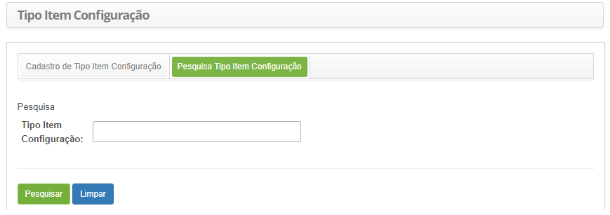
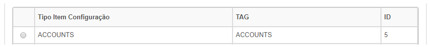
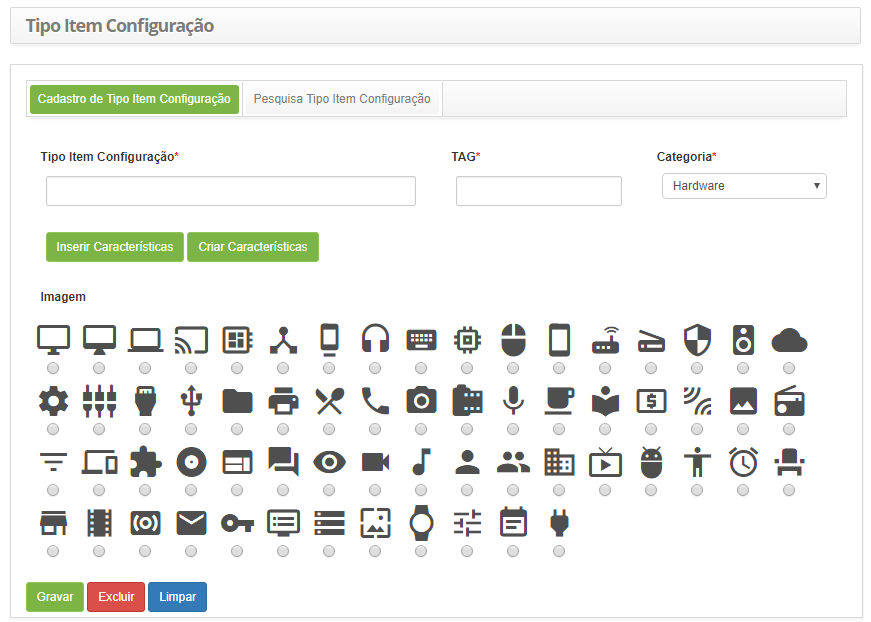

title: Cadastro e pesquisa de tipo de item de configuração
Description: Esta funcionalidade tem por objetivo registrar os tipos de Item de Configuração (IC).
# Cadastro e pesquisa de tipo de item de configuração

Esta funcionalidade tem por objetivo registrar os tipos de Item de Configuração (IC). 

Como acessar
--------------

1. Acesse a funcionalidade de tipos de item de configuração através da navegação no menu principal
**Processos ITIL > Gerência de Configuração > Tipo Item Configuração**.

Pré-condições
---------------

1. Cadastrar característica (ver conhecimento [Cadastro e pesquisa de característica](/pt-br/citsmart-platform-7/processes/configuration/characteristics.html)).

Filtros
---------

1. O seguinte filtro possibilita ao usuário restringir a participação de itens na listagem padrão da funcionalidade, 
facilitando a localização dos itens desejados:

    - Tipo Item Configuração.
    
2. Na tela de **Tipo Item Configuração**, clique na aba **Pesquisa de Tipo de Item de Configuração**. Será apresentada a tela de 
pesquisa conforme ilustrada na figura abaixo:

    
    
    **Figura 1 - Tela de pesquisa de tipo de item configuração**
    
3. Realize a pesquisa de tipo de item de configuração:

    - Informe o nome do tipo de item de configuração que deseja pesquisar e clique no botão "Pesquisar". Após isso, será
    exibido o registro do tipo de item de configuração conforme o nome informado;
    - Caso deseje listar todos os registros de tipo de item de configuração, basta clicar diretamente no botão "Pesquisar";
    
4. Após a pesquisa, selecione o registro desejado. Feito isso, será direcionado para a tela de cadastro exibindo o conteúdo 
referente ao registro selecionado;

5. Para alterar os dados do registro de tipo de item de configuração, basta modificar as informações dos campos desejados e 
clicar no botão "Gravar" para que seja gravada a alteração realizada no registro, onde a data, hora e usuário serão gravados 
automaticamente para uma futura auditoria.

Listagem de itens
-------------------

1. Os seguintes campos cadastrais estão disponíveis ao usuário para facilitar a identificação dos itens desejados na
listagem padrão da funcionalidade: **Tipo Item de Configuração, Tag** e **ID**.

**Figura 2 - Tela de lista de itens**

Preenchimento dos campos cadastrais
-------------------------------------

1. Será apresentada a tela de cadastro de tipo de item de configuração, conforme ilustrada na figura abaixo:

    
    
    **Figura 3 - Tela de cadastro de tipo de item configuração**
    
2. Preencha os campos conforme orientações abaixo:

    - **Tipo Item Configuração**: informe o nome do tipo de item de configuração;
    - **TAG**: informe a TAG que identificará o tipo de item de configuração;
    - **Categoria**: selecione a categoria do tipo de item de configuração;
    - Se desejar, adicione característica(s) do tipo de item de configuração;
    - Clique no botão "Inserir Características". Será exibida uma janela para pesquisa das características;
    - Realize a pesquisa e selecione a característica que condiz com o tipo de item de configuração. Feito isso, será 
    adicionado a característica no registro.
    - Caso não encontre o registro de característica, poderá realizar um cadastro rápido a partir dessa tela, basta clicar
    no botão "Criar Característica".
    - **Imagem**: selecione uma imagem que representará o tipo de item de configuração;
    
3. Clique no botão "Gravar" para efetuar o registro, onde a data, hora e usuário serão gravados automaticamente para uma
futura auditoria;

!!! tip "About"

    <b>Product/Version:</b> CITSmart | 7.00 &nbsp;&nbsp;
    <b>Updated:</b>07/16/2019 – Larissa Lourenço
