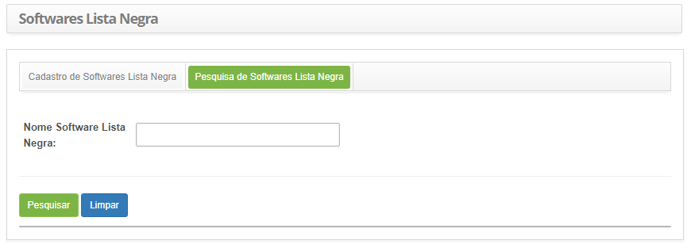
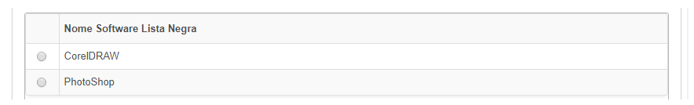

title: Cadastro e pesquisa de lista negra de software
Description: Esta funcionalidade tem por objetivo possibilitar a criação de Lista Negra de Softwares.
# Cadastro e pesquisa de lista negra de software

Esta funcionalidade tem por objetivo possibilitar a criação de Lista Negra de Softwares para que seja 
notificado os responsáveis sempre que detectada a instalação em alguma máquina da rede, onde esta será detectada no 
momento em que gerar o inventário.

Como acessar
-------------

1. Acesse a funcionalidade de lista negra de software através da navegação no menu principal 
**Processos ITIL > Gerência de Configuração > Softwares Lista Negra**.

Pré-condições
---------------

1. Não se aplica.

Filtros
---------

1. O seguinte filtro possibilita ao usuário restringir a participação de itens na listagem padrão da funcionalidade, facilitando a 
localização dos itens desejados, conforme ilustrado na figura abaixo:

    - Nome Software Lista Negra.
    
2. Na tela de **Softwares Lista Negra**, clique na aba **Pesquisa de Softwares Lista Negra**. Será apresentada a tela 
de pesquisa conforme ilustrada na figura abaixo:

    
    
    **Figura 1 - Tela de pesquisa de software para lista negra**
    
 3. Realize a pesquisa de software para lista negra;
 
    - Informe o nome do software para lista negra que deseja pesquisar e clique no botão 
    "Pesquisar". Após isso, será exibido o registro de software para lista negra conforme o nome informado;
 
    - Caso deseje listar todos os registros de software para lista negra, basta clicar diretamente no botão "Pesquisar";
 
Listagem de itens
-------------------

1. O seguinte campo cadastral está disponível ao usuário para facilitar a identificação dos itens desejados na listagem 
padrão da funcionalidade: **Nome**.

    
    
    **Figura 2 - Tela de itens**
    
2. Após a pesquisa, selecione o registro desejado. Feito isso, será direcionado para a tela de cadastro exibindo o 
conteúdo referente ao registro selecionado;

3. Para alterar os dados do registro de software para lista negra, basta modificar as informações dos campos desejados
e clicar no botão "Gravar" para que seja gravada a alteração realizada no registro, onde a data, hora e usuário serão gravados
automaticamente para uma futura auditoria.

Preenchimento dos campos cadastrais
-------------------------------------

1. Será apresentada a tela de cadastro de software para lista negra, conforme ilustrada na figura abaixo:

    
    
    **Figura 3 - Tela de cadastro de software para lista negra**
    
2. Preencha os campos conforme orientações abaixo:

    - **Nome Software Lista Negra**: informe o nome do software.
    
3. Clique no botão "Gravar" para efetuar o registro, onde a data, hora e usuário serão gravados automaticamente 
ara uma futura auditoria.

!!! tip "About"

    <b>Product/Version:</b> CITSmart | 7.00 &nbsp;&nbsp;
    <b>Updated:</b>07/16/2019 – Larissa Lourenço
