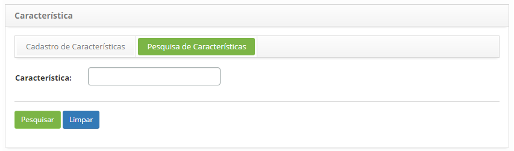
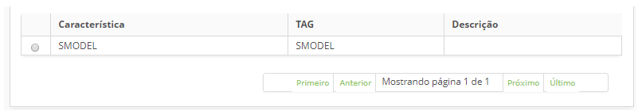
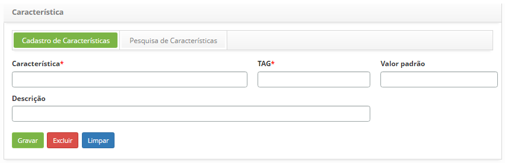

title: Cadastro e pesquisa de característica
Description: Esta funcionalidade tem por objetivo registrar as características do Item de Configuração (IC).
# Cadastro e pesquisa de característica

Esta funcionalidade tem por objetivo registrar as características do Item de Configuração (IC).

Como acessar
--------------

1. Acesse a funcionalidade através da navegação no menu principal 
**Processos ITIL > Gerência de Configuração > Característica**.

Pré-condições
---------------

1. Não se aplica.

Filtros
---------

1. O seguinte filtro possibilita ao usuário restringir a participação de itens na listagem padrão da funcionalidade, 
facilitando a localização dos itens desejados, conforme ilustrado na figura abaixo:

    - Característica.
    
2. Na tela de **Característica**, clique na aba **Pesquisa de Características**. 
Será apresentada a tela de pesquisa conforme ilustrada na figura abaixo:

    
    
    **Figura 1- Tela de pesquisa de característica**
    
3. Realize a pesquisa de característica:

    - Informe o nome da característica que deseja pesquisar e clique no botão "Pesquisar". 
    Após isso, será exibido o registro da característica conforme o nome informado;
    
    - caso deseje listar todos os registros de característica, basta clicar diretamente no botão "Pesquisar";
    
Listagem de itens
-------------------

1. Os seguintes campos cadastrais estão disponíveis ao usuário para facilitar a identificação dos itens 
desejados na listagem padrão da funcionalidade: **Característica, Tag** e **Descrição**.

    
    
    **Figura 2 - Tela de listagem de característica**
    
2. Após a pesquisa, selecione o registro desejado. Feito isso, será direcionado para a tela de 
cadastro exibindo o conteúdo referente ao registro selecionado;

3. Para alterar os dados do registro de característica, basta modificar as informações dos campos desejados
e clicar no botão "Gravar" para que seja gravada a alteração realizada no registro, onde a data, hora e usuário
serão gravados automaticamente para uma futura auditoria. 

Preenchimento dos campos cadastrais
-------------------------------------

 1. Acesse a funcionalidade, após isso, será apresentada a tela de **Cadastro de Característica**, 
 conforme ilustrada na figura abaixo:
 
     
     
     **Figura 3 - Tela de cadastro de característica**
     
 2. Preencha os campos conforme orientações abaixo:
 
     - **Característica**: informe o nome da característica;
     - **TAG**: informe a TAG para identificação da característica;
     - **Valor padrão**: informar um valor para identificação da característica;
     
    !!! abstract "SAIBA MAIS"
     
        O valor padrão possibilita especificar alguma grandeza com características iguais de diversos tipos de itens de 
         configuração.
         
     - **Descrição**: informe a descrição da característica;
     
 3. Clique no botão "Gravar" para efetuar o registro, onde a data, hora e usuário serão gravados
 automaticamente para uma futura auditoria.
 
!!! tip "About"

    <b>Product/Version:</b> CITSmart | 7.00 &nbsp;&nbsp;
    <b>Updated:</b>07/16/2019 – Larissa Lourenço
