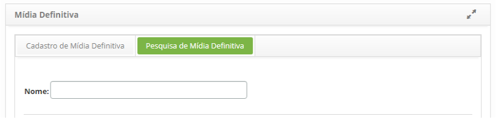
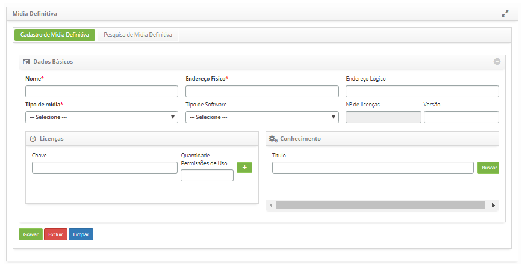

title: Cadastro e pesquisa de mídia definitiva
Description: Esta funcionalidade tem por objetivo registrar as versões definitivas e autorizadas de todos 
# Cadastro e pesquisa de mídia definitiva

Esta funcionalidade tem por objetivo registrar as versões definitivas e autorizadas de todos os Itens de
Configuração (ICs) de Software de maneira segura.

Pode conter itens de configuração associados com licenças e documentação.

Como acessar
--------------

1. Acesse a funcionalidade de mídia definitiva através da navegação no menu principal 
**Processos ITIL > Gerência de Configuração > Mídia Software**.

Pré-condições
----------------

1. Não se aplica.

Filtros
---------

1. O seguinte filtro possibilita ao usuário restringir a participação de itens na listagem padrão da funcionalidade, 
facilitando a localização dos itens desejados, conforme ilustrado na figura abaixo:

    - Nome.
    
2. Na tela de **Mídia Definitiva**, clique na aba **Pesquisa de Mídia Definitiva**. Será apresentada a tela de pesquisa 
conforme ilustrada na figura abaixo:

    
    
    **Figura 1 - Tela de pesquisa de mídia definitiva**
    
3. Realize a pesquisa de mídia definitiva:

    - Informe o nome da mídia definitiva que deseja pesquisar e clique no botão "Pesquisar". Após isso, 
    será exibido o registro da mídia definitiva conforme o nome informado;
    
    - Caso deseje listar todos os registros de mídia definitiva, basta clicar diretamente no botão "Pesquisar";

Listagem de itens
-------------------

1. O seguinte campo cadastral está disponível para o usuário para facilitar a identificação dos elementos desejados
na lista padrão de funcionalidade: **Nome**.

    
    
    **Figura 2 - Tela de listagem de mídia definitiva**
    
2. Após a pesquisa, selecione o registro desejado. Feito isso, será direcionado para a tela de cadastro exibindo o 
conteúdo referente ao registro selecionado;

3. Para alterar os dados do registro de mídia definitiva, basta modificar as informações dos campos desejados e 
clicar no botão "Gravar" para que seja gravada a alteração realizada no registro, onde a data, hora e usuário serão gravados
automaticamente para uma futura auditoria.

Preenchimento dos campos cadastrais
-------------------------------------

1. Acesse a funcionalidade, após isso, será apresentada a tela de **Cadastro de Mídia Definitiva**, conforme ilustrada na 
figura abaixo:

    
    
    **Figura 3 - Tela de cadastro de mídia definitiva**
    
2. Preencha os campos conforme orientações abaixo:

    - **Nome**: informe o nome da mídia;
    - **Endereço Físico**: informe o endereço físico da mídia;
    - **Endereço Lógico**: informe o endereço lógico da mídia;
    - **Tipo de mídia**: selecione o tipo de mídia;
    - **Tipo de Software**: informe o tipo de software;
    - **Nº de licenças**: esse campo é para simples conferência, será exibido a quantidade de licenças da mídia, após adicionar
    as chaves (licenças);
    - **Versão**: informe a versão da mídia;
    - Adicione as licenças da mídia definitiva;
    - **Chave**: informe a chave da mídia definitiva;
    - **Quantidade Permissões de Uso**: informe a quantidade permitida de uso da chave da mídia;
    - Clique no ícone  para adição de licença.
    
3. Relacione um conhecimento à mídia definitiva;

    - Informe o nome do conhecimento desejado e clique no botão "Buscar" para busca do mesmo. Será exibida uma janela 
    apresentando o resultado, basta clicar no botão "Selecionar" do conhecimento para vinculá-lo à mídia definitiva.
    
4. Clique no botão "Gravar" para efetuar o registro, onde a data, hora e usuário serão gravados automaticamente para uma 
futura auditoria.

!!! tip "About"

    <b>Product/Version:</b> CITSmart | 7.00 &nbsp;&nbsp;
    <b>Updated:</b>07/16/2019 – Larissa Lourenço

