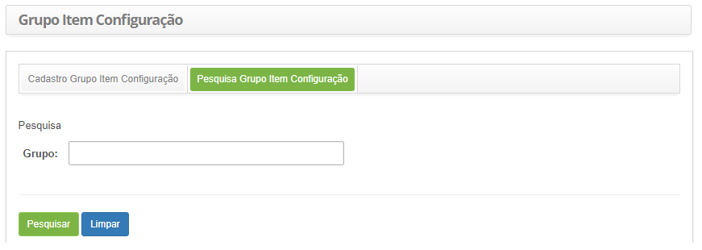
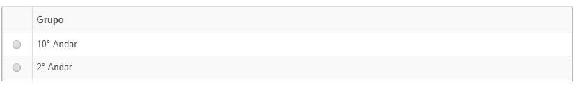
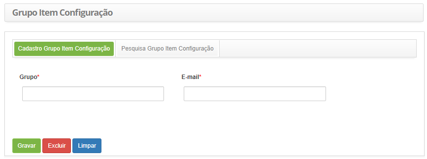

title: Cadastro e pesquisa de grupo de item de configuração
Description: Esta funcionalidade tem por objetivo registrar grupos de item de configuração.
# Cadastro e pesquisa de grupo de item de configuração

Esta funcionalidade tem por objetivo registrar grupos de item de configuração.

Como acessar
--------------

1. Acesse a funcionalidade de grupo de item de configuração através da navegação no menu principal 
**Processos ITIL > Gerência de Configuração > Grupo de Item Configuração**.

Pré-condições
----------------

1. Não se aplica.

Filtros
----------

1. O seguinte filtro possibilita ao usuário restringir a participação de itens na listagem padrão da 
funcionalidade, facilitando a localização dos itens desejados:

    - Grupo.
    
    
    
    **Figura 1 - Tela de pesquisa de grupo de Item de configuração**
    
2. Realize a pesquisa de grupo de item de configuração;

    - Informe o nome do grupo de item de configuração que deseja pesquisar e clique no botão "Pesquisar". 
    Após isso, será exibido o registro do grupo de item de configuração conforme o nome informado;
    - Caso deseje listar todos os registros de grupo de item de configuração, basta clicar diretamente no botão "Pesquisar".
    
3. Após a pesquisa, selecione o registro desejado. Feito isso, será direcionado para a tela de cadastro exibindo o 
conteúdo referente ao registro selecionado.

Listagem de itens
--------------------

1. O seguinte campo cadastral está disponível ao usuário para facilitar a identificação dos itens desejados na listagem 
padrão da funcionalidade: **Grupo**.

    
    
    **Figura 2 - Listagem de grupo item de configuração**
    
2. Para alterar os dados do registro de grupo de item de configuração, basta modificar as informações dos campos desejados
e clicar no botão "Gravar" para que seja gravada a alteração realizada no registro, onde a data, hora e usuário serão gravados
automaticamente para uma futura auditoria.

Preenchimento dos campos cadastrais
------------------------------------

1. Será apresentada a tela de cadastro de grupo de item de configuração, conforme ilustrada na figura abaixo:

    
    
    **Figura 3 - Tela de cadastro de grupo de item de configuração**
    
2. Preencha os campos conforme orientações abaixo:

    - Grupo: informe o nome do grupo de item de configuração;
    - E-mail: informe o e-mail do grupo;
    
3. Clique no botão "Gravar" para efetuar o registro, onde a data, hora e usuário serão gravados automaticamente
para uma futura auditoria.

!!! tip "About"

    <b>Product/Version:</b> CITSmart | 7.00 &nbsp;&nbsp;
    <b>Updated:</b>07/16/2019 – Larissa Lourenço
