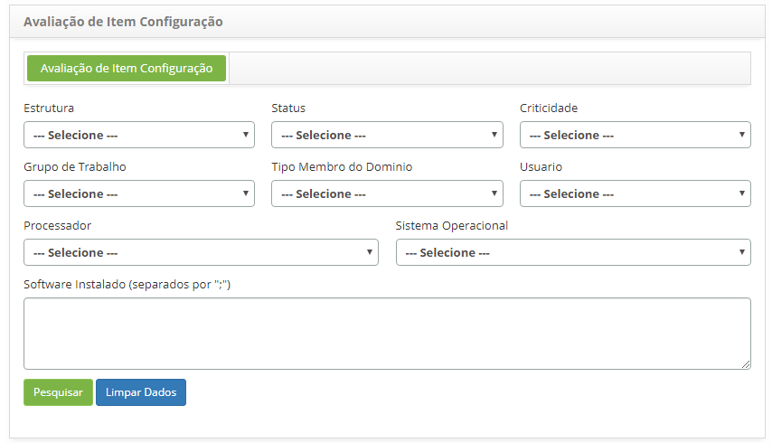

title: Verificação de itens de configuração capturados pelo inventory (agente)
Description: Esta funcionalidade tem por objetivo apresentar os detalhes dos Itens de Configuração coletados pela rotina de
inventário.
# Verificação de itens de configuração capturados pelo inventory (agente)

Esta funcionalidade tem por objetivo apresentar os detalhes dos Itens de Configuração coletados pela rotina de inventário.

Como acessar
--------------

1. Acesse a funcionalidade de Visualização de Ativos através da navegação no menu principal 
**Processos ITIL > Gerência de Configuração > Visualização de Ativos**.

Pré-condições
---------------

1. Não se aplica.

Filtros
---------

1. Os seguintes filtros possibilitam ao usuário restringir a participação de itens na listagem padrão da funcionalidade, 
facilitando a localização dos itens desejados:

    - Estrutura;
    - Status;
    - Criticidade;
    - Grupo de Trabalho;
    - Tipo Membro do Domínio;
    - Usuário;
    - Processador;
    - Sistema Operacional;
    - Software Instalado.
    
2. Será apresentada a tela de **Avaliação de Item de Configuração**. Nesta tela, contém filtros onde poderá defini-los de acordo 
com sua necessidade para busca dos Itens de Configuração que foram capturados pela rotina de inventário. Defina os filtros e 
clique no botão "Pesquisar". A figura abaixo ilustra essa tela:

**Figura 1 - Tela de Pesquisa de Item de configuração capturados pela rotina de inventário**

Listagem de itens
------------------

1. Os seguintes campos cadastrais estão disponíveis ao usuário para facilitar a identificação dos itens desejados na listagem 
padrão da funcionalidade: **Equipamento, Descrição, IP, Último Inventário, Sistema Operacional** e **Storages**.

2. Serão exibidos os ICs conforme exemplo ilustrado na figura abaixo:

    
    
    **Figura 2 - Itens de configuração capturados pela rotina de inventário**
    
3. Para verificar as informações de configuração da rede do IC, clique no ícone  do mesmo.

4. Para verificar os softwares do IC, clique no ícone do mesmo.

Preenchimento dos campos cadastrais
------------------------------------

1. Não se aplica.

!!! tip "About"

    <b>Product/Version:</b> CITSmart | 7.00 &nbsp;&nbsp;
    <b>Updated:</b>07/17/2019 – Larissa Lourenço
