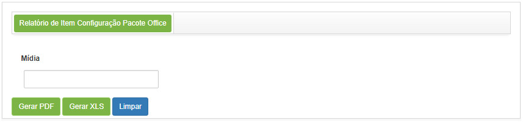
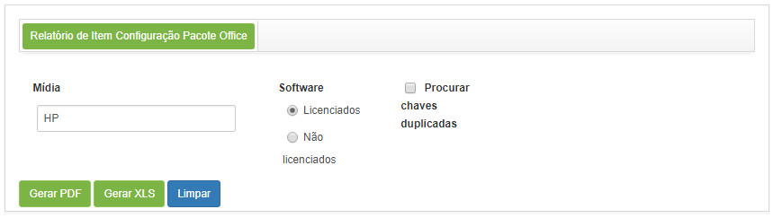
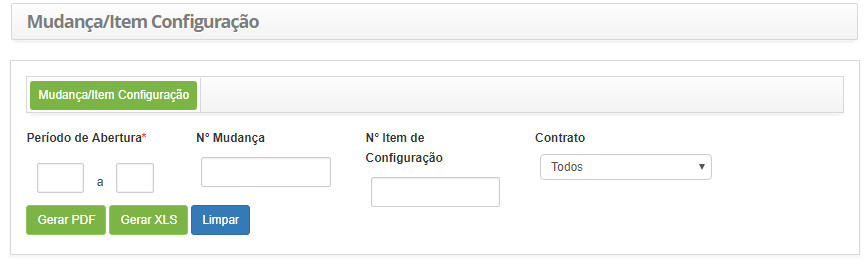

title:  Geração de relatórios - Gerência de Configurações
Description: Esse relatório tem o objetivo de apresentar as chaves (licenças) válidas, inválidas e duplicadas das mídias. 
# Geração de relatórios - Gerência de Configurações

Gerando relatório de item de configuração Pacote Office
-----------------------------------------------------------

Esse relatório tem o objetivo de apresentar as chaves (licenças) válidas, inválidas e duplicadas das mídias.

 *Como acessar* 

1. Acesse a funcionalidade de Relatório de Item de Configuração Pacote Office através da navegação no menu principal
**Relatórios > Gerência de Configurações > Relatório Item Configuração Pacote Office**.

 *Filtros*

1. Os seguintes filtros possibilitam ao usuário restringir a participação de itens na listagem padrão da funcionalidade, 
facilitando a localização dos itens desejados:

    - Nome;
    - Software;
    - Procurar chaves.
    
    
    
    **Figura 1 - Tela de geração de relatório de item configuração - Pacote Office**

2. Informe a mídia desejada para gerar o relatório. Após isso, serão exibidos os campos para filtrar as chaves (licenças) válidas,
inválidas e duplicadas;

    
    
    **Figura 2 - Filtros para geração do relatório de item de configuração - Pacote Office**
    
    - **Software**: selecione a opção que deseja verificar;
    - **Procurar chaves duplicadas**: marque esta opção caso queira verificar as chaves duplicadas relacionadas à mídia.
    
    !!! note "NOTA"
    
        As chaves licenciadas (válidas) serão consideradas as que estiverem registradas no cadastro de mídia.
        
Gerando relatório de mudança/item de configuração
----------------------------------------------------

Esse relatório tem o objetivo de fornecer as informações das diferentes requisições de mudança relacionadas ao mesmo item de 
configuração.

*Como acessar*

1. Acesse a funcionalidade de Relatório de Mudança/Item de Configuração através da navegação no menu principal 
**Relatórios > Gerência de Configurações > Mudança/Item Configuração**.

*Filtros*

1. Os seguintes filtros possibilitam ao usuário restringir a participação de itens na listagem padrão da funcionalidade, 
facilitando a localização dos itens desejados:

    - **Período de Abertura**: informe o período que deseja gerar o relatório;
    - **Nº Mudança**: informe o número de identificação da mudança;
    - **Nº Item de Configuração**: informe o número de identificação do item de configuração
    - **Contrato**: selecione o contrato desejado.
    
2. Será apresentada a tela de **Geração de Relatório de Mudança/Item de Configuração**, conforme ilustrada na figura a seguir:

    
    
    **Figura 3 - Tela de geração de relatório de mudança/item configuração**
    
3. Defina os filtros conforme sua necessidade.

!!! tip "About"

    <b>Product/Version:</b> CITSmart | 7.00 &nbsp;&nbsp;
    <b>Updated:</b>08/02/2019 - Larissa Lourenço

