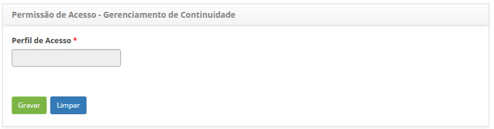
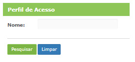
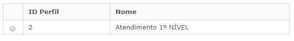

title:  Permissão de acesso do gerenciamento de continuidade
Description: Tem por objetivo definir quem terá acesso às funcionalidades do gerenciamento de continuidade. 
# Permissão de acesso do gerenciamento de continuidade

Esta funcionalidade tem por objetivo definir quem terá acesso às funcionalidades do gerenciamento de continuidade e qual tipo de 
acesso é permitido (leitura, gravação e/ou exclusão).

Como acessar
---------------

1. Acesse a funcionalidade de permissão de acesso de gerenciamento de continuidade através da navegação no menu principal 
**Permissão de Acesso > Gerência de Continuidade**.

Pré-condições
---------------

1. Cadastrar perfil de acesso (ver conhecimento [Cadastro e pesquisa de perfil de acesso][1]);

Filtros
---------

1. O seguinte filtro possibilita ao usuário restringir a participação de itens na listagem padrão da funcionalidade, facilitando a 
localização dos itens desejados:

    - Nome
    
2. Será apresentada a tela para definição da permissão de acesso, conforme ilustrada na figura abaixo:

    
    
    **Figura 1 - Tela de permissão de acesso de gerenciamento de continuidade**
    
    - Ao clicar em Perfil de Acesso, será aberta uma aba de pesquisa do mesmo, conforme a figura abaixo:
    
    
    
    **Figura 2 - Tela de pesquisa de acesso de gerenciamento de continuidade**
    
    - Informe o perfil de acesso para aplicar o tipo de acesso que o mesmo terá;
    
3. Para cada funcionalidade do gerenciamento de continuidade defina as ações (pesquisar, gravar e/ou excluir) que o perfil poderá 
realizar;

4. Clique no botão "Gravar" para efetuar o registro, onde a data, hora e usuário serão gravados automaticamente para uma futura
auditoria.

Listagem de itens
--------------------

1. Os seguintes campos cadastrais estão disponíveis ao usuário para facilitar a identificação dos itens desejados na listagem
padrão da funcionalidade: **ID Perfil** e **Nome**.

    
    
    **Figura 3 - Tela de listagem de acesso de gerenciamento de continuidade**
    
Preenchimento dos campos cadastrais
------------------------------------

1. Não se aplica.

!!! tip "About"

    <b>Product/Version:</b> CITSmart | 7.00 &nbsp;&nbsp;
    <b>Updated:</b>08/05/2019 - Larissa Lourenço

[1]:/pt-br/citsmart-platform-7/initial-settings/access-settings/profile/user-profile.html
