title: Gerenciamento de continuidade
Description: O Gerenciamento de Continuidade foca em recuperar os serviços de TI e seus componentes diante de um evento de desastre.
# Gerenciamento de continuidade

O Gerenciamento de Continuidade foca em recuperar os serviços de TI e seus componentes diante de um evento de desastre.

Pré-condições
--------------

1. Cadastrar categoria de ameaça (ver conhecimento Cadastro e pesquisa de categoria de ameaça);

2. Cadastrar ameaça (ver conhecimento Cadastro e pesquisa de ameaça);

3. Vincular a categoria de ameaça a ameaça cadastrada;

4. Cadastrar categoria de risco (ver conhecimento Cadastro e pesquisa de categoria de risco);

5. Cadastrar risco (ver conhecimento Cadastro e pesquisa de risco de continuidade);

6. Cadastrar cliente (ver conhecimento Cadastro e pesquisa de cliente);

7. Cadastrar colaborador (ver conhecimento Cadastro e pesquisa de colaborador);

8. Cadastrar ações automáticas de Incidente, Requisição e Procedimentos referente ao Gerenciamento de Eventos (ver conhecimento
Cadastro e pesquisa de ações automáticas);

9. Cadastrar na base de conhecimento documento do tipo Medida de Recuperação (ver conhecimento Gerenciamento de conhecimento).

Como acessar
---------------

1. Acesse a funcionalidade pelo menu principal **Processos ITIL > Gerência de Continuidade > Gerenciamento de Continuidade**.

Registrando continuidade de serviço
------------------------------------

1. Na tela de **Gerenciamento de Continuidade**, clique no botão "Registro de Continuidade", conforme indicado na figura abaixo:

    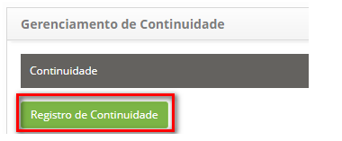
    
    **Figura 1 - Botão registro de continuidade**
    
2. Será apresentada a tela de **Cadastro de Continuidade**, conforme ilustrada na figura abaixo:

    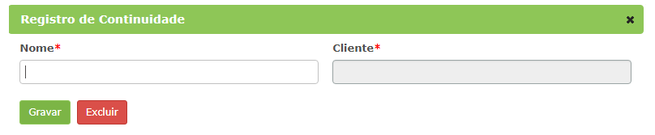
    
    **Figura 2 - Tela de cadastro de continuidade**
    
    - **Nome**: defina o nome da continuidade do serviço;
    - **Cliente**: informe o cliente da continuidade do serviço;
    - Após informar os dados da continuidade do serviço, clique no botão "Gravar" para efetuar o registro. A figura abaixa 
    apresenta a **Continuidade do Serviço** depois de registrada:
    
    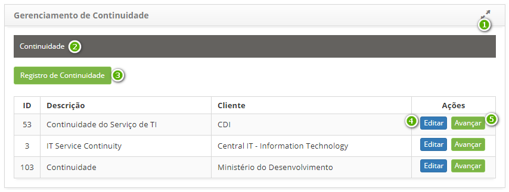
    
    **Figura 3 - Tela de gerenciamento de continuidade**
    
     : amplia a tela de Gerenciamento de Continuidade;
    
     **Barra de Navegação**: permite navegar entre os dados da continuidade;
    
     **Botão Registro de Continuidade**: permite registrar uma nova continuidade de serviços;
    
     **Editar Continuidade**: permite editar os dados do registro de continuidade;
    
     **Avançar Continuidade**: permite acessar a continuidade de serviços.
    
- Para alterar os dados do registro de continuidade de serviço, clique no botão "Editar", altere os dados e clique em "Salvar"
para fazer a alteração, onde a data, a hora e o usuário serão salvos automaticamente para uma auditoria futura.

- Para excluir o registro de continuidade do serviço, selecione a continuidade do serviço desejada, clique em "Editar" e, em 
seguida, clique no botão "Excluir" dados para executar a operação.

- Após registrar a continuidade, clique no botão "Avançar" para acessá-la. A tela Gerenciamento de Continuidade de Serviço será 
então exibida.

Iniciação
-----------

1. Após o registro da Continuidade de Serviço de TI, clique em Avançar da mesma para acessá-la;

2. Será apresentada a tela de informações de Continuidade do Serviço de TI, clique na fase de Iniciação, nesta fase é definido
a política, escopo e projeto. Feito isso, será apresentada a tela onde poderá registrar as informações necessárias dessa fase, 
conforme ilustrada na figura abaixo:

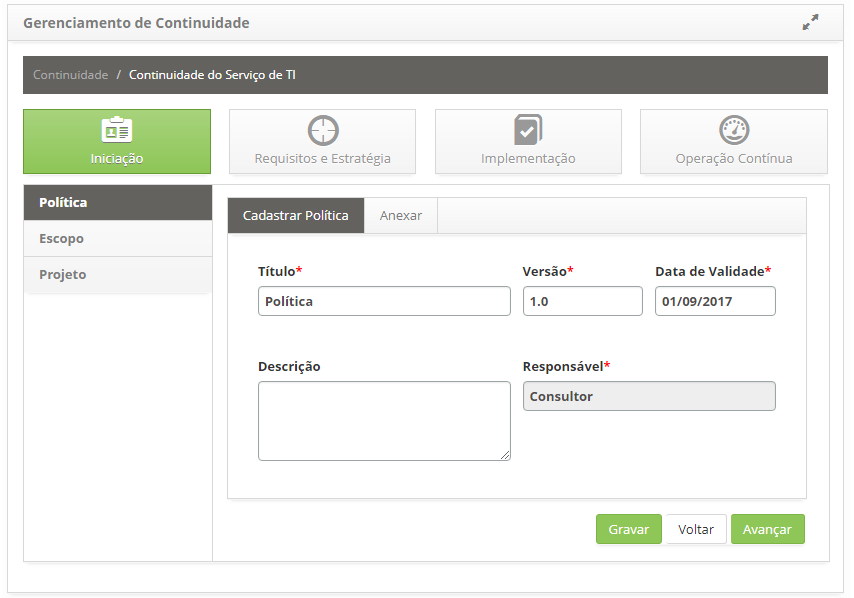

**Figura 4 - Fase de iniciação da continuidade do serviço de TI**

Definindo política
--------------------

A política deve ser definida e comunicada o mais cedo possível para que todos os membros da organização envolvidos ou afetados
pela continuidade de negócio sejam conscientizados sobre suas responsabilidades para suportar o Gerenciamento de Continuidade 
do Serviço de TI (GCSTI) de acordo com os objetivos da política.

1. Na tela de **Gerenciamento de Continuidade**, na fase de **Iniciação**, clique na guia **Política**. Feito isso, será 
apresentada a respectiva tela de cadastro de política, conforme ilustrada na figura abaixo:

    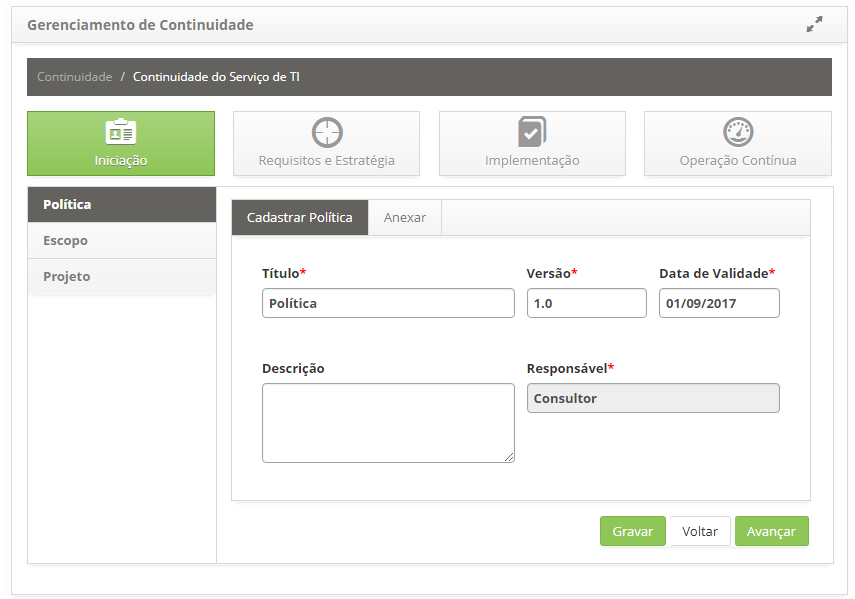
    
    **Figura 5 - Tela de registro de política**
    
2. Preencha os campos conforme orientações abaixo:

    - **Título**: informe o título da política;
    - **Versão**: informe a versão da política;
    - **Data de Validade**: informe a data de validade da política;
    - **Descrição**: descreva os detalhes da política;
    - **Responsável**: informe o responsável pela política;
    - Após informar os dados e caso queira anexar um arquivo, clique na aba **Anexar**. Será exibida a tela para anexo de 
    arquivos conforme ilustrada na figura abaixo:
    
    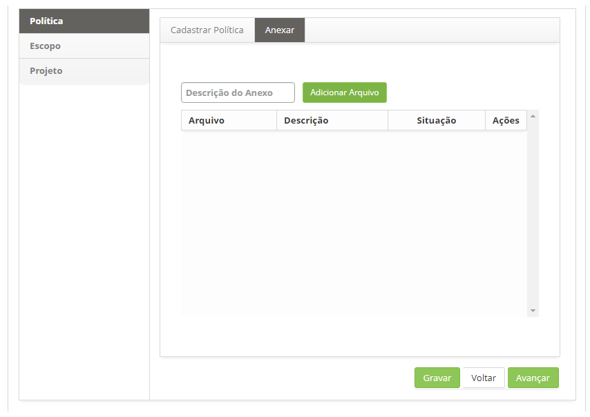
    
    **Figura 6 - Tela de anexo de arquivos**
    
    - Informe a descrição para o arquivo que será anexado, clique no botão "Adicionar Arquivo" e selecione o arquivo desejado. 
    Após isso, o arquivo será anexado e apresentado na tela de anexo da política, conforme exemplo ilustrado na figura abaixo:
    
    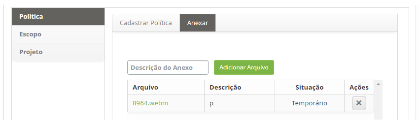
    
    **Figura 7 - Arquivo de política anexado**
    
3. Após a definição da política, clique no botão "Gravar" para efetuar o registro, onde a data, hora e usuário serão gravados 
automaticamente para uma futura auditoria;

4. O botão "Avançar", ao ser acionado, avança para a próxima etapa da fase de iniciação.

Registrando escopo
---------------------

Definição do escopo e responsabilidades das equipes cobrindo as atividades do processo como avaliação de risco, Análise de
impacto do Negócio (AIN), determinação dos controles de acordo com os requisitos dos clientes e regulatórios, considerando os
pontos de auditoria e conformidade com a ISO 27001.

1. Na tela de **Gerenciamento de Continuidade**, na fase de **Iniciação**, clique na guia **Escopo**. Feito isso, será apresentada
a respectiva tela de cadastro de escopo, conforme ilustrada na figura abaixo:

    
    
    **Figura 8 - Tela de registro de escopo**
    
2. Preencha os campos conforme orientações abaixo:

    - **Sumário Executivo**: descreva um resumo sobre o plano de negócio da organização;
    - **Descrição**: descreva os detalhes do escopo da continuidade do serviço;
    - **Data de Validade**: informe a data de validade do escopo da continuidade do serviço;
    - Após informar os dados e caso queira anexar um arquivo, clique na aba **Anexar**. Será exibida a tela para anexo de 
    arquivos conforme ilustrada na figura abaixo:
    
    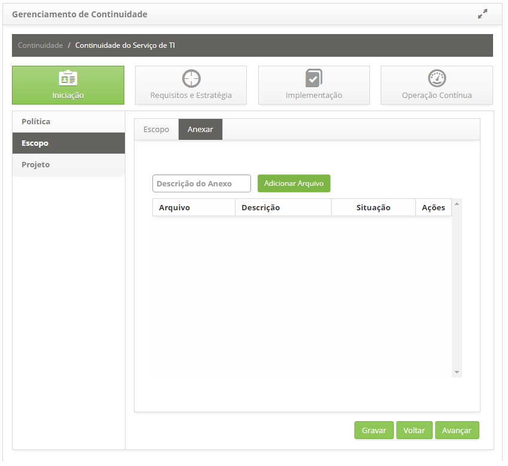
    
    **Figura 9 - Tela de anexo de arquivos**
    
    - Informe a descrição para o arquivo que será anexado, clique no botão "Adicionar Arquivo" e selecione o arquivo desejado. 
    Após isso, o arquivo será anexado e apresentado na tela de anexo do escopo, conforme exemplo ilustrado na figura abaixo:
    
    
    
    **Figura 10 - Arquivo de escopo anexado**
    
3. Após registro das informações do escopo, clique no botão "Gravar" para efetuar o registro, onde a data, hora e usuário serão
gravados automaticamente para uma futura auditoria;

4. O botão "Voltar", ao ser acionado, retorna para a etapa anterior da fase de iniciação;

5. O botão "Avançar", ao ser acionado, avança para a próxima etapa da fase de iniciação.

Definindo projeto
-------------------

1. Na tela de **Gerenciamento de Continuidade**, na fase de **Iniciação*8, clique na guia **Projeto**. Feito isso, será 
apresentada a tela de definição do projeto, conforme ilustrada na figura abaixo:

    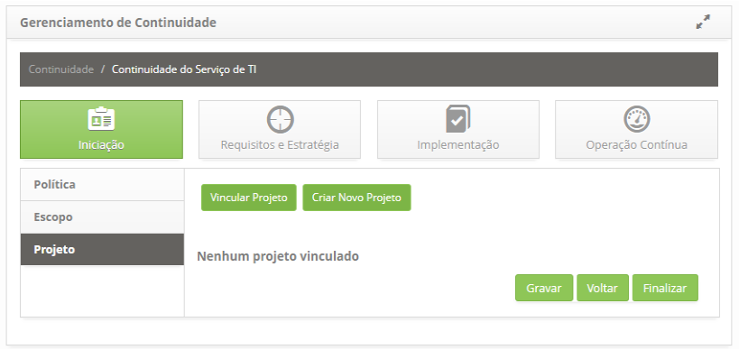
    
    **Figura 11 - Tela de vínculo de projeto**
    
2. Clique no botão "Vincular Projeto" para relacionar um projeto já existente à continuidade do serviço. Feito isso, será exibida 
a tela de pesquisa do projeto. Realize a pesquisa e selecione o projeto desejado para efetuar a operação. Após isso, será 
apresentado o registro de projeto conforme exemplo ilustrado na figura abaixo:

    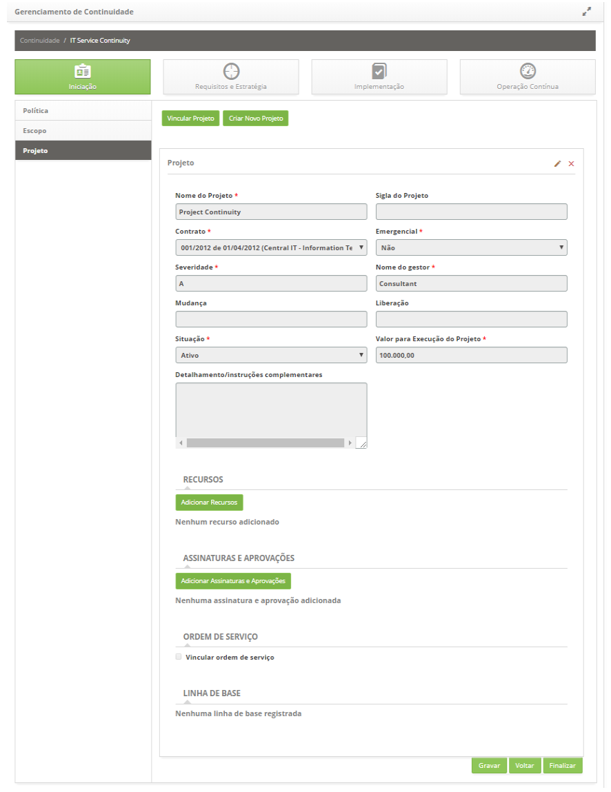
    
    **Figura 12 - Registro de projeto**
    
    - Caso seja necessário a criação de um novo projeto, poderá registrá-lo a partir dessa tela, basta clicar no botão 
    "Criar Novo Projeto".
    - Para alterar os dados do projeto, basta clicar no ícone  do mesmo, localizado 
    no canto superior esquerdo.
    
3. Após definição do projeto, clique no botão "Gravar" para efetuar o registro, onde a data, hora e usuário serão gravados
automaticamente para uma futura auditoria;

4. O botão "Voltar", ao ser acionado, retorna para a etapa anterior da fase de iniciação;

5. O botão "Avançar", ao ser acionado, avança para a próxima etapa da fase de iniciação.

Requisitos e estratégia
--------------------------

1. Será apresentada a tela de informações de **Continuidade do Serviço de TI**, clique na fase de **Requisitos e Estratégia**, 
nesta fase é definido as funções vitais, análise de impacto no negócio, avaliação de riscos e estratégia de continuidade. Feito 
isso, será apresentada a tela onde poderá registrar as informações necessárias dessa fase, conforme ilustrada na figura abaixo:

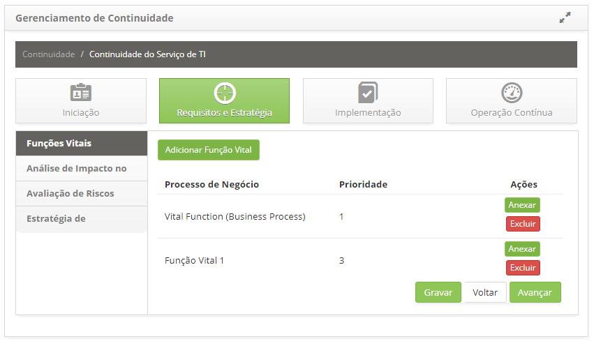

**Figura 13 - Fase de requisitos e estratégia da continuidade do serviço de TI**

Registrando funções vitais
----------------------------

1. Na tela de **Gerenciamento de Continuidade**, na fase de **Requisitos e Estratégia**, clique na guia **Funções Vitais**. Feito 
isso, será apresentada a tela de cadastro de funções vitais, conforme ilustrada na figura abaixo:

    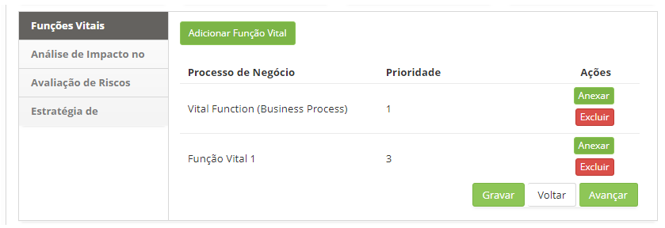
    
    **Figura 14 - Tela de adição de função vital**
    
2. Clique no botão "Adicionar Função Vital" para adicionar o(s) processo(s) de negócio. Feito isso, será exibida a tela de 
pesquisa do processo de negócio. Realize a pesquisa, selecione o(s) processo(s) desejado(s) e clique no botão "Enviar" para 
efetuar a operação. Após isso, será(ão) adicionado(s) na tela o(s) registro(s) de processo de negócio, conforme exemplo ilustrado 
na figura abaixo:

    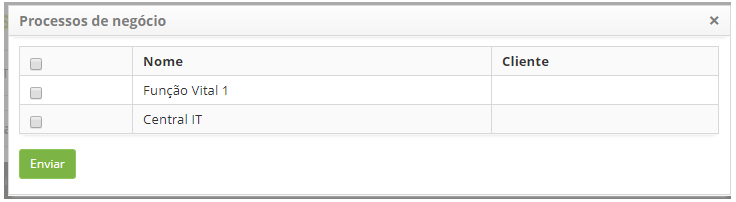
    
    **Figura 15 - Registro de função vital**
    
3. Após definição das funções vitais, clique no botão "Gravar" para efetuar o registro, onde a data, hora e usuário serão 
gravados automaticamente para uma futura auditoria. Após a gravação do registro, será apresentado o botão "Anexar" para anexo de 
arquivos referente a função vital, conforme ilustrado na figura abaixo:

    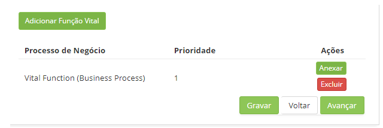
    
    **Figura 16 - Registro de função vital**
    
4. O botão "Avançar", ao ser acionado, avança para a próxima etapa da fase de requisitos e estratégia.

Registrando análise de impacto no negócio
--------------------------------------------

1. Na tela de **Gerenciamento de Continuidade**, na fase de **Requisitos e Estratégia**, clique na guia **Análise de Impacto no 
Negócio**. Feito isso, será apresentada a tela para adição da função vital no intuito de registrar as características do impacto 
no negócio, conforme ilustrada na figura abaixo:

    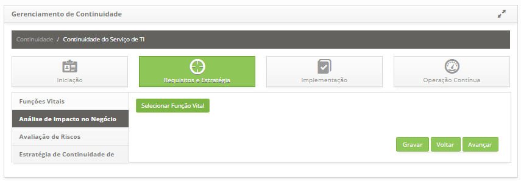
    
    **Figura 17 - Tela de adição de função vital**
    
2. Clique no botão "Selecionar Função Vital" para adicionar a função vital à análise de impacto do negócio. Feito isso, será 
exibida a tela de pesquisa de funções vitais. Realize a pesquisa e selecione a função vital que desejar. Após isso, será 
adicionada na tela a função vital, clique no ícone  da mesma para registro das informações 
da análise de impacto no negócio, conforme exemplo ilustrado na figura abaixo:

    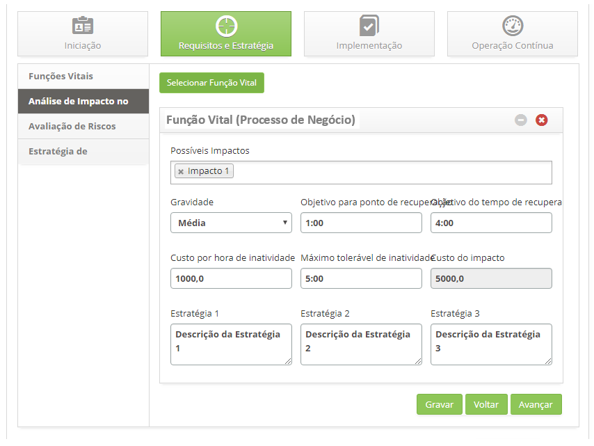
    
    **Figura 18 - Tela de registro de impacto no negócio**
    
    - **Possíveis Impactos**: informe os possíveis impactos ao negócio;
    - **Gravidade**: selecione a gravidade ao negócio;
    - **Objetivo para ponto de recuperação**: informe o tempo que começará a recuperação do serviço;
    - **Objetivo do tempo de recuperação**: informe o tempo esperado para recuperação do serviço;
    - **Custo por hora de inatividade**: defina o custo por hora quando houver indisponibilidade dessa função vital;
    - **Máximo tolerável de inatividade**: informe o tempo máximo que o serviço poderá ficar inativo;
    - **Custo do impacto**: defina o custo do impacto quando houver indisponibilidade dessa função vital;
    - **Estratégia 1**: descreva a primeira estratégia para continuidade do serviço;
    - **Estratégia 2**: descreva a segunda estratégia para continuidade do serviço;
    - **Estratégia 3**: descreva a terceira estratégia para continuidade do serviço.
    
3. Após informar as características do impacto no negócio, clique no botão "Gravar" para efetuar o registro, onde a data, hora e 
usuário serão gravados automaticamente para uma futura auditoria;

4. O botão "Voltar", ao ser acionado, retorna para a etapa anterior da fase de requisitos e estratégia;

5. O botão "Avançar", ao ser acionado, avança para a próxima etapa da fase de requisitos e estratégia.

Registrando avaliação de riscos
---------------------------------

1. Na tela de **Gerenciamento de Continuidade**, na fase de **Requisitos e Estratégia**, clique na guia **Avaliação de Riscos**. 
Feito isso, será apresentada a tela de adição de cenários para registro da avaliação dos riscos, conforme ilustrada na figura 
abaixo:

    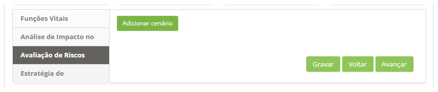
    
    **Figura 19 - Tela de adição de cenário**
    
2. Clique no botão Adicionar Cenário. Feito isso, será apresentado o cenário na tela, clique no 
ícone  do mesmo para registro das características, conforme ilustrado na figura abaixo:

    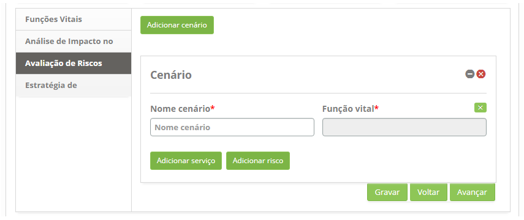
    
    **Figura 20 - Tela de registro de cenário**
    
    - **Nome cenário**: informe descrição do cenário;
    - **Função vital**: selecione a função vital. Caso queira limpar o dado informado no campo, clique no 
    ícone 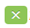 ;
    
3. Adicione os serviços à avaliação de risco:

    - Clique no botão "Adicionar serviço", será apresentada a tela de pesquisa de serviços, conforme ilustrada na figura abaixo:
    
    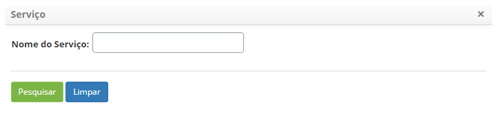
    
    **Figura 21 - Tela de pesquisa de serviço**
    
    - Realize a pesquisa e selecione o serviço desejado. Após isso, será adicionado o serviço na tela, conforme exemplo ilustrado 
    na figura abaixo:
    
    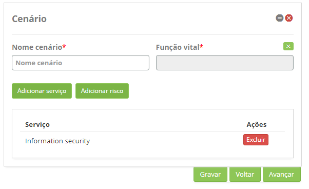
    
    **Figura 22 - Serviço relacionado à cenário**
    
4. Adicione os riscos à avaliação:

    - Clique no botão "Adicionar risco", será apresentada a tela de pesquisa de riscos, conforme ilustrada na figura abaixo:
    
    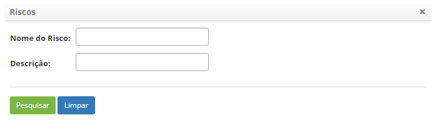
    
    **Figura 23 - Tela de pesquisa de riscos**
    
    - Realize a pesquisa e selecione o risco desejado. Após isso, será adicionado o risco na tela, conforme exemplo ilustrado na 
    figura abaixo:
    
    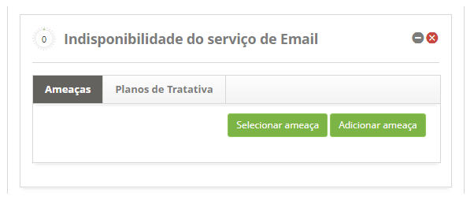
    
    **Figura 24 - Guia de ameaças**
    
    - Clique no botão "Selecionar ameaça" para adicionar a ameaça do risco ou no botão "Adicionar ameaça" para criar um nova ameaça. Será apresentado o campo para informar a ameaça. Após selecionar a ameaça clique no ícone para expandir a tela e informar a probabilidade e o impacto da ameaça sobre o risco;
    
    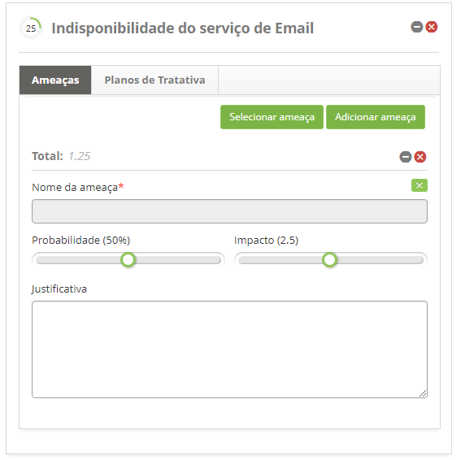
    
    **Figura 25 - Registro de ameaças**
    
    - Após informar as ameaças, clique na guia **Planos de Tratativa**. Será apresenta a tela de plano de tratativa conforme 
    ilustrada na figura abaixo:
    
    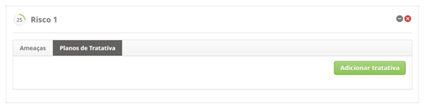
    
    **Figura 26 - Guia de Planos de Tratativa**
    
    - Clique no botão "Adicionar tratativa", para registrar a tratativa da ameaça. Será apresentado o campo para informar a 
    descrição do plano de tratativa. Após informar o nome do plano clique no ícone  para 
    expandir a tela e informar a probabilidade e o impacto da tratativa sobre a ameaça;
    
    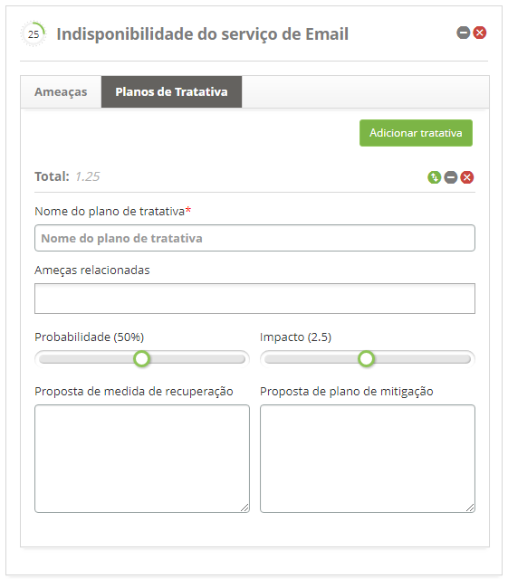
    
    **Figura 27 - Registro de plano de tratativa**
    
    - **Nome do plano de tratativa**: informe no nome do plano de tratativa das ameaças;
    - **Ameaças relacionadas**: informe as ameaças relacionadas ao risco;
    - **Probabilidade**: informe a probabilidade de tratativa das ameaças;
    - **Impacto**: informe o impacto da tratativa sobre as ameaças;
    - **Proposta de medida de recuperação**: descreva a proposta da medida de recuperação;
    - **Proposta de plano de mitigação**: descreva a proposta do plano de mitigação.
    
    - Após registro dos dados do plano de tratativa, clique no ícone  para verificar o gráfico 
    de avaliação de riscos. A figura abaixo ilustra o exemplo do gráfico de avaliação de riscos:
    
    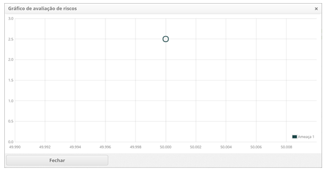
    
    **Figura 28 - Gráfico de avaliação de riscos**
    
5. Após a definição de ameaças e planos de tratativa, a avaliação de risco estará completa, diante disso, clique no botão 
"Gravar" para efetuar o registro, onde a data, hora e usuário serão gravados automaticamente para uma futura auditoria.

6. O botão "Voltar", ao ser acionado, retorna para a etapa anterior da fase de requisitos e estratégia.

7. O botão "Avançar", ao ser acionado, avança para a próxima etapa da fase de requisitos e estratégia.

Registrando estratégia de continuidade de serviços de TI
----------------------------------------------------------

1. Na tela de **Gerenciamento de Continuidade**, na fase de **Requisitos e Estratégia**, clique na guia **Estratégia de 
Continuidade de Serviços de TI**. Feito isso, será apresentada a tela para registro da estratégia de continuidade de serviço de 
TI, conforme ilustrada na figura abaixo:

    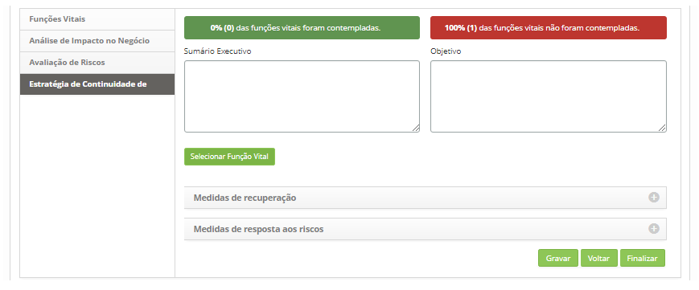
    
    **Figura 29 - Tela de registro de estratégia de continuidade de serviço de TI**
    
2. Nesta tela, é apresentado uma tarja *verde* informando a porcentagem de funções vitais contempladas para o sumário executivo e 
uma tarja *vermelha* informando a porcentagem de funções vitais não contempladas para o objetivo;

    - **Sumário Executivo**: descreva o sumário executivo da estratégia de continuidade de serviço de TI;
    - **Objetivo**: descreva o objetivo da estratégia de continuidade de serviço de TI.
    
3. Adicione as funções vitais:

    - Clique no botão "Selecionar Função Vital". Será apresentada a tela para pesquisa de funções vitais. Realize a pesquisa e 
    selecione a função vital desejada. Feito isso, será adicionado na tela a função vital, conforme exemplo ilustrado na figura 
    abaixo:
    
    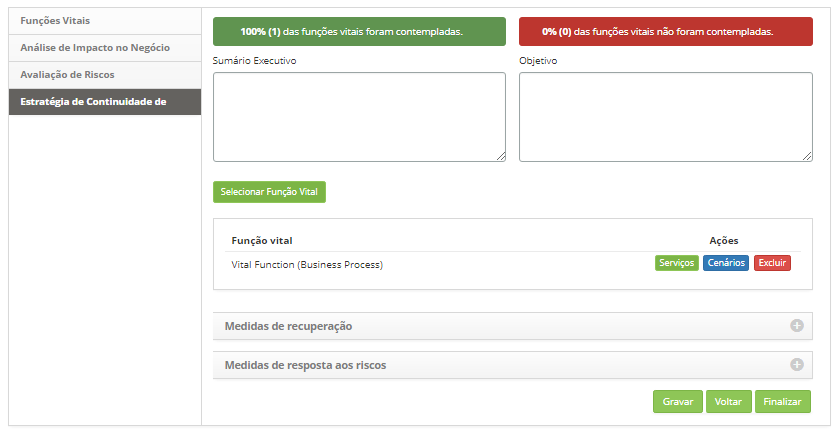
    
    **Figura 30- Selecionar função vital**
    
    - Clique no botão "Serviços" da função vital para visualizar os serviços vinculados à mesma;
    - Clique no botão "Cenários" para visualizar os cenários vinculados à mesma. Após isso, serão apresentados os cenários, 
    clique no ícone  do cenário para exibição das informações do mesmo, conforme exemplo 
    ilustrado na figura abaixo:
    
    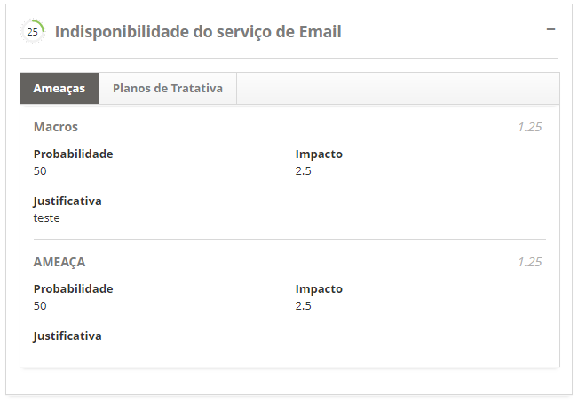
    
    **Figura 31 - Visualização de cenário**
    
    -Clique na guia de **Planos de Tratativa** do risco, serão apresentados dois botões que permite utilizar a proposta de medida 
    de recuperação como medida de recuperação e utilizar a proposta de plano de mitigação como medida de resposta;
    
    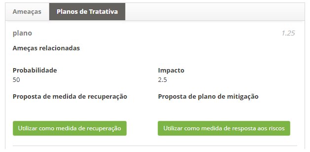
    
    **Figura 32 - Visualização de planos de tratativa**
    
    - Após clicar nos botões, será adicionado na tela de Estratégia da Continuidade de Serviço de TI a medida de recuperação e 
    medida de resposta para definição, conforme exemplo ilustrado na figura abaixo:
    
    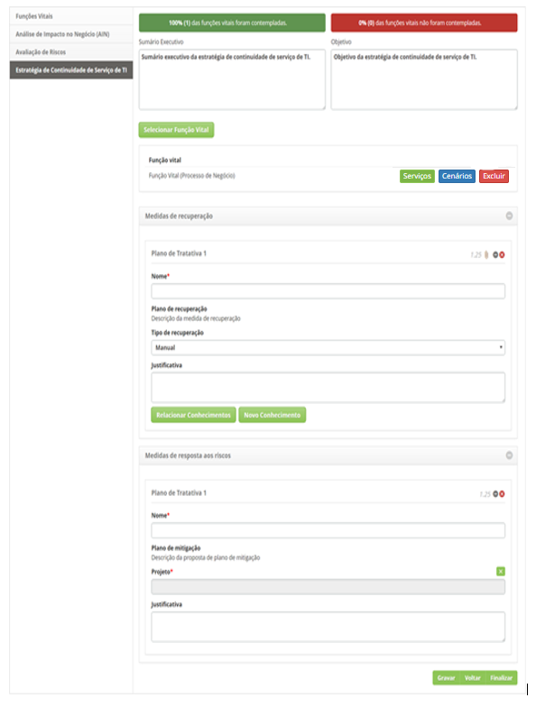
    
    **Figura 33 - Medidas de recuperação e medidas de respostas aos riscos**
    
4. Após a definição da estratégia da continuidade de serviço de TI, clique no botão "Gravar" para efetuar o registro, onde a 
data, hora e usuário serão gravados automaticamente para uma futura auditoria;

5. O botão "Voltar", ao ser acionado, retorna para a etapa anterior da fase de requisitos e estratégia;

6. O botão "Finalizar", ao ser acionado, encerra os registros da fase de requisitos e estratégia e avança para a próxima fase do 
processo.

Implementação
--------------

1. Após o registo da Continuidade de Serviço de TI, clique no botão "Avançar" da mesma para acessá-la, conforme indicado na 
figura abaixo:

    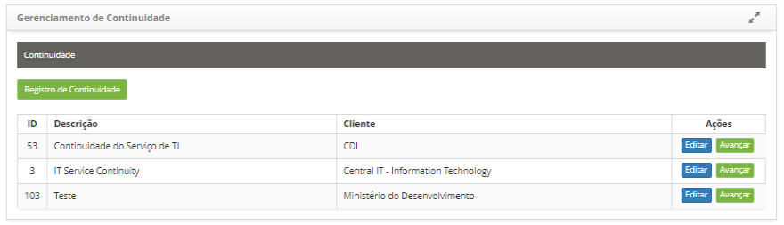
    
    **Figura 34 - Acesso a continuidade de serviço de TI**
    
2. Será apresentada a tela de informações de **Continuidade do Serviço de TI**, clique na fase de **Implementação**, nesta fase é 
definido o plano de continuidade, planejamento organizacional e estratégia de testes. Feito isso, será apresentada a tela onde 
poderá registrar as informações necessárias dessa fase, conforme ilustrada na figura abaixo:

**Figura 35 - Fase de implementação da continuidade do serviço de TI**

Registrando o plano de continuidade
-------------------------------------

1. Na tela de **Gerenciamento de Continuidade**, na fase de **Implementação**, clique na guia **Plano de Continuidade**. Feito 
isso, será apresentada a respectiva tela de cadastro de plano de continuidade, conforme ilustrada na figura abaixo:

    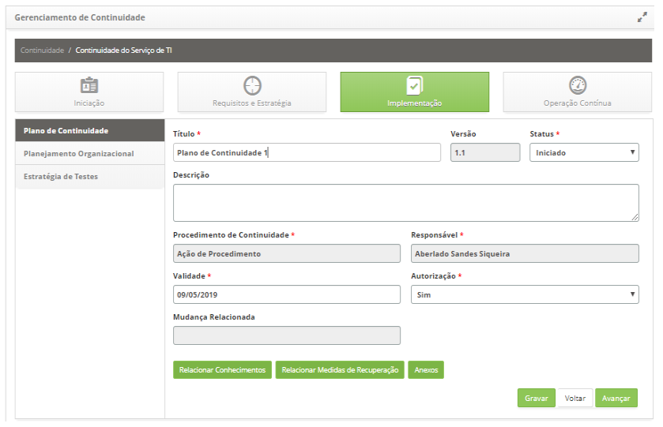
    
    **Figura 36 - Tela de registro de plano de continuidade**
    
2. Preencha os campos conforme orientações abaixo:

    - **Título**: informe o título do plano de continuidade;
    - **Versão**: este campo é para simples conferência, será apresentado a versão do plano de continuidade;
    - **Status**: informe o status do plano de continuidade;
    - **Descrição**: descreva os detalhes do plano de continuidade;
    - **Procedimentos de Continuidade**: informe o procedimento de continuidade (ação automática de 
    incidente/requisição/procedimento);
    - **Responsável**: informe o responsável pelo plano de continuidade;
    - **Validade**: informe a data de validade para o plano de continuidade;
    - **Autorização**: informe se o plano de continuidade será autorizado;
    - **Mudança Relacionada**: informe a mudança referente ao plano de continuidade;
    - Clique no botão "Gravar", e serão apresentadas as opções para relacionar conhecimento(s), relacionar medida(s) de 
    recuperação e adicionar anexo(s).
    
3. Relacione um conhecimento ao plano de continuidade:

    - Clique no botão "Relacionar Conhecimentos", será apresentada a tela de pesquisa de conhecimentos. Realize a pesquisa e 
    selecione o conhecimento. Feito isso, será vinculado o conhecimento ao plano de continuidade, conforme exemplo ilustrado na 
    figura abaixo:
    
    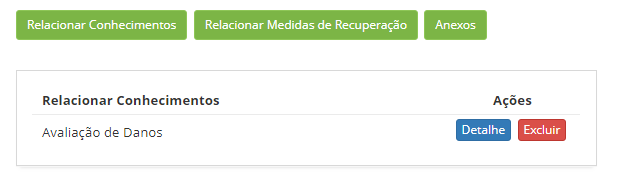
    
    **Figura 37 - Relacionar conhecimentos**
    
    - Para visualizar o conteúdo do conhecimento, basta clicar no ícone  do mesmo;
    - Para excluir o vínculo do conhecimento com o plano de continuidade, basta clicar no
    ícone  do mesmo.
    
4. Relacione medidas de recuperação ao plano de continuidade:

    - Clique no botão "Relacionar Medidas de Recuperação", será apresentada a tela de pesquisa de medidas de recuperação. Realize 
    a pesquisa e selecione a medida de recuperação. Feito isso, será vinculado a medida de recuperação ao plano de continuidade, 
    conforme exemplo ilustrado na figura abaixo:
    
    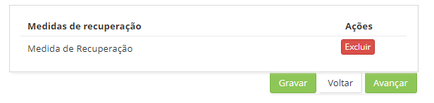
    
    **Figura 38 - Relacionar medidas de recuperação**
    
5. Caso queira anexar um arquivo, clique no botão "Anexos". Será exibida a tela para anexo de arquivos. Informe a descrição para 
o arquivo que será anexado, clique no botão "Adicionar Arquivo" e selecione o arquivo desejado. Após isso, o arquivo será anexado 
e apresentado na tela de anexo do plano de continuidade;

6. Após informação dos dados do plano de continuidade, clique no botão "Gravar" para efetuar o registro, onde a data, hora e 
usuário serão gravados automaticamente para uma futura auditoria;

7. O botão "Avançar", ao ser acionado, avança para a próxima etapa da fase de implementação.

Registrando planejamento organizacional
-----------------------------------------

1. Na tela de **Gerenciamento de Continuidade**, na fase de **Implementação**, clique na guia **Planejamento Organizacional**. 
Feito isso, será apresentada a tela de cadastro de planejamento organizacional, conforme ilustrada na figura abaixo:

    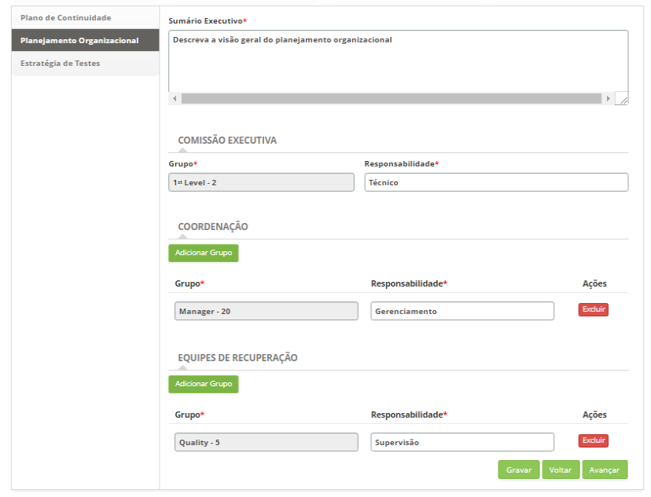
    
    **Figura 39 - Tela de registro de planejamento organizacional**
    
2. Preencha os campos conforme orientações abaixo:

    - **Sumário Executivo**: descreva um resumo sobre o planejamento organizacional;
    - Informe a comissão executiva do planejamento organizacional:
        - **Grupo**: informe o grupo do planejamento;
        - **Responsabilidade**: informe a responsabilidade do grupo.
        
3. Adicione o grupo de coordenação do planejamento organizacional:

    - Clique no botão "Adicionar Grupo", serão exibidos os campos: Grupo e Responsabilidade;
    - **Grupo**: informe o grupo de coordenação do planejamento organizacional;
    - **Responsável**: informe responsabilidade do grupo.
    
4. Adicione a equipe de recuperação:

    - Clique no botão "Adicionar Grupo", serão exibidos os campos: Grupo e Responsabilidade;
    - **Grupo**: informe o grupo de recuperação do planejamento organizacional;
    - **Responsável**: informe responsabilidade do grupo.
    
5. Após definição do planejamento organizacional, clique no botão "Gravar" para efetuar o registro, onde a data, hora e usuário 
serão gravados automaticamente para uma futura auditoria;

6. O botão "Voltar", ao ser acionado, retorna para a etapa anterior da fase de implementação;

7. O botão "Avançar", ao ser acionado, avança para a próxima etapa da fase de implementação.

Registrando estratégia de testes
----------------------------------

1. Na tela de **Gerenciamento de Continuidade**, na fase de **Implementação**, clique na guia **Estratégia de Testes**. Feito 
isso, será apresentada a tela de cadastro de estratégia de testes, conforme ilustrada na figura abaixo:

    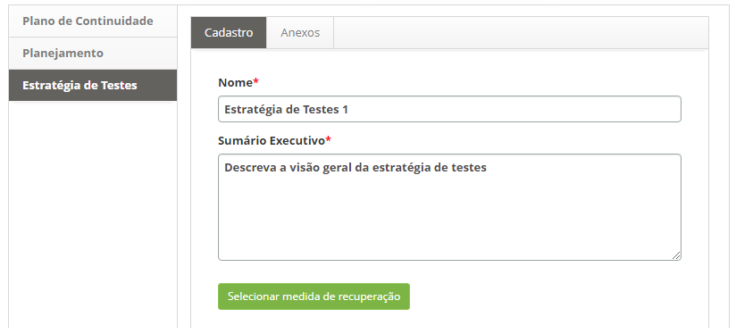
    
    **Figura 40 - Tela de registro estratégia de testes**
    
2. Preencha os campos conforme orientações abaixo:

    - **Nome**: informe a descrição da estratégica de testes;
    - **Sumário Executivo**: descreva o resumo do plano de teste, níveis de teste, cenários de teste, critérios de aceite do 
    teste e etc.;
    - Adicione as medidas de recuperação. Essas medidas de recuperação (tratativas) são traçadas dentro dos cenários da etapa de 
    Estratégia de Continuidade do Serviço da fase de Requisitos e Estratégia.
    
3. Clique no botão "Selecionar medida de recuperação", será apresentada a tela de pesquisa de medidas de recuperação. Realize a 
pesquisa e selecione a medida de recuperação. Feito isso, será exibida uma tela para definir o plano de teste da medida de 
recuperação, conforme ilustrada na figura abaixo:

    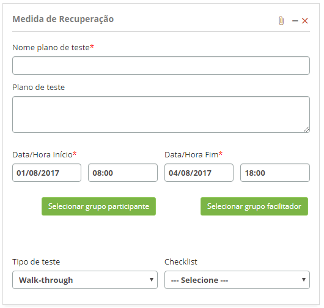
    
    **Figura 41 - Registro medidas de recuperação**
    
    - **Nome do plano de teste**: informe o nome do plano de testes;
    - **Plano de teste**: descreva o plano de teste que será seguido. Nesse momento pode-se escrever os tipos de teste que será 
    realizado, riscos e contingência e os critérios de saída;
    - **Data/Hora Início**: informe a data e hora de início dos testes;
    - **Data/Hora Fim**: informe a data e hora de encerramento dos testes.
    - Informe o grupo participante dos testes.
    
4. Clique no botão "Selecionar grupo participante", será apresentada a tela de pesquisa de grupos. Realize a pesquisa e selecione 
o grupo. Feito isso, será adicionado o grupo participante na tela.

    - Informe o grupo facilitador dos testes;
    - Clique no botão "Selecionar grupo facilitador", será apresentada a tela de pesquisa de grupos. Realize a pesquisa e 
    selecione o grupo. Feito isso, será adicionado o grupo facilitador na tela;
    - **Tipo de teste**: selecione o tipo de teste que será realizado durante a etapa de testes;
    - **Checklist**: selecione o checklist que será verificado nos testes;
    - Caso queira anexar um arquivo ao plano de teste, basta clicar no ícone ;
    
5. Após informar os dados da estratégia de testes e caso queira anexar um arquivo, clique na aba **Anexos**. Será exibida a tela 
para anexo de arquivos conforme ilustrada na figura abaixo:

    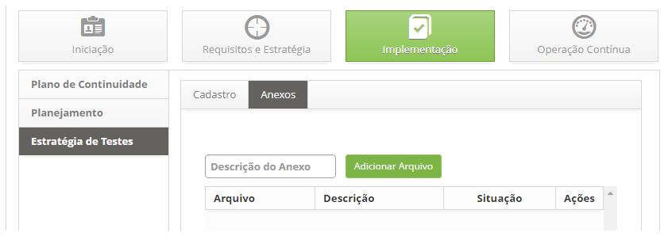
    
    **Figura 42 - Tela de anexo de arquivos**
    
    - Informe a descrição para o arquivo que será anexado, clique no botão "Adicionar Arquivo" e selecione o arquivo desejado. 
    Após isso, o arquivo será anexado e apresentado na tela de anexo da estratégia de testes.
    
6. Após a definição da estratégia de testes, clique no botão "Gravar" para efetuar o registro, onde a data, hora e usuário serão 
gravados automaticamente para uma futura auditoria;

7. O botão "Voltar", ao ser acionado, retorna para a etapa anterior da fase de implementação;

8. O botão "Finalizar", ao ser acionado, encerra os registros da fase de implementação e avança para a próxima fase do processo.

Operação contínua
-------------------

1. Após o registro da Continuidade de Serviço de TI, clique no botão "Avançar" da mesma para acessá-la, conforme indicado na 
figura abaixo:

    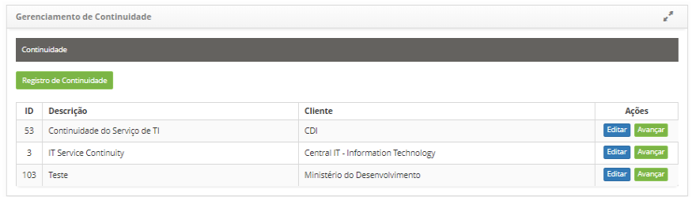
    
    **Figura 43 - Acesso a continuidade de serviço de TI**
    
2. Será apresentada a tela de informações de **Continuidade do Serviço de TI**, clique na fase de **Operação Contínua**, nesta 
fase é definido a conscientização, auditoria, testes e invocação. Feito isso, será apresentada a tela onde poderá registrar as 
informações necessárias dessa fase, conforme ilustrada na figura abaixo:

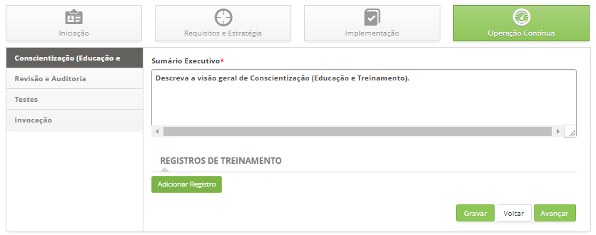

**Figura 44 - Fase de operação contínua da continuidade do serviço de TI**

Conscientização (educação e treinamento)
------------------------------------------

1. Na tela de **Gerenciamento de Continuidade**, na fase de **Operação Contínua**, clique na guia **Conscientização (Educação e 
Treinamento)**. Feito isso, será apresentada a tela de cadastro, conforme ilustrada na figura abaixo:

    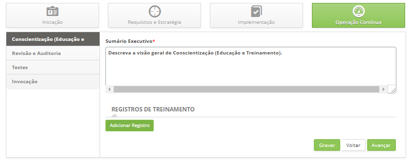
    
    **Figura 45 - Tela de registro de conscientização**
    
2. Preencha os campos conforme orientações abaixo:

    - **Sumário Executivo**: descreva o sumário executivo;
    - Informe os registros de treinamento;
    - Clique no botão "Adicionar Registro", será apresentada a tela registro dos dados de treinamento, conforme ilustrada na 
    figura abaixo:
    
    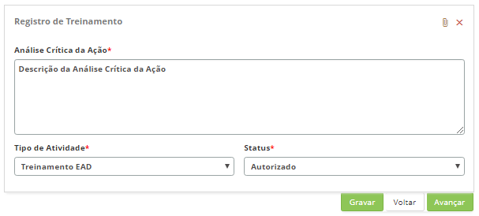
    
    **Figura 46 - Registro de treinamento**
    
    - **Análise Crítica da Ação**: informe a análise crítica sobre o treinamento;
    - **Tipo de Atividade**: selecione o tipo de atividade do treinamento;
    - **Status**: selecione o status do treinamento;
    - Caso queira anexar um arquivo ao registro de treinamento, basta clicar no ícone .
    
3. Após a informação dos dados, clique no botão "Gravar" para efetuar o registro, onde a data, hora e usuário serão gravados 
automaticamente para uma futura auditoria;

4. O botão "Avançar", ao ser acionado, avança para a próxima etapa da fase de operação contínua.

Realizando revisão e auditoria
--------------------------------

1. Na tela de **Gerenciamento de Continuidade**, na fase de **Operação Contínua**, clique na guia **Revisão e Auditoria**. Feito 
isso, será apresentada a tela de revisão e auditoria da continuidade do serviço. Nesta tela permite verificar o histórico de 
alterações do registro de continuidade de serviço de TI para auditoria do mesmo e registrar as informações necessárias da 
auditoria realizada. A figura abaixo ilustra essa tela:

    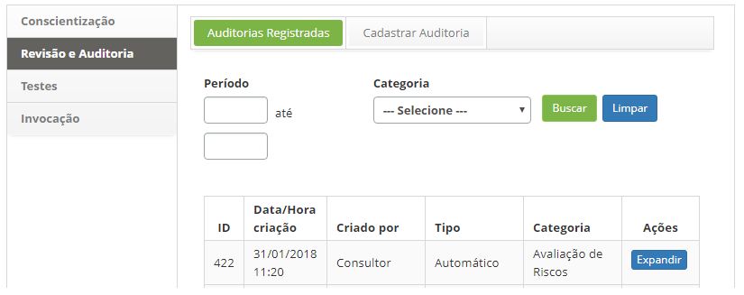
    
    **Figura 47 - Tela auditorias registradas**
    
2. Para realizar uma busca específica da alteração feita no registro de continuidade do serviço de TI, informe o período 
desejado, selecione a categoria e clique no botão "Buscar". Após isso, serão apresentados os dados para revisão e auditoria;

3. Para verificar mais detalhes sobre a modificação realizada, basta clicar no botão "Expandir" do item desejado;

4. Caso tenha a necessidade de registrar os detalhes da auditoria realizada, clique na aba **Cadastrar Auditoria**. Feito isso, 
será apresentada a tela de cadastro conforme ilustrada na figura abaixo:

    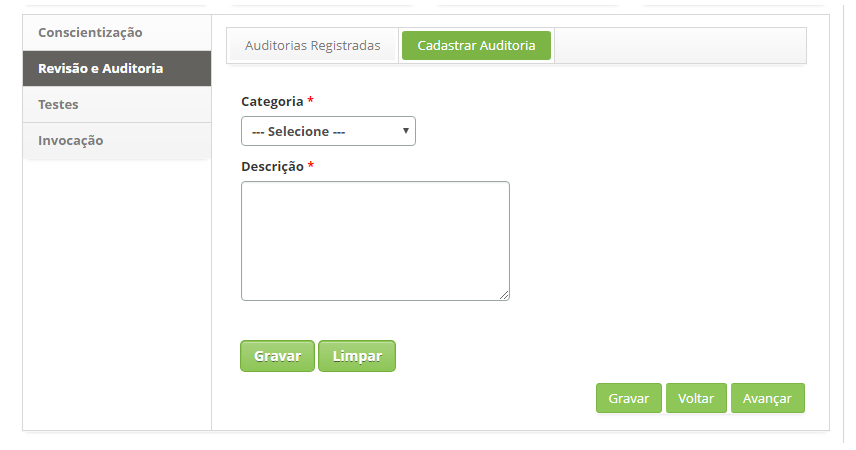
    
    **Figura 48 - Tela cadastrar auditoria**
    
    - **Categoria**: selecione a categoria de continuidade de serviço, na qual foi feita a auditoria;
    - **Descrição**: informe os detalhes da auditoria realizada.
    
5. Após informar todos os dados necessários, clique no botão "Gravar" para efetuar o registro;

6. O botão "Voltar", ao ser acionado, retorna para a etapa anterior da fase de operação contínua;

7. O botão "Avançar", ao ser acionado, avança para a próxima etapa da fase de contínua.

Testes
---------

1. Na tela de **Gerenciamento de Continuidade**, na fase de **Operação Contínua**, clique na guia **Testes**. Feito isso, será 
apresentado o calendário de testes, conforme ilustrado na figura abaixo:

    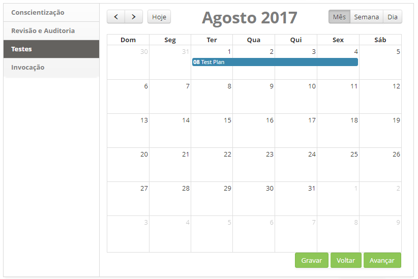
    
    **Figura 49 - Calendário de testes**
    
2. Neste calendário, são apresentados os eventos de testes traçados durante a implementação, o que chamamos de estratégia de 
testes. Estes eventos de testes podem ser visualizados por mês, semana ou dia. Para definir o tipo de visualização, clique em um 
dos botões localizados acima do calendário: **Mês, Semana** ou **Dia**;

3. Clique no evento de teste para registrar as demais informações sobre o teste. Após isso, será apresentada a tela de evento de 
teste exibindo as informações principais do mesmo, conforme ilustrada na figura abaixo:

    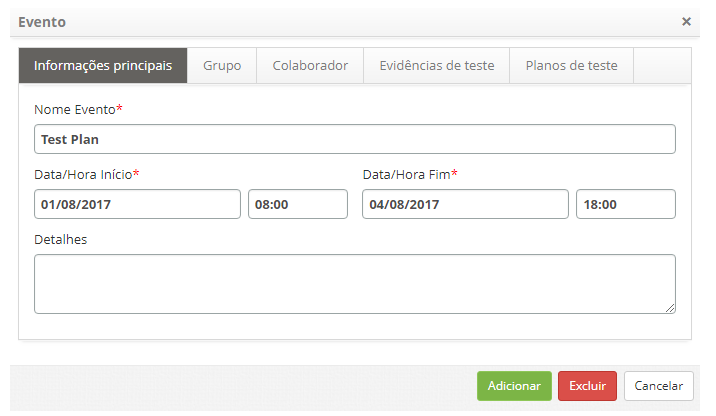
    
    **Figura 50 - Guia informações principais**
    
4. Adicione os grupos de teste. Clique na aba **Grupo**, será apresentada a tela conforme ilustrada na figura abaixo:

    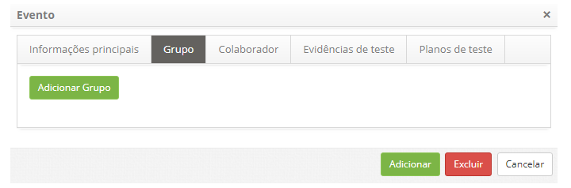
    
    **Figura 51 - Guia grupo**
    
5. Clique no botão "Adicionar Grupo", será apresentada a tela de pesquisa de grupo. Realize a pesquisa do grupo desejado e 
selecione o mesmo para efetuar a operação;

6. Após a adição dos grupos, os mesmos serão exibidos na tela de evento de teste, conforme exemplo ilustrado na figura abaixo:

    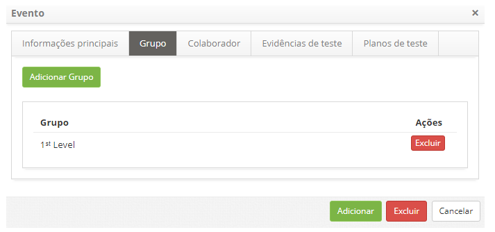
    
    **Figura 52 - Grupo relacionado**
    
7. Adicione os colaboradores envolvidos no teste. Clique na aba **Colaborador**, será apresentada a tela conforme ilustrada na 
figura abaixo:

    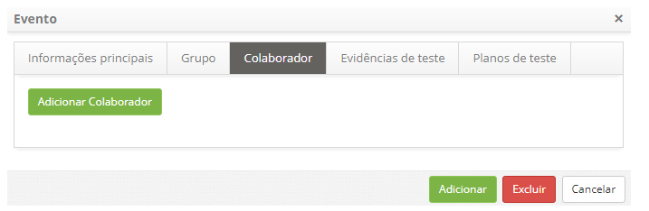
    
    **Figura 53 - Guia colaborador**
    
8. Clique no botão "Adicionar Colaborador", será apresentada a tela de pesquisa de colaborador. Realize a pesquisa do colaborador 
desejado e selecione o mesmo para efetuar a operação;

9. Após a adição dos colaboradores, os mesmos serão exibidos na tela de evento de teste, conforme exemplo ilustrado na figura 
abaixo:

    
    
    **Figura 54 - Colaborador relacionado**
    
10. Informe a evidência de teste. Clique na guia **Evidências de teste**, será apresentada a tela conforme ilustrada na figura 
abaixo:

    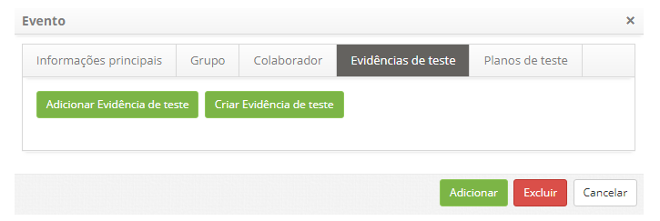
    
    **Figura 55 - Guia evidência de teste**
    
11. Clique no botão "Adicionar Evidência de teste", será apresentada a tela de pesquisa de evidências de teste. Realize a 
pesquisa da evidência de teste desejada e selecione a mesma para efetuar a operação. Caso não encontre o registro da evidência de 
teste e haja a necessidade de registrar uma evidência para adicionar ao evento de teste, poderá registrá-la a partir dessa tela, 
basta clicar no botão "Criar Evidência de teste";

12. Após a adição das evidências de teste, as mesmas serão exibidas na tela de evento de teste, conforme exemplo ilustrado na 
figura abaixo:

    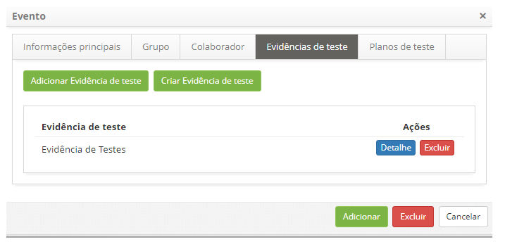
    
    **Figura 56 - Evidência de teste relacionado**
    
    - Para visualizar o conteúdo da evidência de teste, basta clicar no botão "Detalhe" da mesma.
    
13. Informe os planos de teste. Clique na aba **Planos de teste**, será apresentada a tela conforme ilustrada na figura abaixo:

    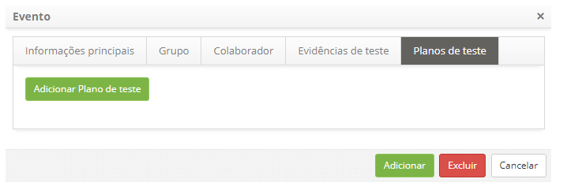
    
    **Figura 57 - Guia planos de teste**
    
    - Clique no botão "Planos de teste", será apresentada a tela de pesquisa de planos de teste. Realize a pesquisa do plano de 
    teste desejado e selecione o mesmo para efetuar a operação;
    - Após a adição dos planos de teste, os mesmos serão exibidos na tela de evento de teste, conforme exemplo ilustrado na 
    figura abaixo:
    
    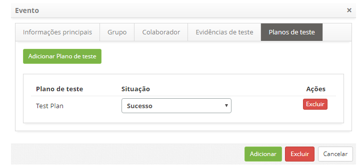
    
    **Figura 58 - Planos de teste relacionado**
    
14. Após informar todos os dados necessários do evento de teste, clique no botão "Adicionar" para efetuar a operação;

15. O botão "Excluir", ao ser acionado, exclui o evento de teste do calendário;

16. Clique no botão "Gravar" do calendário de testes para aplicar as alterações realizadas;

17. O botão "Voltar" do calendário de teste, ao ser acionado, retorna para a etapa anterior da fase de operação contínua;

18. O botão "Avançar" do calendário de teste, ao ser acionado, avança para a próxima etapa da fase de operação contínua.

Invocação
----------

O gatilho para haver uma invocação é a abertura de um incidente do tipo crítico. O incidente tem que estar aprovado para exibição 
na tela de Invocação.

1. Na tela de **Gerenciamento de Continuidade**, na fase de **Operação Contínua**, clique na guia **Invocação**. Feito isso, será 
apresentado a tela de invocação, conforme ilustrado na figura abaixo:

    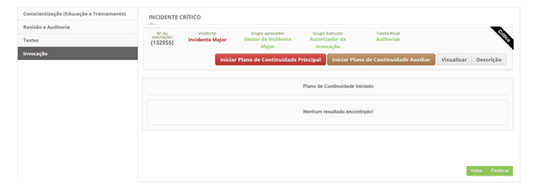
    
    **Figura 59 - Tela invocação**
    
    !!! warning "ATENÇÃO"
    
        Para iniciar o procedimento de continuidade, os dados básicos dos procedimentos já devem estar registrados nas 
        Iniciativas/Solicitações/Procedimentos Ação Automática.
        
2. Clique no botão "Iniciar Plano de Continuidade Principal", para iniciar o procedimento principal de continuidade, o qual já 
deve estar cadastrado no plano de continuidade da fase de implementação;

3. Clique no botão "Iniciar Plano de Continuidade Auxiliar", para iniciar os procedimentos auxiliares de continuidade;

4. O exemplo ilustrado na figura abaixo apresenta os procedimentos de continuidade que foram iniciados:

    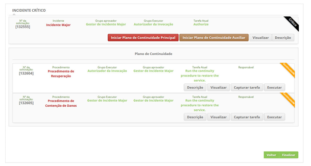
    
    **Figura 60 - Procedimentos de continuidade iniciados**
    
5. Para verificar a descrição da solicitação de procedimento de continuidade, basta clicar no botão "Descrição";

6. Para visualizar a solicitação de procedimento de continuidade, basta clicar no botão "Visualizar";

7. Para capturar a solicitação de procedimento de continuidade para execução da mesma, basta clicar no botão "Capturar tarefa";

8. Para executar a solicitação de procedimento de continuidade, clique no botão "Executar", será apresentada a tela para 
atendimento da solicitação.

Fluxo de incidente crítico
-----------------------------

A solicitação de serviço do tipo "incidente crítico" segue o fluxo definido no portfólio de serviços, no momento do vínculo do 
serviço de incidente com contrato. A figura abaixo ilustra o desenho do fluxo:

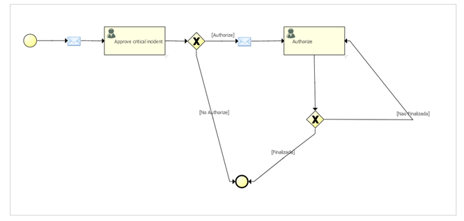

**Figura 61 - Fluxo de incidente crítico**

Fluxo de procedimento de continuidade
---------------------------------------

A solicitação de serviço do tipo procedimento de continuidade segue o fluxo definido no portfólio de serviços, no momento do 
vínculo do serviço de procedimento com contrato. A figura abaixo ilustra o desenho do fluxo:

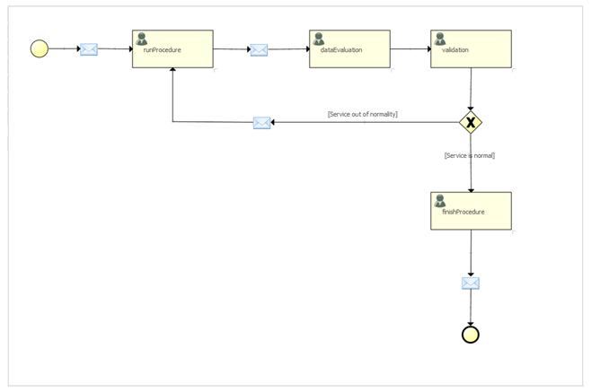

**Figura 62 - Fluxo de procedimento de continuidade**

!!! tip "About"

    <b>Product/Version:</b> CITSmart | 7.00 &nbsp;&nbsp;
    <b>Updated:</b>07/17/2019 – Larissa Lourenço
