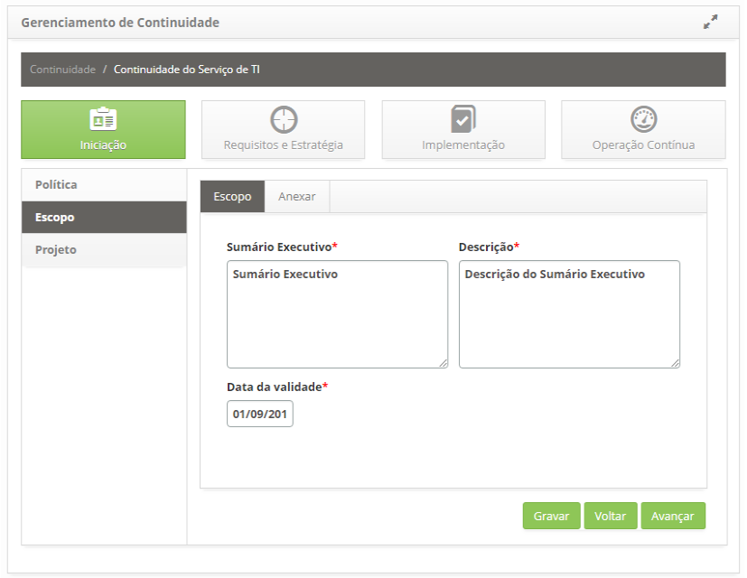
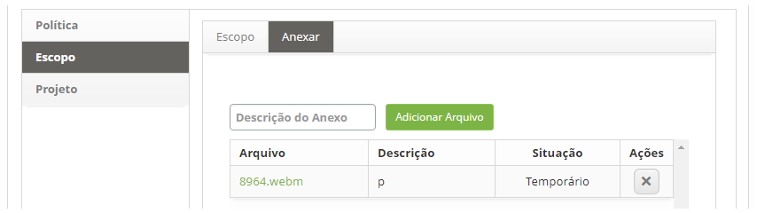

title: Gerenciamento de continuidade
Description: O Gerenciamento de Continuidade foca em recuperar os serviços de TI e seus componentes diante de um evento de desastre.
# Gerenciamento de continuidade

O Gerenciamento de Continuidade foca em recuperar os serviços de TI e seus componentes diante de um evento de desastre.

Pré-condições
--------------

1. Cadastrar categoria de ameaça (ver conhecimento Cadastro e pesquisa de categoria de ameaça);

2. Cadastrar ameaça (ver conhecimento Cadastro e pesquisa de ameaça);

3. Vincular a categoria de ameaça a ameaça cadastrada;

4. Cadastrar categoria de risco (ver conhecimento Cadastro e pesquisa de categoria de risco);

5. Cadastrar risco (ver conhecimento Cadastro e pesquisa de risco de continuidade);

6. Cadastrar cliente (ver conhecimento Cadastro e pesquisa de cliente);

7. Cadastrar colaborador (ver conhecimento Cadastro e pesquisa de colaborador);

8. Cadastrar ações automáticas de Incidente, Requisição e Procedimentos referente ao Gerenciamento de Eventos (ver conhecimento
Cadastro e pesquisa de ações automáticas);

9. Cadastrar na base de conhecimento documento do tipo Medida de Recuperação (ver conhecimento Gerenciamento de conhecimento).

Como acessar
---------------

1. Acesse a funcionalidade pelo menu principal **Processos ITIL > Gerência de Continuidade > Gerenciamento de Continuidade**.

Registrando continuidade de serviço
------------------------------------

1. Na tela de **Gerenciamento de Continuidade**, clique no botão "Registro de Continuidade", conforme indicado na figura abaixo:

    
    
    **Figura 1 - Botão registro de continuidade**
    
2. Será apresentada a tela de **Cadastro de Continuidade**, conforme ilustrada na figura abaixo:

    
    
    **Figura 2 - Tela de cadastro de continuidade**
    
    - **Nome**: defina o nome da continuidade do serviço;
    - **Cliente**: informe o cliente da continuidade do serviço;
    - Após informar os dados da continuidade do serviço, clique no botão "Gravar" para efetuar o registro. A figura abaixa 
    apresenta a **Continuidade do Serviço** depois de registrada:
    
    
    
    **Figura 3 - Tela de gerenciamento de continuidade**
    
     : amplia a tela de Gerenciamento de Continuidade;
    
     **Barra de Navegação**: permite navegar entre os dados da continuidade;
    
     **Botão Registro de Continuidade**: permite registrar uma nova continuidade de serviços;
    
     **Editar Continuidade**: permite editar os dados do registro de continuidade;
    
     **Avançar Continuidade**: permite acessar a continuidade de serviços.
    
- Para alterar os dados do registro de continuidade de serviço, clique no botão "Editar", altere os dados e clique em "Salvar"
para fazer a alteração, onde a data, a hora e o usuário serão salvos automaticamente para uma auditoria futura.

- Para excluir o registro de continuidade do serviço, selecione a continuidade do serviço desejada, clique em "Editar" e, em 
seguida, clique no botão "Excluir" dados para executar a operação.

- Após registrar a continuidade, clique no botão "Avançar" para acessá-la. A tela Gerenciamento de Continuidade de Serviço será 
então exibida.

Iniciação
-----------

1. Após o registro da Continuidade de Serviço de TI, clique em Avançar da mesma para acessá-la;

2. Será apresentada a tela de informações de Continuidade do Serviço de TI, clique na fase de Iniciação, nesta fase é definido
a política, escopo e projeto. Feito isso, será apresentada a tela onde poderá registrar as informações necessárias dessa fase, 
conforme ilustrada na figura abaixo:

**Figura 4 - Fase de iniciação da continuidade do serviço de TI**

Definindo política
--------------------

A política deve ser definida e comunicada o mais cedo possível para que todos os membros da organização envolvidos ou afetados
pela continuidade de negócio sejam conscientizados sobre suas responsabilidades para suportar o Gerenciamento de Continuidade 
do Serviço de TI (GCSTI) de acordo com os objetivos da política.

1. Na tela de **Gerenciamento de Continuidade**, na fase de **Iniciação**, clique na guia **Política**. Feito isso, será 
apresentada a respectiva tela de cadastro de política, conforme ilustrada na figura abaixo:

    
    
    **Figura 5 - Tela de registro de política**
    
2. Preencha os campos conforme orientações abaixo:

    - **Título**: informe o título da política;
    - **Versão**: informe a versão da política;
    - **Data de Validade**: informe a data de validade da política;
    - **Descrição**: descreva os detalhes da política;
    - **Responsável**: informe o responsável pela política;
    - Após informar os dados e caso queira anexar um arquivo, clique na aba **Anexar**. Será exibida a tela para anexo de 
    arquivos conforme ilustrada na figura abaixo:
    
    
    
    **Figura 6 - Tela de anexo de arquivos**
    
    - Informe a descrição para o arquivo que será anexado, clique no botão "Adicionar Arquivo" e selecione o arquivo desejado. 
    Após isso, o arquivo será anexado e apresentado na tela de anexo da política, conforme exemplo ilustrado na figura abaixo:
    
    
    
    **Figura 7 - Arquivo de política anexado**
    
3. Após a definição da política, clique no botão "Gravar" para efetuar o registro, onde a data, hora e usuário serão gravados 
automaticamente para uma futura auditoria;

4. O botão "Avançar", ao ser acionado, avança para a próxima etapa da fase de iniciação.

Registrando escopo
---------------------

Definição do escopo e responsabilidades das equipes cobrindo as atividades do processo como avaliação de risco, Análise de
impacto do Negócio (AIN), determinação dos controles de acordo com os requisitos dos clientes e regulatórios, considerando os
pontos de auditoria e conformidade com a ISO 27001.

1. Na tela de **Gerenciamento de Continuidade**, na fase de **Iniciação**, clique na guia **Escopo**. Feito isso, será apresentada
a respectiva tela de cadastro de escopo, conforme ilustrada na figura abaixo:

    
    
    **Figura 8 - Tela de registro de escopo**
    
2. Preencha os campos conforme orientações abaixo:

    - **Sumário Executivo**: descreva um resumo sobre o plano de negócio da organização;
    - **Descrição**: descreva os detalhes do escopo da continuidade do serviço;
    - **Data de Validade**: informe a data de validade do escopo da continuidade do serviço;
    - Após informar os dados e caso queira anexar um arquivo, clique na aba **Anexar**. Será exibida a tela para anexo de 
    arquivos conforme ilustrada na figura abaixo:
    
    
    
    **Figura 9 - Tela de anexo de arquivos**
    
    - Informe a descrição para o arquivo que será anexado, clique no botão "Adicionar Arquivo" e selecione o arquivo desejado. 
    Após isso, o arquivo será anexado e apresentado na tela de anexo do escopo, conforme exemplo ilustrado na figura abaixo:
    
    
    
    **Figura 10 - Arquivo de escopo anexado**
    
3. Após registro das informações do escopo, clique no botão "Gravar" para efetuar o registro, onde a data, hora e usuário serão
gravados automaticamente para uma futura auditoria;

4. O botão "Voltar", ao ser acionado, retorna para a etapa anterior da fase de iniciação;

5. O botão "Avançar", ao ser acionado, avança para a próxima etapa da fase de iniciação.

Definindo projeto
-------------------

1. Na tela de **Gerenciamento de Continuidade**, na fase de **Iniciação*8, clique na guia **Projeto**. Feito isso, será 
apresentada a tela de definição do projeto, conforme ilustrada na figura abaixo:

    
    
    **Figura 11 - Tela de vínculo de projeto**
    
2. Clique no botão "Vincular Projeto" para relacionar um projeto já existente à continuidade do serviço. Feito isso, será exibida 
a tela de pesquisa do projeto. Realize a pesquisa e selecione o projeto desejado para efetuar a operação. Após isso, será 
apresentado o registro de projeto conforme exemplo ilustrado na figura abaixo:

    
    
    **Figura 12 - Registro de projeto**
    
    - Caso seja necessário a criação de um novo projeto, poderá registrá-lo a partir dessa tela, basta clicar no botão 
    "Criar Novo Projeto".
    - Para alterar os dados do projeto, basta clicar no ícone  do mesmo, localizado 
    no canto superior esquerdo.
    
3. Após definição do projeto, clique no botão "Gravar" para efetuar o registro, onde a data, hora e usuário serão gravados
automaticamente para uma futura auditoria;

4. O botão "Voltar", ao ser acionado, retorna para a etapa anterior da fase de iniciação;

5. O botão "Avançar", ao ser acionado, avança para a próxima etapa da fase de iniciação.
    
