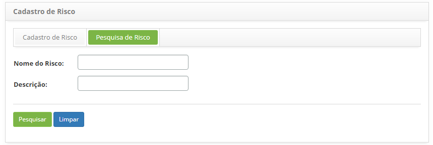
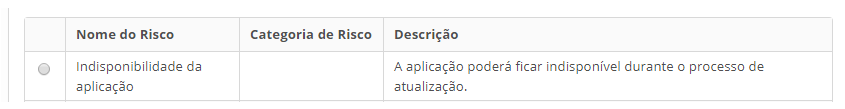
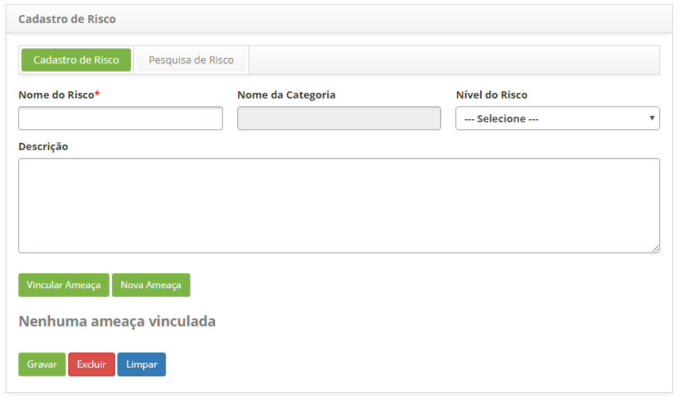
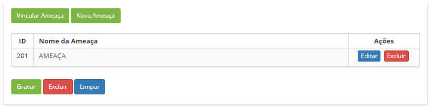

title: Cadastro e pesquisa de risco de continuidade
Description: Esta funcionalidade tem por objetivo cadastrar os riscos que serão usadas durante o registro da Continuidade.
# Cadastro e pesquisa de risco de continuidade

Esta funcionalidade tem por objetivo cadastrar os riscos que serão usadas durante o registro da Continuidade.

Como acessar
--------------

1. Acesse a funcionalidade de risco através da navegação no menu principal 
**Processos ITIL > Gerência de Continuidade > Cadastro de Risco**.

Pré-condições
--------------

1. Cadastrar categoria de risco (ver conhecimento Cadastro e pesquisa de categoria de risco);

2. Cadastrar ameaça (ver conhecimento Cadastro e pesquisa de ameaça).

Filtros
---------

1. Os seguintes filtros possibilitam ao usuário restringir a participação de itens na listagem padrão da funcionalidade, facilitando
a localização dos itens desejados:

    - Nome do Risco;
    - Descrição.
    
    
    
    **Figura 1 - Tela de pesquisa de risco**
    
2. Realize a pesquisa de risco;

- Informe o nome e/ou descrição do risco que deseja pesquisar e clique no botão "Pesquisar". Após isso, será exibido o registro 
do risco conforme o nome informado;

- Caso deseje listar todos os registros de risco, basta clicar diretamente no botão "Pesquisar".

Listagem de itens
-------------------

1. Os seguintes campos cadastrais estão disponíveis ao usuário para facilitar a identificação dos itens desejados na listagem 
padrão da funcionalidade: **Nome do Risco, Categoria de Risco** e **Descrição**.

    
    
    **Figura 2 - Tela de listagem de risco**
    
2. Após a pesquisa, selecione o registro desejado. Feito isso, será direcionado para a tela de cadastro exibindo o conteúdo 
referente ao registro selecionado;

3. Para alterar os dados do registro de risco, basta modificar as informações dos campos desejados e clicar no botão "Gravar" 
para que seja gravada a alteração realizada no registro, onde a data, hora e usuário serão gravados automaticamente para uma
futura auditoria.

Preenchimento dos campos cadastrais
------------------------------------

1. Será apresentada a tela de cadastro de risco, conforme ilustrada na figura abaixo:

    
    
    **Figura 3 - Tela de cadastro de risco**
    
2. Preencha os campos conforme orientações abaixo:

    - **Nome do risco**: informe o nome do risco;
    - **Nome da categoria**: selecione a categoria do risco;
    - **Nível do Risco**: selecione o nível do risco;
    - **Descrição**: informe a descrição do risco;
    - Vincule ameaça(s) ao risco:
        - Clique no botão "Vincular Ameaça". Feito isso, será exibida a tela de pesquisa de ameaça. Realize a pesquisa, selecione 
        a(s) ameaça(s) desejada(s) e clique no botão "Enviar" para efetuar a operação. Caso não encontre o registro da ameaça e
        haja a necessidade de registrar uma ameaça para vincular ao risco, poderá registrá-la a partir dessa tela, basta clicar
        no botão "Nova Ameaça";
        - Após o vínculo da(s) ameaça(s) ao risco, a(s) mesma(s) será(ão) apresentada(s) na tela de registro de risco, conforme
        exemplo ilustrado na figura abaixo:
        
    
    
    **Figura 4 - Ameaças vinculadas ao risco**
    
3. Clique no botão "Gravar" para efetuar o registro, onde a data, hora e usuário serão gravados automaticamente para uma 
futura auditoria.

!!! tip "About"

    <b>Product/Version:</b> CITSmart | 7.00 &nbsp;&nbsp;
    <b>Updated:</b>07/17/2019 – Larissa Lourenço
