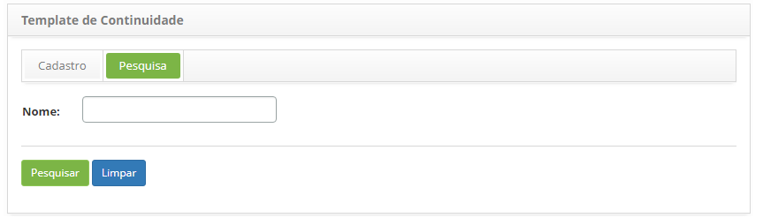
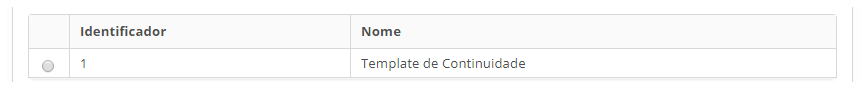
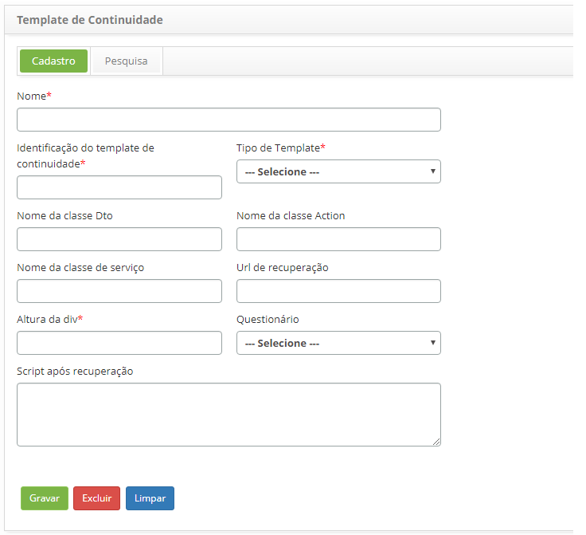

title: Cadastro e pesquisa de template de continuidade
Description: Esta funcionalidade tem por objetivo registrar template de continuidade, o qual será utilizado para personalizar
# Cadastro e pesquisa de template de continuidade

Esta funcionalidade tem por objetivo registrar template de continuidade, o qual será utilizado para personalizar a tela 
de registro de testes.

Como acessar
---------------

1. Acesse a funcionalidade de template de continuidade através da navegação no menu principal 
**Processos ITIL > Gerência de Continuidade > Template de Continuidade**.

Pré-condições
---------------

1. Cadastrar um questionário (ver conhecimento [Cadastro e pesquisa de categoria de questionários](/pt-br/citsmart-platform-7/plataform-administration/questionnaires/questionnaires-management/questionnaire-category.html)).

Filtros
---------

1. O seguinte filtro possibilita ao usuário restringir a participação de itens na listagem padrão da funcionalidade, facilitando
a localização dos itens desejados:

    - Nome.
    
    
    
    **Figura 1 - Tela de pesquisa de template de continuidade**
    
2. Realize a pesquisa do template de continuidade:

    - Informe o nome do template de continuidade que deseja pesquisar e clique no botão "Pesquisar". Após isso, será exibido o 
    registro conforme o nome informado;

    - Caso deseje listar todos os registros de template de continuidade, basta clicar diretamente no botão "Pesquisar".

Listagem de itens
------------------

1. Os seguintes campos cadastrais estão disponíveis ao usuário para facilitar a identificação dos itens desejados na listagem 
padrão da funcionalidade: **Identificador** e **Nome**.

    
    
    **Figura 2 -Tela de listagem de template de continuidade**
    
2. Após a pesquisa, selecione o registro desejado. Feito isso, será direcionado para tela de cadastro exibindo o conteúdo 
referente ao registro selecionado;

3. Para alterar os dados do registro de template de continuidade, basta modificar os campos desejados e clicar no botão "Gravar"
para efetuar a alteração realizada no registro, onde a data, hora e usuário serão gravados automaticamente para uma futura 
auditoria.

Preenchimento dos campos cadastrais
------------------------------------

1. Será apresentada a tela de cadastro de template de continuidade, conforme ilustrada na figura abaixo:

    
    
    **Figura 3 - Tela de cadastro de template de continuidade**
    
2. Preencha os campos conforme orientação abaixo:

    - **Nome**: informe o nome do template de continuidade;
    - **Identificação do template de continuidade**: informe a identificação do template de continuidade;
    - **Tipo de Template**: selecione o tipo de template de continuidade;
    - **Nome da classe Dto**: informe o nome da classe Dto do template de continuidade;
    - **Nome da classe Action**: informe o nome classe Action do template de continuidade;
    - **Nome da classe de serviço**: informe o nome da classe de serviço do template de continuidade;
    - **Url de recuperação**: informe a URL (endereço) de recuperação;
    - **Altura da div**: informe o valor da altura da DIV;
    - **Questionário**: informe o questionário da continuidade. O mesmo é definido na tela de Questionário;
    - **Script após recuperação**: informe o script após recuperação.
    
3. Após o registro dos dados, clique no botão "Gravar" para efetuar o registro, onde a data, hora e usuário serão gravados
automaticamente para uma futura auditoria.

!!! tip "About"

    <b>Product/Version:</b> CITSmart | 7.00 &nbsp;&nbsp;
    <b>Updated:</b>07/17/2019 – Larissa Lourenço

