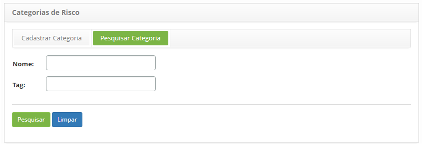
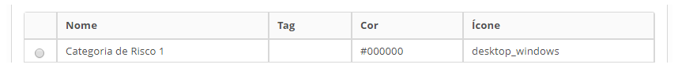
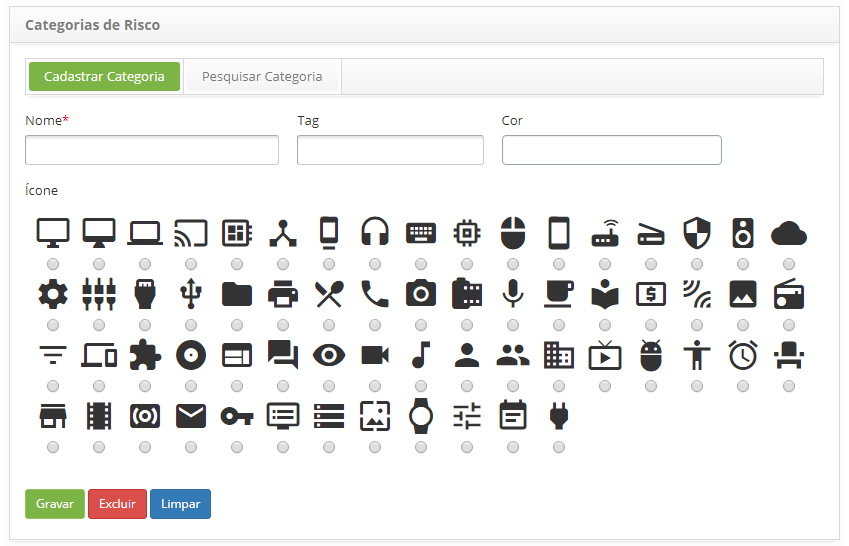
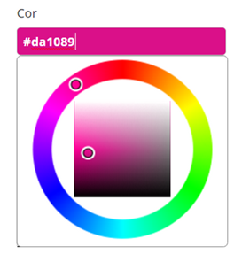

title: Cadastro e pesquisa de categoria de risco
Description: Esta funcionalidade tem por objetivo cadastrar as categorias de riscos que serão usadas durante o cadastro do risco.
# Cadastro e pesquisa de categoria de risco

Esta funcionalidade tem por objetivo cadastrar as categorias de riscos que serão usadas durante o cadastro do risco.

Como acessar
--------------

1. Acesse a funcionalidade de categoria de risco através da navegação no menu principal 
**Processos ITIL > Gerência de Continuidade > Cadastro Categoria de Risco**.

Pré-condições
---------------

1. Não se aplica.

Filtros
---------

1. Os seguintes filtros possibilitam ao usuário restringir a participação de itens na listagem padrão da funcionalidade, 
facilitando a localização dos itens desejados:

    - Nome;
    - Tag.
    
2. Na tela de **Categorias de Risco**, clique na guia **Pesquisar Categoria**, será apresentada a tela de pesquisa conforme 
ilustrada na figura abaixo:

    
    
    **Figura 1 - Tela de pesquisa de categoria de risco**
    
3. Realize a pesquisa da categoria de risco;

    - Informe o Nome e/ou Tag da categoria de risco que deseja pesquisar e clique no botão "Pesquisar". Após isso, será exibido o 
    registro da categoria conforme o(s) dado(s) informado(s);

    - Caso deseje listar todos os registros de categoria de risco, basta clicar diretamente no botão "Pesquisar".

Listagem de itens
-------------------

1. Os seguintes campos cadastrais estão disponíveis ao usuário para facilitar a identificação dos itens desejados na listagem 
padrão da funcionalidade: **Nome, Tag, Cor** e **Ícone**.

    
    
    **Figura 2 - Tela de listagem de categoria de risco**
    
2. Após a pesquisa, selecione o registro desejado. Feito isso, será direcionado para a tela de cadastro exibindo o conteúdo
referente ao registro selecionado;

3. Para alterar os dados do registro de categoria de risco, basta modificar as informações desejadas e clicar no botão "Gravar" 
para efetuar a alteração realizada no registro, onde a data, hora e usuário serão gravados automaticamente para uma futura 
auditoria.

Preenchimento dos campos cadastrais
-------------------------------------

1. Será apresentada a tela de **Cadastro de Categoria de Risco**, conforme ilustrada na figura abaixo:

    
    
    **Figura 3 - Tela de cadastro de categoria de risco**
    
2. Preencha os campos conforme orientações abaixo:

    - **Nome**: informe o nome da categoria de risco;
    - **Tag**: informe a Tag que identificará a categoria de risco;
    - **Cor**: informe uma cor para categoria de risco. Ao clicar neste campo, será apresentada uma paleta de cores para seleção 
    da cor desejada conforme ilustrada na figura abaixo:
    
    
    
    **Figura 4 - Paleta**
    
    - Para selecionar uma cor, basta posicionar o mouse na cor desejada e clicar na mesma.
    - **Ícone**: selecione um ícone que representará a categoria de risco.
    
3. Clique no botão "Gravar" para efetuar o registro, onde a data, hora e usuário serão gravados automaticamente para uma futura 
auditoria.

!!! tip "About"

    <b>Product/Version:</b> CITSmart | 7.00 &nbsp;&nbsp;
    <b>Updated:</b>07/17/2019 – Larissa Lourenço
