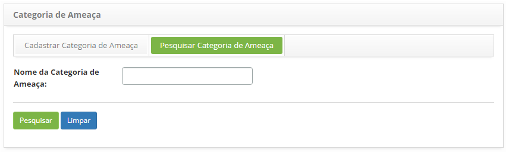
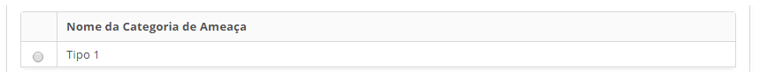
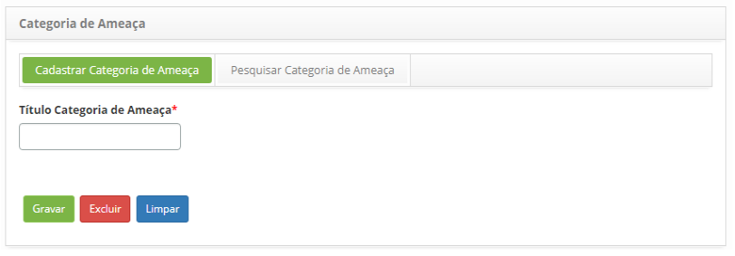

title: Cadastro e pesquisa de categoria de ameaça
Description: Esta funcionalidade tem por objetivo cadastrar as categorias de ameaças que serão usadas durante o registro das 
ameaças.
# Cadastro e pesquisa de categoria de ameaça

Esta funcionalidade tem por objetivo cadastrar as categorias de ameaças que serão usadas durante o registro das ameaças.

Como acessar
--------------

1. Acesse a funcionalidade de categoria de ameaça através da navegação no menu principal 
**Processos ITIL > Gerência de Continuidade > Cadastro Categoria de Ameaças**.

Pré-condições
--------------

1. Não se aplica.

Filtros
--------

1. O seguinte filtro possibilita ao usuário restringir a participação de itens na listagem padrão da funcionalidade, facilitando 
a localização dos itens desejados:

    - Nome da Categoria de Ameaça.
    
    
    
    **Figura 1 - Tela de pesquisa de categoria de ameaça**
    
2. Realize a pesquisa da categoria de ameaça:

    - Informe o nome da categoria de ameaça que deseja pesquisar e clique no botão "Pesquisar". Após isso, será exibido o  
    registro da categoria de ameaça conforme o nome informado.

    - Caso deseje listar todos os registros de categoria de ameaça, basta clicar diretamente no botão "Pesquisar".

Listagem de itens
-------------------

1. O seguinte campo cadastral está disponível ao usuário para facilitar a identificação dos itens desejados na listagem padrão
da funcionalidade: **Nome da Categoria de Ameaça**.

    
    
    **Figura 2 - Tela de listagem de categoria de ameaça**
    
2. Após a pesquisa, selecione o registro desejado. Feito isso, será direcionado para a tela de cadastro exibindo o conteúdo 
referente ao registro selecionado;

3. Para alterar os dados do registro de categoria de ameaça, basta modificar as informações desejadas e clicar no botão "Gravar" 
para efetuar a alteração realizada no registro, onde a data, hora e usuário serão gravados automaticamente para uma futura 
auditoria.

Preenchimento dos campos cadastrais
-------------------------------------

1. Será apresentada a tela de cadastro de categoria de ameaças, conforme ilustrada na figura abaixo:

    
    
    **Figura 3 - Tela de cadastro de categoria de ameaça**
    
2. Preencha os campos conforme orientações abaixo:

    - **Título Categoria de Ameaça**: informe a descrição da categoria de ameaça.
    
3. Clique no botão "Gravar" para efetuar o registro, onde a data, hora e usuário serão gravados automaticamente para uma futura 
auditoria.

!!! tip "About"

    <b>Product/Version:</b> CITSmart | 7.00 &nbsp;&nbsp;
    <b>Updated:</b>07/17/2019 – Larissa Lourenço
