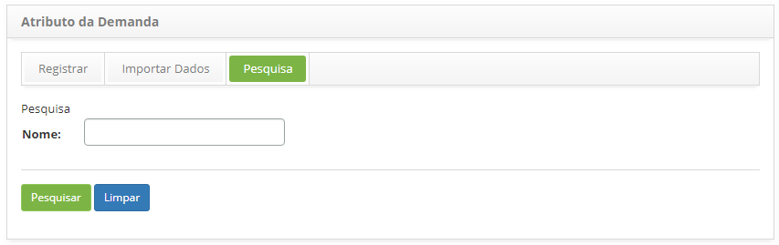
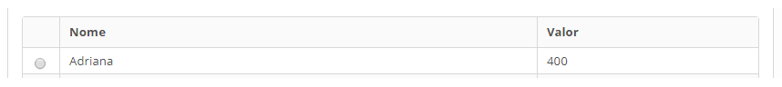
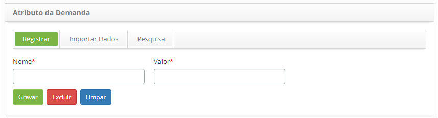

title: Cadastro e pesquisa de atributo da demanda
Description: Esta funcionalidade tem o objetivo de cadastrar os atributos da demanda que serão vinculados aos Serviços e Itens de 
Configuração (IC).
# Cadastro e pesquisa de atributo da demanda

Esta funcionalidade tem o objetivo de cadastrar os atributos da demanda que serão vinculados aos Serviços e Itens de 
Configuração (IC).

Como acessar
--------------

1. Acesse a funcionalidade de Atributo da Demanda através da navegação no menu principal 
**Processos ITIL > Gerência de Demanda > Atributo da Demanda**.

Pré-condições
---------------

1. Não se aplica.

Filtros
---------

1. O seguinte filtro possibilita ao usuário restringir a participação de itens na listagem padrão da funcionalidade, 
facilitando a localização dos itens desejados:

    - Nome.
    
    
    
    **Figura 1 - Tela de pesquisa de atributo da demanda**
    
2. Realize a pesquisa do atributo da demanda;

    - Informe o nome do atributo da demanda que deseja pesquisar e clique no botão "Pesquisar". Após isso, será exibido o 
    registro do atributo conforme o nome informado.
    
    - Caso deseje listar todos os registros de atributo da demanda, basta clicar diretamente no botão "Pesquisar".
    
Listagem de itens
-------------------

1. Os seguintes campos cadastrais estão disponíveis ao usuário para facilitar a identificação dos itens desejados na
listagem padrão da funcionalidade: **Nome** e **Valor**.
  
2. Após a pesquisa, selecione o registro desejado. Feito isso, será direcionado para a tela de cadastro exibindo o 
conteúdo referente ao registro selecionado, conforme o exemplo ilustrado na figura abaixo:

    
    
    **Figura 2 - Tela de listagem de atributo de demanda**
    
3. Para alterar os dados do registro de atributo da demanda, basta modificar as informações desejadas e clicar no botão "Gravar";

Preenchimento dos campos cadastrais
------------------------------------

1. Será apresentada a tela de **Cadastro de Atributo da Demanda**, conforme ilustrada na figura abaixo:

    
    
    **Figura 3 - Tela de cadastro de atributo da demanda**
    
2. Preencha os campos conforme orientações abaixo:

    - **Nome**: informe o nome do atributo da demanda;
    - **Valor**: informe o valor do atributo da demanda.
    
3. Após os dados informados, clique no botão "Gravar" para efetuar o registro, onde a data, hora e usuário serão gravados
automaticamente para uma futura auditoria.

!!! tip "About"

    <b>Product/Version:</b> CITSmart | 7.00 &nbsp;&nbsp;
    <b>Updated:</b>07/17/2019 – Larissa Lourenço
