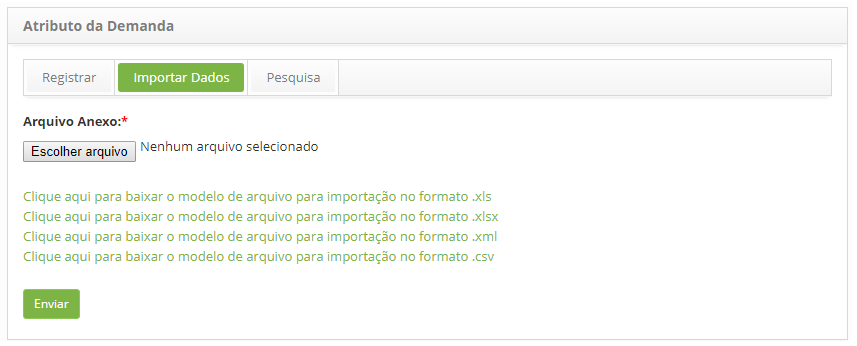

title: Importação de dados de atributo da demanda
Description: Importação de dados de atributo da demanda.
# Importação de dados de atributo da demanda

Como acessar
-------------

1. Acesse a funcionalidade de Atributo da Demanda através da navegação no menu principal 
**Processos ITIL > Gerência de Demanda > Atributo da Demanda**.

Realizando importação de dados de atributo da demanda
-------------------------------------------------------

1. Será apresentada a tela de **Atributo da Demanda**. Clique na guia **Importar Dados**, será apresentada a tela de importação de
dados, conforme ilustrada na figura abaixo:

    
    
    **Figura 1 - Tela de importação de dados**
    
2. Anexe o arquivo para importação dos dados:

    - Note que na tela são apresentados os modelos de arquivos para orientar na forma e ordem que os dados devem estar no arquivo.
    Portanto, antes de selecionar o arquivo, verifique se o mesmo está de acordo com o modelo, levando em consideração o 
    formato (.xls, .xlsx, .xml ou .csv). Após a verificação, clique no botão "Escolher arquivo", selecione o arquivo e clique
    no botão "Enviar" para efetuar a importação;
    
    - Feito isso, os dados serão importados com sucesso.
    
Veja também
-------------

- Módulo Gerenciamento de Demanda

!!! tip "About"

    <b>Product/Version:</b> CITSmart | 7.00 &nbsp;&nbsp;
    <b>Updated:</b>07/17/2019 – Larissa Lourenço
