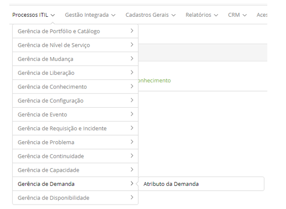

title: Módulo Gerenciamento de Demanda
Description: O Gerenciamento de Demanda é o processo que busca compreender, antecipar e influenciar a demanda dos clientes por 
serviços.
# Módulo Gerenciamento de Demanda

Objetivo do módulo
--------------------

O Gerenciamento de Demanda é o processo que busca compreender, antecipar e influenciar a demanda dos clientes por serviços e
fornecer a capacidade necessária para atender a essa demanda. O mesmo está intimamente ligado à garantia de prestação de serviços,
por isso é um processo crítico a ser gerenciado, porque, para garantir que os serviços serão entregues, dentro da capacidade e 
disponibilidade exigida no custo, no acordo de nível de serviço e na qualidade.

Este processo trabalha em estreita colaboração com o Gerenciamento de Capacidade para garantir que o provedor tenha capacidade 
para atender a demanda. É neste módulo que registra os atributos da demanda.

Esta funcionalidade destina-se a registrar os atributos de demanda que serão vinculados aos itens de Serviços e Configuração.

Onde estão suas funcionalidades
---------------------------------

Acesse o menu principal **Processos ITIL > Gerência de Demanda**.

**Figura 1 - Menu do Módulo Gerência de Demanda**

Principal funcionalidades (em destaque)
-----------------------------------------

Na seção "Veja também" é possível acessar a(s) funcionalidade(s) principal(is) deste módulo, desta forma se pode obter um 
conhecimento mais detalhado.

Veja também
-------------

- [Cadastro e pesquisa de atributo da demanda](/pt-br/citsmart-platform-7/processes/demand/demand-attribute.html)

- [Importação de dados de atributo da demanda](/pt-br/citsmart-platform-7/processes/demand/demand-import.html)

!!! tip "About"

    <b>Product/Version:</b> CITSmart | 7.00 &nbsp;&nbsp;
    <b>Updated:</b>07/17/2019 – Larissa Lourenço
