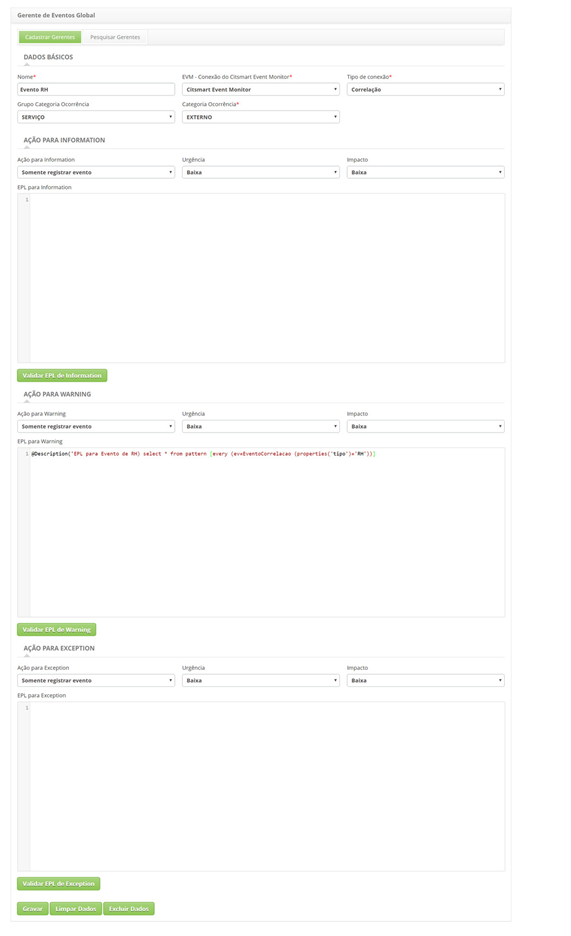
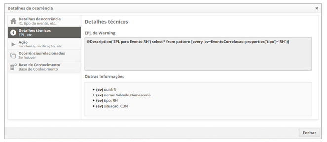

title: Captura de eventos de outras fontes/ferramentas
Description: Permite capturar eventos de outras fontes ou ferramentas (WebService).
# Captura de eventos de outras fontes/ferramentas

Permite capturar eventos de outras fontes ou ferramentas (WebService).

Pré-condições
--------------

1. Não se aplica.

Capturando eventos de outras fontes/ferramentas
-------------------------------------------------

## Como acessar ##

1. Acesse a funcionalidade de captura de eventos de outras fontes/ferramentas através da navegação no menu principal 
**Processos ITIL > Gerência de Evento > Gerente de Eventos Global**.

## Filtros ##

1. Não se aplica.

## Listagem de itens ##

1. Não se aplica.

## Preenchimento dos campos cadastrais ##

1. Na aba **Cadastrar Gerentes**, cadastre uma EPL para identificação dos eventos relevantes:

    - Realize o cadastro de uma EPL que irá definir quais eventos serão relevantes e deverão ser registrados.
    - Segue abaixo um exemplo de EPL para RH:
        - @Description ('EPL para Evento de RH') select * from pattern [every (ev=EventoCorrelacao (properties('tipo')='RH'))]
        
    
    
    **Figura 1 - Tela gerente de eventos global**
    
2. Esta EPL irá capturar e registrar qualquer evento que seja enviado utilizando nosso WS que contenha o tipo ‘RH’.

3. Envio de Eventos através do WebService:

    - Utilize a URL http://<IP_EVM>:<PORTA>/citsmartevm/ws/processEvent para enviar os eventos que deverão ser processados pelo 
    Esper. Este WebService utiliza método POST e recebe um JSON como dado para o processamento dos eventos. Segue abaixo um 
    exemplo de JSON para ser enviado no WebService que irá se enquadrar no exemplo da EPL registrada acima:
    {"properties" : {"uuid" : "5e5517507c66", "nome" : "Barry Allen", "tipo" : "RH", "situacao" : "Contratação"}}
    
        - O elemento “**properties**” é obrigatório, e se não foi enviado, não será possível a identificação do evento.
        - O elemento “**uuid**” é obrigatório para a identificação de eventos relacionados.
        - O WS não retornará nenhuma informação, somente a resposta de 200 OK informando que a requisição foi realizada com 
        sucesso.
        
Visualizando os eventos capturados
-----------------------------------

## Como acessar ##

1. Após o registro da ocorrência de evento, o mesmo poderá ser visualizado na tela de Gerenciamento de Eventos 
**Processos ITIL > Gerência de Eventos > Gerenciamento de Eventos**.

2. Nesta tela permite realizar a pesquisa da ocorrência e permite verificar os detalhes técnicos do evento, conforme exemplo 
ilustrado na figura abaixo:

**Figura 2 - Tela detalhes da ocorrência - detalhes técnicos**

## Filtros ##

1. Não se aplica.

## Listagem de itens ##

1. Não se aplica.

## Preenchimento dos campos cadastrais ##

1. Não se aplica.

!!! tip "About"

    <b>Product/Version:</b> CITSmart | 7.00 &nbsp;&nbsp;
    <b>Updated:</b>07/18/2019 – Larissa Lourenço
