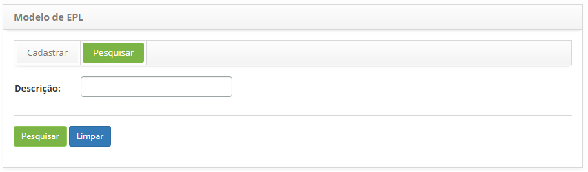
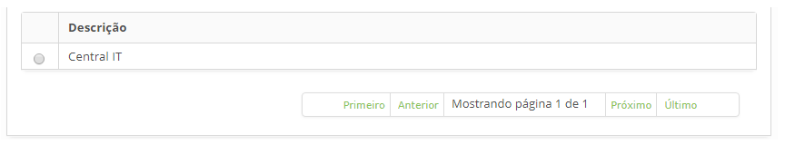
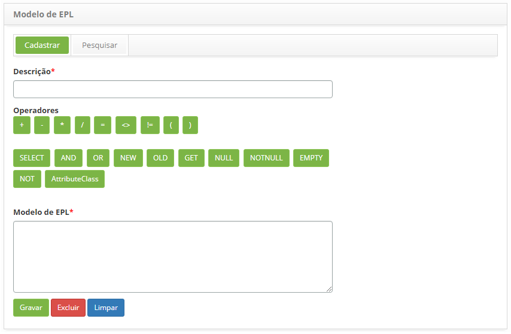

title: Cadastro e pesquisa de modelos de EPL
Description: Esta funcionalidade permite criar e manter modelos de EPL a serem usados na criação de uma EPL.
# Cadastro e pesquisa de modelos de EPL

Esta funcionalidade permite criar e manter modelos de EPL a serem usados na criação de uma EPL.

!!! warning "ATENÇÃO"

    É necessário ter conhecimento da linguagem de processamento de eventos. Para mais informações consulte o site: 
    [Esper documentation](http://www.espertech.com/esper/esper-documentation/)
    
Como acessar
--------------

1. Acesse a funcionalidade de **modelo de EPL** através da navegação no menu principal 
**Processos ITIL > Gerência de Evento > Modelo de EPL**.

Pré-condições
----------------

1. Não se aplica.

Filtros
----------

1. O seguinte filtro possibilita ao usuário restringir a participação de itens na listagem padrão da funcionalidade, facilitando 
a localização dos itens desejados:

    - Descrição.
    
    
    
    **Figura 1 - Tela de pesquisa de modelo EPL**
    
2. Realize a pesquisa de modelo de EPL:

    - Informe a descrição do modelo EPL que deseja pesquisar e clique no botão "Pesquisar". Após isso, será exibido o registro 
    conforme a descrição informada;
    
    - Caso deseje listar todos os registros de modelo EPL, basta clicar diretamente no botão "Pesquisar".
    
Listagem de itens
-------------------

1. O seguinte campo cadastral está disponível ao usuário para facilitar a identificação dos itens desejados na listagem padrão 
da funcionalidade: **Descrição**.

    
    
    **Figura 2 - Tela de listagem de modelo EPL**
    
2. Após a pesquisa, selecione o registro desejado. Feito isso, será direcionado para a tela de cadastro exibindo o conteúdo 
referente ao registro selecionado.

Preenchimento dos campos cadastrais
-------------------------------------

1. Será apresentada a tela de cadastro de modelo de EPL, conforme ilustrada na figura abaixo:

    
    
    **Figura 3 - Tela de cadastro de modelo de EPL**
    
2. Informe os dados para cadastro de modelo de EPL:

    - **Descrição**: informe a descrição do modelo de EPL;
    - **Operadores**: são itens que poderão ser utilizados na criação do modelo de EPL;
    - **Modelo de EPL**: descreva o script de EPL que servirá como modelo para criação de EPL. 
    Ex.: select * from Event where classeNegocio = 'BusinessClass' and ( old is null );
    
3. Clique no botão "Gravar" para efetuar o registro, onde a data, hora e usuário serão gravados automaticamente para uma futura 
auditoria.

!!! tip "About"

    <b>Product/Version:</b> CITSmart | 7.00 &nbsp;&nbsp;
    <b>Updated:</b>07/18/2019 – Larissa Lourenço
