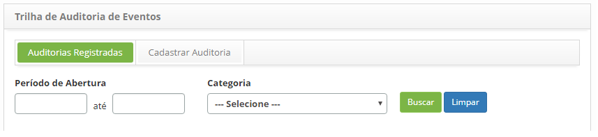
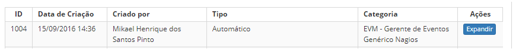
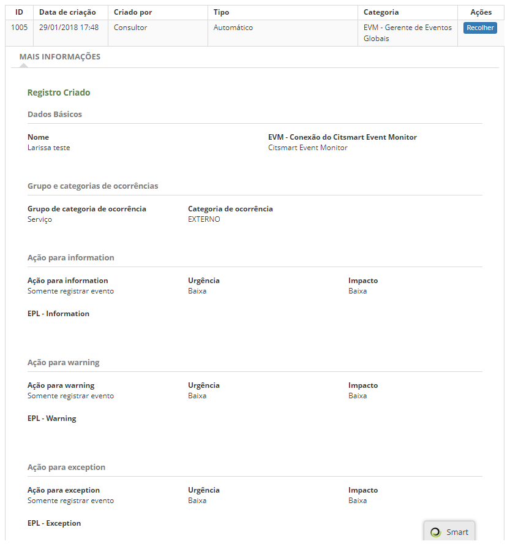
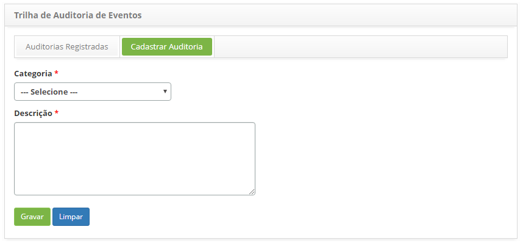

title: Cadastro e pesquisa de auditoria de eventos
Description: O objetivo deste recurso é manter um banco de dados do histórico de todas as mudanças de eventos para realizar
uma auditoria manual.
# Cadastro e pesquisa de auditoria de eventos

O objetivo deste recurso é manter um banco de dados do histórico de todas as mudanças de eventos para realizar uma auditoria manual.

Como acessar
-------------

1. Acesse o recurso Trilha de Auditoria navegando pelo menu principal 
**Processos ITIL > Gerência de Evento > Trilha de Auditoria**.

Pré-condições
---------------

1. Não se aplica.

Filtros
---------

1. Os seguintes filtros possibilitam ao usuário restringir a participação de itens na listagem padrão da funcionalidade, 
facilitando a localização dos itens desejados:

    - Período de Abertura;
    - Categoria.
    
2. Na tela de **Trilha de Auditoria de Eventos**, na guia **Auditoria Registradas**, todas as auditorias de eventos que foram 
executadas serão exibidas, conforme ilustrado abaixo:

    
    
    **Figura 1 - Tela de auditoria de evento**
    
3. Para realizar uma pesquisa de auditoria específica, proceda conforme instruções abaixo:

    - **Período de abertura**: insira o período de auditoria pretendido;
    - **Categoria**: selecione a categoria de auditoria.
    
4. Clique no botão "Pesquisar" e os dados da auditoria serão exibidos;

Listagem de itens
------------------

1. Os seguintes campos cadastrais estão disponíveis ao usuário para facilitar a identificação dos itens desejados na listagem 
padrão da funcionalidade: **ID, Data de Criação, Criado por, Tipo** e **Categoria**.

2. Existe um botão de ação disponível ao usuário em relação a cada item da listagem, é ele: "Expandir".

    
    
    **Figura 2 - Tela de Lista de Itens**
    
3. Clique no botão "Expandir" para ver os detalhes da auditoria;

4. A imagem abaixo ilustra um exemplo:

**Figura 3 - Tela de auditoria de evento**

Preenchimento dos campos cadastrais
-------------------------------------

1. Na tela de **Trilha de Auditoria de Eventos**, na guia **Cadastrar Auditoria**, a tela de auditoria manual é exibida:

    
    
    **Figura 4 - Tela de cadastro de auditoria**
    
2. Preencha os campos conforme indicado abaixo:

    - **Categoria**: selecione a categoria de auditoria;
    - **Descrição**: insira uma descrição para a auditoria realizada.
    
3. Clique no botão "Salvar" o botão para confirmar a entrada, em que data, hora e usuário serão automaticamente armazenados para
uma auditoria futura.

!!! tip "About"

    <b>Product/Version:</b> CITSmart | 7.00 &nbsp;&nbsp;
    <b>Updated:</b>07/17/2019 – Larissa Lourenço
