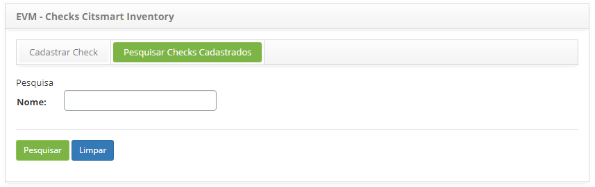
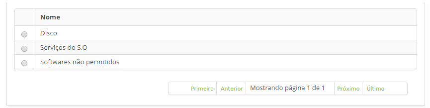
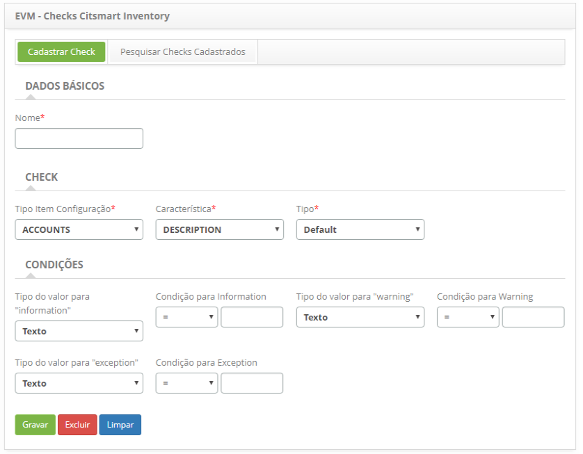

title: Cadastro e pesquisa de checks de eventos
Description: Esta funcionalidade tem como objetivo realizar o cadastro dos Checks de Eventos.
# Cadastro e pesquisa de checks de eventos

Esta funcionalidade tem como objetivo realizar o cadastro dos Checks de Eventos que serão utilizados para monitoração dos itens de
configuração, através do CITSmart Inventory.

Como acessar
---------------

1. Acesse a funcionalidade de Checks de Eventos através da navegação no menu principal 
**Processos ITIL > Gerência de Evento > Check**.

Pré-condições
---------------

1. Cadastrar tipo de item de configuração (ver conhecimento [Cadastro e pesquisa de tipo de item de configuração](/pt-br/citsmart-platform-7/processes/configuration/IC-type.html)).

Filtros
---------

1. O seguinte filtro possibilita ao usuário restringir a participação de itens na listagem padrão da funcionalidade, facilitando a 
localização dos itens desejados, conforme ilustrado na figura abaixo:

    - Nome.
    
    
    
    **Figura 1 - Tela de pesquisa de checks de eventos**
    
2. Realize a pesquisa de Checks de Eventos;

    - Informe o nome do Checks de Eventos que deseja pesquisar e clique no botão "Pesquisar". Após isso, será exibido o registro de
    check conforme o nome informado;
    
    - Caso deseje listar todos os registros de check, basta clicar diretamente no botão "Pesquisar".
    
Listagem de itens
------------------

1. O seguinte campo cadastral está disponível ao usuário para facilitar a identificação dos itens desejados na listagem padrão 
da funcionalidade: **Nome**.

    
    
    **Figura 2 - Tela de listagem de checks de eventos**
    
2. Após a pesquisa, selecione o registro desejado. Feito isso, será direcionado para a tela de cadastro exibindo o conteúdo 
referente ao registro selecionado;

3. Para alterar os dados do registro de Checks de Eventos, basta modificar as informações dos campos desejados e clicar no botão
"Gravar" para que seja gravada a alteração realizada no registro, onde a data, hora e usuário serão gravados automaticamente para
uma futura auditoria.

Preenchimento dos campos cadastrais
------------------------------------

1. Será apresentada a tela de **Cadastro de Checks de Eventos**, conforme ilustrada na figura abaixo:

    
    
    **Figura 3 - Tela de cadastro de checks de eventos**
    
2. Nesta tela, os campos são autoexplicativos. Basta posicionar o mouse sobre o campo escolhido e será apresentada uma breve
descrição. Portanto serão abordadas somente as informações principais para efetuar o registro da conexão;

    - Informe os **Dados Básicos**;
    - Informe os dados de **Check**. Se no campo **Tipo** for escolhida a opção “Percentual”, será apresentado o campo 
    **Característica Complementar** para ser preenchido;
    - Informe os dados de **Condições**. Associe uma condição para information (informação) e/ou warning (advertência) e/ou 
    exception (exceção) e as mesmas serão avaliadas no monitoramento de eventos do item de configuração definido no check.
        - **Information**: indica uma operação normal, ou seja, não requer qualquer ação e não representa uma exceção, está 
        funcionando como deveria. Fornece dados para tomada de decisão. Geralmente usado para fins de estatísticas e
        investigações.
        - **Warning**: significa operação anormal, mas não excepcional. É um indicativo de que a situação pode requerer uma 
        monitoração mais próxima, precisa ser verificada e que ações apropriadas precisam ser tomadas para impedir uma exceção.
        - **Exception**: são exceções que indicam uma situação anormal que requer uma ação, uma operação fora dos limites 
        aceitáveis, ou seja, pode representar falha total, uma funcionalidade inviabilizada ou um desempenho degradado.
        
3. Clique no botão "Gravar" para efetuar o registro, onde a data, hora e usuário serão gravados automaticamente para uma 
futura auditoria.

!!! tip "About"

    <b>Product/Version:</b> CITSmart | 7.00 &nbsp;&nbsp;
    <b>Updated:</b>07/17/2019 – Larissa Lourenço
