title: Gerenciamento de evento
Description: Esta funcionalidade tem como objetivo apresentar algumas funcionalidades para o gerenciamento de eventos.
# Gerenciamento de evento

Esta funcionalidade tem como objetivo apresentar algumas funcionalidades para o gerenciamento de eventos, permitindo visualizar 
gráficos, acompanhar o monitoramento e pesquisar ocorrência de eventos.

- Gráficos;
- Gerenciamento;
- Pesquisa.

Como acessar
-------------

1. Acesse a funcionalidade de **Gerenciamento de Eventos** através da navegação no menu principal. Posicione o mouse na opção 
**Processos ITIL > Gerência de Evento > Gerenciamento de Eventos**.

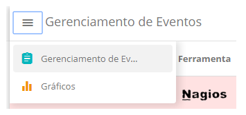

**Figura 1 - Tela menu de gerenciamento de eventos**

Pré-condições
---------------

1. Cadastrar Conexão do CITSmart Event Monitor (ver conhecimento Conexão CITSmart Event Monitor);

2. Cadastrar Ferramenta de Monitoração;

3. Ter pelo menos uma Requisição/Incidente cadastrada e vinculada ao IC (Item de Configuração) que gerou o evento, caso queira
"Executar" o serviço usando tela de Eventos (ver conhecimento Gerenciamento de ticket (serviços)).

Filtros
---------

1. Os seguintes filtros possibilitam ao usuário restringir a participação de itens na listagem padrão da funcionalidade, 
facilitando a localização dos itens desejados, conforme ilustrado na figura abaixo:

    - Id da ocorrência;
    - Ferramenta;
    - Classificação;
    - Situação;
    - Host;
    - Gerenciado;
    - Data inicial;
    - Data final.
    
    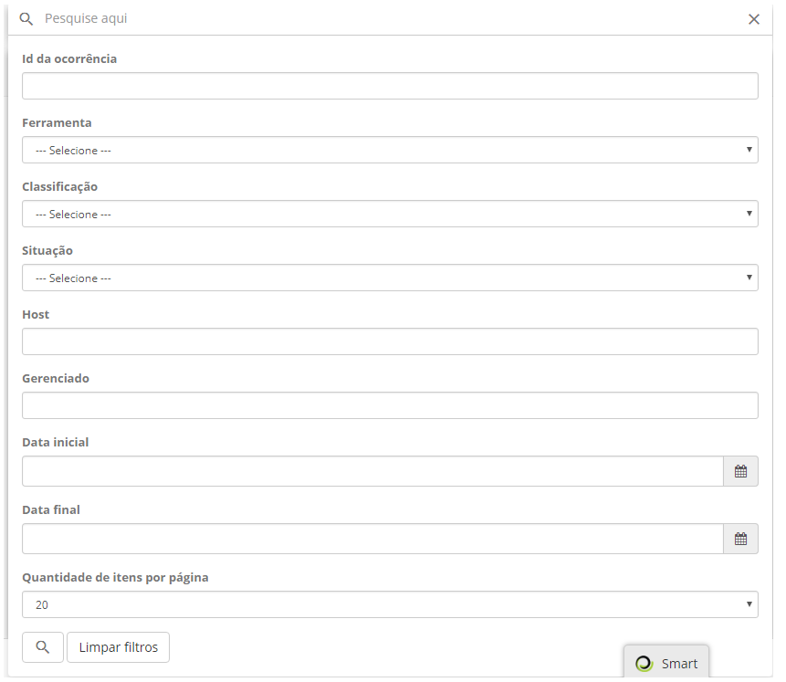
    
    **Figura 2 - Tela de pesquisa de ocorrência de evento**
    
Listagem de itens das ocorrências de eventos
----------------------------------------------

1. Os seguintes campos cadastrais estão disponíveis ao usuário para facilitar a identificação dos itens desejados na listagem 
padrão da funcionalidade: **Classificação, Ferramenta, Data/Hora, Categoria, Host, Gerenciando, Prioridade** e **Situação**.

2. Após acessar a funcionalidade de **Gerenciamento de Eventos** são visualizadas todas as ocorrências registradas no MongoDB 
através da aplicação Citsmart Event Monitor, conforme ilustração abaixo:

    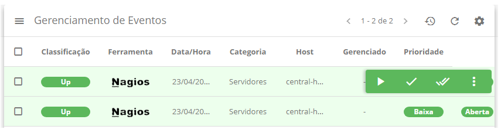
    
    **Figura 3 - Tela de listagem de eventos**
    
3. A guia 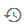 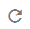 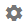, apresenta as 
seguintes funcionalidades para a listagem de eventos:

    - **Atualização automática** : possibilita que a opção "atualizar lista" seja executada de 
    tempos em tempos;
    - **Atualizar lista** : ao clicar a lista de eventos é atualizada;
    - **Opções** : possibilita a alteração das colunas da lista de eventos.
    
4. Ao clicar sobre qualquer evento da listagem, a guia 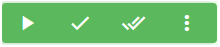 será mostrada:

    - **Abrir** : é possível acessar os detalhes de cada ocorrência de eventos;
    - **Encerrar ocorrência** : encerra a ocorrência aberta;
    - **Encerrar ocorrência e todas as ações** : encerra a ocorrência e as ações vinculadas a ela;
    - **Mais opções** 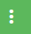: é possível realizar três ações ao clicar nesse ícone (criar solicitação
    de serviço/criar requisição de mudança/criar requisição de problema).
    
Preenchimento dos campos cadastrais
-------------------------------------

1. Não se aplica.

Opção - gerenciamento de eventos
----------------------------------

Essa funcionalidade permite acompanhar em tempo real as ocorrências de todas as ferramentas, sendo atualizada automaticamente
de acordo com o tempo. Esta tela exibirá somente ocorrências que estão iniciadas e aguardando tratamento.

Pesquisa
-----------

1. Todos os eventos das ferramentas de monitoração Nagios, Zabbix e Citsmart Inventory poderão ser filtradas 
através dessa funcionalidade;

2. Clique no ícone 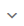  da seção de Pesquisa 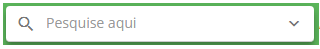, então será 
apresentada a respectiva tela para pesquisa de ocorrência de evento, conforme ilustração abaixo:

    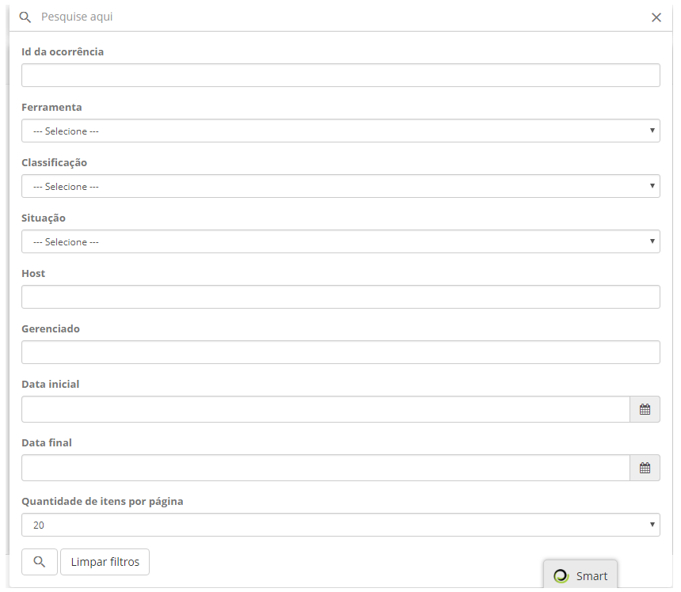
    
    **Figura 4 - Tela de pesquisa de ocorrência de evento**
    
3. Informe os filtros de acordo com sua necessidade para pesquisa de ocorrência de eventos.

4. Clique no botão 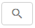 e a listagem de ocorrências com a aplicação do filtro é mostrada conforme
a **Figura 3**.

5. Passa a ser possível acessar os detalhes de cada ocorrência de eventos, como mostrado na figura abaixo, através do botão
 (que surge quando clicar na ocorrência):

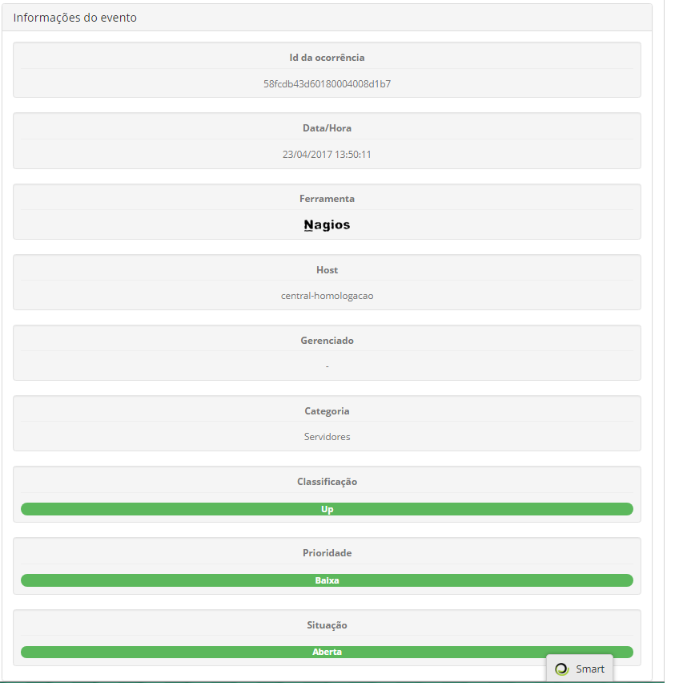

**Figura 5 - Informações do evento**

Menu da tela de detalhamento
------------------------------

1. Ao clicar no ícone  localizado no canto esquerdo superior, será apresentado a 
seguinte listagem:

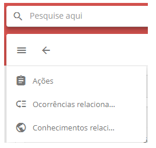

**Figura 6 - Tela de detalhamento**

Ações
-------

1. Ao clicar na opção "Ações" do menu da **Figura 6**, uma tela será mostrada com a relação de todos os incidentes/requisições
vinculados a ocorrência selecionada:

    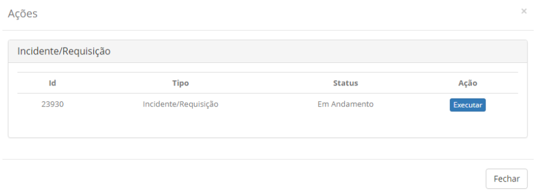
    
    **Figura 7 - Ações**
    
2. Ao clicar no botão "Executar", uma nova tela é apresentada mostrando e disponibilizando a requisição/incidente para
executá-lo normalmente (Encerrar, Capturar, etc.). conforme figura abaixo:

    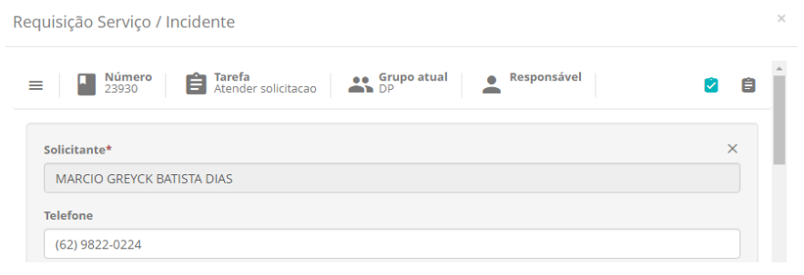
    
    **Figura 8 - Tela de requisição/incidente**
    
Ocorrências relacionadas
--------------------------

1. Para visualizar ocorrências relacionadas, basta clicar na guia **Ocorrências relacionadas**, conforme exemplo ilustrado 
abaixo:

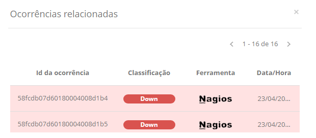

**Figura 9 - Ocorrências relacionadas**

Conhecimentos relacionados
---------------------------

1. Para ver o detalhamento da ocorrência, clique na ocorrência que será apresentada a tela detalhes:

    - Para visualizar os conhecimentos já gravados e cadastrar novos conhecimentos na Base de Conhecimento, clique na guia de 
    **Base de Conhecimento**, será apresentado os conhecimentos já relacionados e para a criação de um conhecimento novo, basta
    clicar no botão "Criar Conhecimento". A figura abaixo apresenta essa tela:
    
    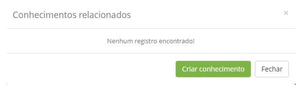
    
    **Figura 10 - Conhecimentos relacionados**
    
Opção - gráficos
-----------------

Essa funcionalidade permite visualizar gráficos de comparação por tipos de evento, quantidade de ocorrências por tipos de evento, 
quantidade de ocorrência por ferramentas e quantidade de ocorrências por item de configuração, conforme filtros escolhidos.

Consultando gráficos
----------------------

1. Após acessar a funcionalidade de Gerenciamento de Eventos, no menu Gráficos, será apresentada a tela com as informações de 
ocorrência de eventos, sendo essas demonstradas em gráficos, conforme exemplificados nas imagens abaixo. Nesta tela é possível 
filtrar as ocorrências por data/período (busca realizado pelo campo  no canto superior do lado direito):

    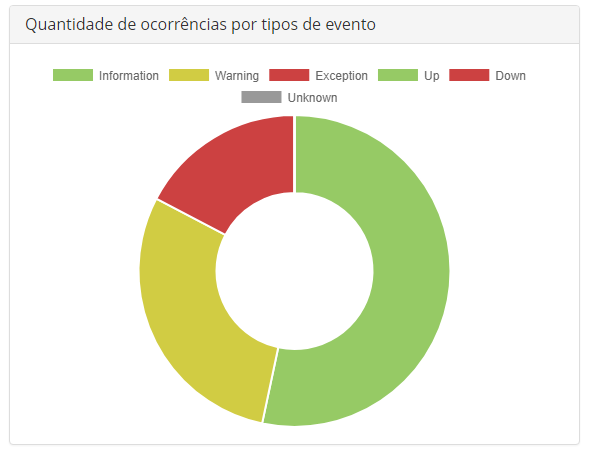
    
    **Figura 11 - Gráfico quantidade de ocorrências por tipos de evento**
    
    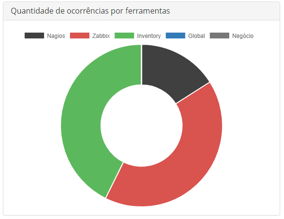
    
    **Figura 12 - Gráfico quantidade de ocorrências por ferramentas**
    
    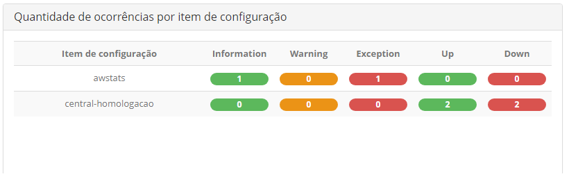
    
    **Figura 13 - Gráfico quantidade de ocorrências por item de configuração**
    
!!! tip "About"

    <b>Product/Version:</b> CITSmart | 7.00 &nbsp;&nbsp;
    <b>Updated:</b>07/18/2019 – Larissa Lourenço
