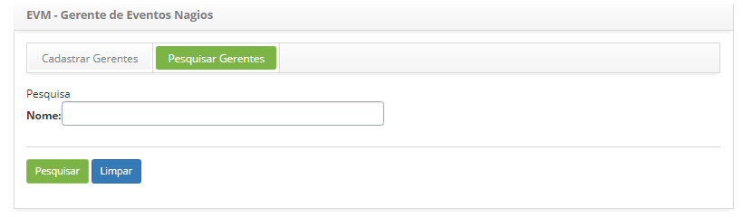

title: Cadastro e pesquisa de gerentes do CITSmart event monitor
Description: Trata-se da funcionalidade responsável por gerenciar a aplicação que faz a análise, monitoração e sinalização de
Eventos.
# Cadastro e pesquisa de gerentes do CITSmart event monitor

Trata-se da funcionalidade responsável por gerenciar a aplicação que faz a análise, monitoração e sinalização de Eventos, que 
pode ser: 

- **Gerente Nagios**;
- **Gerente Zabbix**;
- **Gerente Inventory**;
- **Gerente de Eventos Global**;
- **Gerente Genérico Nagios**;
- **Gerente Genérico Zabbix**.
    
Pré-condições
---------------

1. Cadastrar conexão do CITSmart Event Monitor (ver conhecimento Conexão CITSmart Event Monitor);

2. Cadastrar horário (ver conhecimento Cadastro e pesquisa de horários);

3. Cadastrar categoria de ocorrência (ver conhecimento Cadastro e pesquisa de categoria de ocorrência);

4. Cadastrar ação automática (ver conhecimento Cadastro e pesquisa de ações automáticas);

5. Cadastrar Conexão do CITSmart Inventory (ver conhecimento Configuração da conexão do CITSmart Inventory);

6. Cadastrar check (ver conhecimento Cadastro e pesquisa de checks de eventos).

Gerente Nagios
-----------------

Nagios é uma ferramenta de monitoramento de rede. Ele pode monitorar tanto hosts quanto serviços, alertando quando ocorrerem
problemas e também quando os problemas são resolvidos. Os Hosts são os equipamentos e os Serviços são os recursos oferecidos 
pelos equipamentos.

O objetivo desta funcionalidade é cadastrar e manter os gerentes que serão responsáveis por monitorar os itens de configuração 
e ocorrência de eventos capturadas a partir do Nagios. Permite ao usuário informar de quanto em quanto tempo o Gerente será 
processado, quais os itens de configuração que ele irá gerenciar e as ações a serem tomadas automaticamente.

## Como acessar ##

1. Acesse a funcionalidade de gerente nagios através da navegação no menu principal 
**Processos ITIL > Gerência de Evento > Gerente Nagios**.

## Filtros ##

1. O seguinte filtro possibilita ao usuário restringir a participação de itens na listagem padrão da funcionalidade, facilitando 
a localização dos itens desejados:

    - Nome
    
    
    
    **Figura 1 - Tela de pesquisa de gerente Nagios**
    
2. Realize a pesquisa de Gerente Nagios:

    - Informe o nome do gerente nagios que deseja pesquisar e clique no botão "Pesquisar". Após isso, será exibido o registro 
    conforme o nome informado;
    
    - Caso deseje listar todos os registros de gerente nagios, basta clicar diretamente no botão "Pesquisar".
