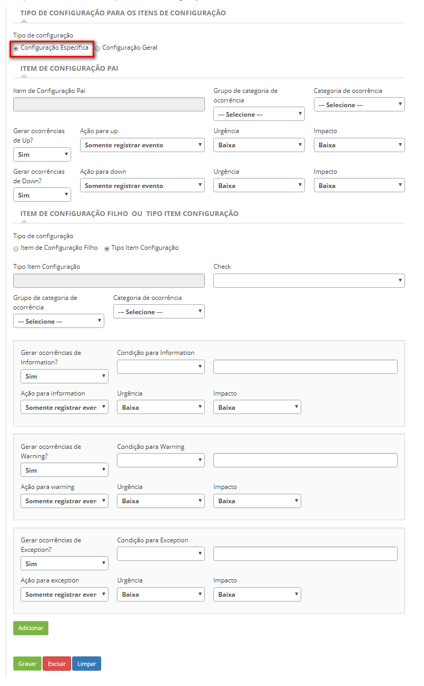

title: Cadastro e pesquisa de gerentes do CITSmart event monitor
Description: Trata-se da funcionalidade responsável por gerenciar a aplicação que faz a análise, monitoração e sinalização de
Eventos.
# Cadastro e pesquisa de gerentes do CITSmart event monitor

Trata-se da funcionalidade responsável por gerenciar a aplicação que faz a análise, monitoração e sinalização de Eventos, que 
pode ser: 

- **Gerente Nagios**;
- **Gerente Zabbix**;
- **Gerente Inventory**;
- **Gerente de Eventos Global**;
- **Gerente Genérico Nagios**;
- **Gerente Genérico Zabbix**.
    
Pré-condições
---------------

1. Cadastrar conexão do CITSmart Event Monitor (ver conhecimento Conexão CITSmart Event Monitor);

2. Cadastrar horário (ver conhecimento Cadastro e pesquisa de horários);

3. Cadastrar categoria de ocorrência (ver conhecimento Cadastro e pesquisa de categoria de ocorrência);

4. Cadastrar ação automática (ver conhecimento Cadastro e pesquisa de ações automáticas);

5. Cadastrar Conexão do CITSmart Inventory (ver conhecimento Configuração da conexão do CITSmart Inventory);

6. Cadastrar check (ver conhecimento Cadastro e pesquisa de checks de eventos).

Gerente Nagios
-----------------

Nagios é uma ferramenta de monitoramento de rede. Ele pode monitorar tanto hosts quanto serviços, alertando quando ocorrerem
problemas e também quando os problemas são resolvidos. Os Hosts são os equipamentos e os Serviços são os recursos oferecidos 
pelos equipamentos.

O objetivo desta funcionalidade é cadastrar e manter os gerentes que serão responsáveis por monitorar os itens de configuração 
e ocorrência de eventos capturadas a partir do Nagios. Permite ao usuário informar de quanto em quanto tempo o Gerente será 
processado, quais os itens de configuração que ele irá gerenciar e as ações a serem tomadas automaticamente.

## Como acessar ##

1. Acesse a funcionalidade de gerente nagios através da navegação no menu principal 
**Processos ITIL > Gerência de Evento > Gerente Nagios**.

## Filtros ##

1. O seguinte filtro possibilita ao usuário restringir a participação de itens na listagem padrão da funcionalidade, facilitando 
a localização dos itens desejados:

    - Nome
    
    
    
    **Figura 1 - Tela de pesquisa de gerente Nagios**
    
2. Realize a pesquisa de Gerente Nagios:

    - Informe o nome do gerente nagios que deseja pesquisar e clique no botão "Pesquisar". Após isso, será exibido o registro 
    conforme o nome informado;
    
    - Caso deseje listar todos os registros de gerente nagios, basta clicar diretamente no botão "Pesquisar".
    
## Listagem de itens ##

1. O seguinte campo cadastral está disponível ao usuário para facilitar a identificação dos itens desejados na listagem padrão da 
funcionalidade: **Nome**.

    
    
    **Figura 2 - Tela de lista de itens**
    
2. Após a pesquisa, selecione o registro desejado. Feito isso, será direcionado para a tela de cadastro exibindo o conteúdo 
referente ao registro selecionado;

3. Para alterar os dados do registro de **Gerente Nagios**, basta modificar as informações dos campos desejados e clicar no botão 
"Gravar" para que seja gravada a alteração realizada no registro, onde a data, hora e usuário serão gravados automaticamente para 
uma futura auditoria.

## Preenchimento dos campos cadastrais ##

1. Acesse a funcionalidade, após isso, será apresentada a tela de **Cadastro de Gerente Nagios**, conforme ilustrada na figura 
abaixo:

    
    
    **Figura 3 - Tela de cadastro de gerente Nagios**
    
2. Nesta tela, os campos são autoexplicativos. Basta posicionar o mouse sobre o campo escolhido e será apresentada uma breve 
descrição. Portanto serão abordadas somente as informações principais para efetuar o registro da conexão;

    - Informe os **Dados Básicos**;
        - Ao selecionar a ferramenta de monitoração, serão listados os hosts que são monitorados pela ferramenta.
    - Informe os **Dados Agendador**;
        - **Ativar/Desativar autocorreção**: Determina se uma ocorrência de evento deverá ser encerrada automaticamente caso a 
        condição que gerou a ocorrência inicialmente não voltar a acontecer. Se está opção for ativa, o campo “Tempo para 
        encerramento de evento” será habilitado para preenchimento.
        - **Tempo para encerramento de evento**: Neste campo deve-se informar o tempo em minutos para a autocorreção, a qual 
        determina o tempo para o encerramento de uma ocorrência que não acontece mais.
    - Informe os **Dados de Item de Configuração Pai**;
        - Ao clicar no campo de iten de configuração pai, será apresentada a tela para pesquisa do IC pai conforme os filtros 
        preenchidos. A figura abaixo ilustra esta tela:
        
    
    
    **Figura 4 - Tela pesquisa item de configuração**
    
    - Realize a pesquisa e clique no ícone  para selecionar o IC pai desejado e gravar 
        na tela de gerente.
    - Ao clicar no campo Host, serão listados os hosts que estão sendo monitorados pelo Nagios para seleção. Feito isso, serão 
    apresentados os serviços do Host, conforme exemplo ilustrado abaixo:
    
    
    
    **Figura 5 - Tela de cadastro de gerente Nagios**
    
    - Após apresentação dos serviços do Host, caso queira cadastrar o IC no CITSmart com os dados do Host selecionado, basta 
    clicar no botão "Criar IC". Lembrando que esse registro só poderá ser realizado caso não haja um IC com a mesma identificação 
    do Host.
    - Informe os demais campos que serão utilizados na geração dos eventos deste gerente.
    - Informe os dados do item de configuração filho.
    
    
    
    **Figura 6 - Tela de registro do gerenciador Nagios**
    
    - Conduzir uma relação entre o serviço Host e o iten de configuração filho. Cada serviço host deve estar relacionado ao seu 
    respectivo item de configuração filho.
    - Informe os outros campos que serão utilizados na geração de eventos de serviço.
    - Digite as ações que serão ativadas quando ocorrer um evento de um determinado tipo (informações, aviso e exceção).
    
3. Clique no botão "Gravar" para executar o registro, onde a data, hora e usuário serão salvos automaticamente para uma auditoria 
futura.

Gerente Zabbix
----------------

O Zabbix é uma ferramenta para monitorar redes, servidores e serviços, projetados para monitorar disponibilidade, experiência do 
usuário e qualidade de serviços.

O objetivo desta funcionalidade é registrar e manter os gerentes responsáveis pelo monitoramento dos itens de configuração cujo 
status será consultado no Zabbix. Ele permite ao usuário associar os elementos de configuração aos seus respectivos disparadores 
e às ações que devem ser tomadas na ocorrência de eventos.

## Como acessar ##

1. Acesse a funcionalidade do administrador Zabbix através da navegação no menu principal 
**Processos ITIL > Gerência de eventos > Gerente Zabbix**.

## Filtros ##

1. O seguinte filtro permite ao usuário restringir a participação de elementos na lista padrão de funcionalidades, facilitando a 
localização dos itens desejados:

    - Nome.
    
    
    
    **Figura 7 - Tela de pesquisa de gerente Zabbix**
    
2. Realize a pesquisa do gerente Zabbix;

    - Digite o nome do Gerente do Zabbix que deseja pesquisar e clique no botão "Pesquisar". Após disso, o registro será exibido 
    de acordo com o nome informado;
    
    - Caso deseje listar todos os registros do Gerente Zabbix, basta clicar diretamente no botão "Pesquisar".
    
## Listagem de itens ##

1. O seguinte campo cadastral está disponível para o usuário facilitar a identificação dos elementos desejados na lista padrão de 
funcionalidade: **Nome**.

    
    
    **Figura 8 - Tela da lista de itens**
    
2. Após a pesquisa, selecione o registro desejado. Uma vez feito isso, será direcionado para a tela de registro exibindo o 
conteúdo referente à gravação selecionada;

3. Para alterar os dados do cadastro do Gerente do Zabbix, basta modificar as informações dos campos desejados e clicar no botão 
"Gravar" para que a alteração feita na gravação seja gravada, onde a data, a hora e o usuário serão gravados automaticamente para 
um futuro auditoria.

## Preenchimento dos campos cadastrais ##

1. Acesse a funcionalidade, depois disso, será apresentada a tela de **Cadastro do Gerente Zabbix**, conforme ilustrada na figura 
abaixo:

    
    
    **Figura 9 - Tela de registro do gerente Zabbix**
    
2. Nesta tela, os campos são autoexplicativos. Basta posicionar o mouse sobre o campo escolhido e será apresentada uma breve 
descrição. Portanto serão abordadas somente as informações principais para efetuar o registro da conexão;

    - Informe os **Dados Básicos**;
        - Ao selecionar a ferramenta de monitoramento, os hosts que são monitorados pela ferramenta estão listados.
    - Informe os **Dados do Programador**;
        - **Ativar/Desativar autocorreção**: Determina se uma ocorrência de evento deverá ser encerrada automaticamente caso a 
        condição que gerou a ocorrência inicialmente não voltar a acontecer;
        - **Tempo de encerramento do evento**: Neste campo deve-se informar o tempo em minutos para a autocorreção, a qual 
        determina o tempo para o encerramento de uma ocorrência que não acontece mais.
    - Informe os Dados do item de configuração do pai;
        - Ao clicar no campo do "Item de configuração principal", a tela de pesquisa do IC principal aparecerá de acordo com os 
        filtros preenchidos.
    - A figura a seguir ilustra essa tela:
    
    
    
    **Figura 10 - Tela de pesquisa do item de configuração**
    
    - Realize a pesquisa e clique no botão "Selecionar" para selecionar a IC principal desejada e grave na tela do administrador.
    - Ao clicar no campo Host, os hosts que estão sendo monitorados pelo Zabbix aparecerão para a seleção.
    - Uma vez feito isso, os serviços do Host serão apresentados, conforme mostrado abaixo:
    
    
    
    **Figura 11 - Tela de registro do gerente Zabbix**
    
    - Após apresentar os serviços Host, se deseja registrar o IC no CITSmart com os dados do Host selecionado, basta clicar no 
    botão "Criar IC". Lembrando que esse registro só pode ser feito se não houver IC com o mesmo ID de host.
    - Informe os outros campos que serão usados na geração dos eventos desse gerente.
    - Informe os dados do **item de configuração do filho**.
    
    
    
    **Figura 12 - Tela de registro do gerente Zabbix**
    
    - Conduzir uma relação entre o serviço Host e o iten de configuração filho. Cada serviço host deve estar relacionado ao seu 
    respectivo item de configuração filho.
    - Informe os outros campos que serão utilizados na geração de eventos de serviço.
    - Digite as ações que serão ativadas quando ocorrer um evento de um determinado tipo (information, warning e exception).
    
3. Clique no botão "Gravar" para executar o registro, onde a data, hora e usuário serão salvos automaticamente para uma auditoria 
futura.

Gerente Inventory
--------------------

O objetivo desta funcionalidade é cadastrar e manter os gerentes que serão responsáveis pelas ocorrências de eventos capturadas a 
partir do CITSmart Inventory. Permite ao usuário informar de quanto em quanto tempo o Gerente será processado, quais os itens de 
configuração que ele irá gerenciar, os checks que serão aplicados e as ações a serem tomadas automaticamente.

## Como acessar ##

1. Acesse a funcionalidade de gerente inventory através da navegação no menu principal **Processos ITIL > Gerência de Evento > 
Gerente Inventory**.

## Filtros ##

1. O seguinte filtro possibilita ao usuário restringir a participação de itens na listagem padrão da funcionalidade, facilitando 
a localização dos itens desejados, conforme ilustrado abaixo:

    - Nome
    
    
    
    **Figura 13 - Tela de pesquisa de gerente Inventory**
    
2. Realize a pesquisa de gerente inventory;

    - Informe o nome do gerente inventory que deseja pesquisar e clique no botão "Pesquisar". Após isso, será exibido o registro 
    conforme o nome informado;
    
    - Caso deseje listar todos os registros de gerente inventory, basta clicar diretamente no botão "Pesquisar".
    
## Listagem de itens ##

1. O seguinte campo cadastral está disponível ao usuário para facilitar a identificação dos itens desejados na listagem padrão da 
funcionalidade: **Nome**.

    
    
    **Figura 14 - Tela de lista de itens**
    
2. Após a pesquisa, selecione o registro desejado. Feito isso, será direcionado para a tela de cadastro exibindo o conteúdo 
referente ao registro selecionado;

3. Para alterar os dados do registro de gerente inventory, basta modificar as informações dos campos desejados e clicar no botão 
"Gravar" para que seja gravada a alteração realizada no registro, onde a data, hora e usuário serão gravados automaticamente para 
uma futura auditoria.

## Preenchimento dos campos cadastrais

1. Acesse a funcionalidade, após isso, será apresentada a tela de **Cadastro de Gerente Iventory**, conforme ilustrada na figura 
abaixo:

    
    
    **Figura 15 - Tela de cadastro de gerente Inventory**
    
2. Nesta tela, os campos são autoexplicativos. Basta posicionar o mouse sobre o campo escolhido e será apresentada uma breve 
descrição. Portanto serão abordadas somente as informações principais para efetuar o registro da conexão;

    - Informe os **Dados Básicos**;
    - Informe os **Dados Agendador**;
        - **Ativar/Desativar autocorreção**: Determina se uma ocorrência de evento deverá ser encerrada automaticamente caso a 
        condição que gerou a ocorrência inicialmente não voltar a acontecer;
        - **Tempo para encerramento de evento**: Neste campo deve-se informar o tempo em minutos para a autocorreção, a qual 
        determina o tempo para o encerramento de uma ocorrência que não acontece mais.
    - Informe os dados de **Tipo de Configuração para os Itens de Configuração**. Selecione uma das opções, “Configuração 
    Específica” ou “Configuração Geral”;
    - **Configuração Específica** permite criar regras específicas para um único item de configuração. Essas regras serão 
    aplicadas no momento em que o item de configuração estiver sendo inventariado.
    
    
    
    **Figura 16 - Tela de cadastro de gerente Inventory**
    
    - Informe os dados de item de configuração pai;
    - Clicando no campo "Item de Configuração Pai", será apresentada a tela para pesquisa e seleção do mesmo conforme os filtros 
    preenchidos.
    
    
    
    **Figura 17 - Tela pesquisa item de configuração**
    
    - Selecione o item configuração filho ou tipo de item de configuração para aplicar uma regra específica;
    - Ao selecionar o item de configuração filho ou tipo de item de configuração será listado no campo Check os registros do 
    mesmo para ser selecionado;
    - Após selecionar o check, serão apresentadas as condições default, as quais foram configuradas no cadastro de check. É 
    permitido alteração dos valores dessas condições;
    - Informe uma ação para cada condição. Essas ações serão disparadas, quando houve uma ocorrência de evento;
    - Após informar os dados necessários, clique no botão "Adicionar". Serão listadas as regras definidas para o item de 
    configuração, conforme ilustração abaixo:
    
    
    
    **Figura 18 - Tela de cadastro de gerente Inventory**
    
    - Caso desejar editar as regras para Information, Warning e Exception, basta clicar no ícone
    ;
    - Caso desejar editar as ações clique no ícone  e para excluir um item de configuração 
    da lista, clique no ícone .
    
3. **Configuração Geral** permite criar regras para todos os itens de configuração. Essas regras serão aplicadas no momento em que os itens de configuração estiverem sendo inventariados.

    
    
    **Figura 19 - Tela de cadastro de gerente Inventory**
    
    - Selecione o item configuração filho ou tipo de item de configuração para aplicar uma regra específica;
    - Ao selecionar o tipo item de configuração será listado no campo Check os registros do mesmo para ser selecionado;
    - Após selecionar o check, serão apresentadas as condições default, as quais foram configuradas no cadastro de check. É 
    permitido alteração dos valores dessas condições;
    - Informe uma ação para cada condição. Essas ações serão disparadas, quando houve uma ocorrência de evento;
    - Após informar os dados necessários, clique no botão "Adicionar". Serão listadas as regras definidas para os itens de 
    configuração, conforme ilustração abaixo:
    
    
    
    **Figura 20 - Tela de cadastro de gerente Inventory**
    
    - Caso desejar editar as regras para Information, Warning e Exception, basta clicar no ícone 
    ;
    - Caso desejar editar as ações clique no ícone  e para excluir um item de configuração 
    da lista, clique no ícone .
    
4. Clique no botão "Gravar" para efetuar o registro, onde a data, hora e usuário serão gravados automaticamente para uma futura 
auditoria.

Gerente de eventos Global
--------------------------

Esta funcionalidade tem como objetivo criar regras para monitorar vários tipos de eventos.

## Como acessar ##

1. Acesse a funcionalidade de gerente de eventos global através da navegação no menu principal **Processos ITIL > Gerência de Evento > Gerente de Eventos Global**.

## Filtros ##

1. O seguinte filtro possibilita ao usuário restringir a participação de itens na listagem padrão da funcionalidade, facilitando 
a localização dos itens desejados:

    - Nome
    
    
    
    **Figura 21 - Tela de pesquisa de gerente de eventos Global**
    
2. Realize a pesquisa de gerente de eventos global;

    - Informe o nome do gerente de eventos global que deseja pesquisar e clique no botão "Pesquisar". Após isso, será exibido o 
    registro conforme o nome informado;
    
    - Caso deseje listar todos os registros de gerente de eventos global, basta clicar diretamente no botão "Pesquisar".
    
## Listagem de itens ##

1. O seguinte campo cadastral está disponível ao usuário para facilitar a identificação dos itens desejados na listagem padrão da 
funcionalidade: **Nome**.

    
    
    **Figura 22 - Tela de lista de itens**
    
2. Após a pesquisa, selecione o registro desejado. Feito isso, será direcionado para a tela de cadastro exibindo o conteúdo 
referente ao registro selecionado;

3. Para alterar os dados do registro de gerente de eventos global, basta modificar as informações dos campos desejados e clicar 
no botão "Gravar" para que seja gravada a alteração realizada no registro, onde a data, hora e usuário serão gravados 
automaticamente para uma futura auditoria.

## Preenchimento dos campos cadastrais ##

1. Acesse a funcionalidade, após isso, será apresentada a tela de **Cadastro de Gerente de Eventos Global**, conforme ilustrada 
na figura abaixo:

    
    
    **Figura 23 - Tela de cadastro de eventos Global**
    
2. Nesta tela, os campos são autoexplicativos. Basta posicionar o mouse sobre o campo escolhido e será apresentada uma breve 
descrição. Portanto serão abordadas somente as informações principais para efetuar o registro da conexão;

    - Informe os **Dados Básicos**;
    - Informe o tipo de conexão:
        - **Correlação**: Este tipo de conexão é utilizado para gerenciar eventos de correlação entre os tipos de eventos 
        existentes no CITSmart (Gerente de Eventos Nagios, Gerente de Eventos Zabbix e Gerente de Eventos Inventory);
        - **Externo**: Este tipo de conexão é utilizado para gerenciar eventos externos, enviados através de um WS. O mesmo é 
        passivo, ou seja, aguarda o recebimento de qualquer evento que for enviado através do WS e compara com os eventos 
        gerenciados no cadastro de gerente global;
        - **Arquivo**: Este tipo de conexão é utilizado para gerenciar eventos conforme a leitura de arquivos de log. Ao 
        selecionar esse tipo de conexão, informe o “Agendador” e descreva o “ScriptRhino”.
    - Informe os dados da **Ação para Information**;
        - Selecione a ação que será disparada quando houver uma ocorrência de evento do tipo information, o grau de urgência e 
        impacto. As regras para essa ação, são definidas utilizando a Linguagem de Processamento de Eventos - EPL. Clique no 
        botão "Validar EPL de Information" para validar a EPL informada.
    - Informe os dados da **Ação para Warning**;
        - Selecione a ação que será disparada quando houver uma ocorrência de evento do tipo warning, o grau de urgência e 
        impacto. As regras para essa ação, são definidas utilizando a Linguagem de Processamento de Eventos - EPL. Clique no 
        botão "Validar EPL de Warning" para validar a EPL informada.
    - Informe os dados da **Ação para Exception**;
        - Selecione a ação que será disparada quando houver uma ocorrência de evento do tipo exception, o grau de urgência e 
        impacto. As regras para essa ação, são definidas utilizando a Linguagem de Processamento de Eventos - EPL. Clique no 
        botão "Validar EPL de Exception" para validar a EPL informada.
        
    !!! warning "ATENÇÃO"
        
        Cada gerente de eventos global contém uma EPL para Information (informação), Warning (advertência) e/ou Exception 
        (exceção). EPL é uma linguagem de correlação de eventos utilizada pelo Esper (Espertech). Na inicialização do 
        CITSmart Event Monitor, estes EPL são importados para a engine do Esper, de modo que um novo evento correlacionado 
        será criado toda vez que a condição definida na EPL for satisfeita. Exemplo de uma EPL que faz correlação entre os 
        eventos do CITSmart Inventory e Nagios: @Description ('Para qualquer evento do Nagios que ocorrer depois de um evento 
        qualquer do Inventory, nos últimos 10 minutos) select * from pattern [every a=EventoCheckInventory-
        >b=EventoServicoNagios where timer:within(10minutes)]
        
3. Clique no botão "Gravar" para efetuar o registro, onde a data, hora e usuário serão gravados automaticamente para uma futura 
auditoria.

Gerente genérico Nagios
-------------------------

O objetivo desta funcionalidade é cadastrar e manter os gerentes genéricos que serão responsáveis por monitorar os hosts e/ou 
serviços da ferramenta de monitoramento Nagios.

Os gerentes permitem o monitoramento de todos os hosts ou todos os serviços de forma genérica, ou seja, sem a necessidade de 
escolher um host específico para monitoramento.

A finalidade é simplificar o monitoramento de uma rede inteira em busca dos eventos relevantes para o negócio.

## Como acessar ##

1. Acesse a funcionalidade de gerente genérico nagios através da navegação no menu principal **Processos ITIL > Gerência de 
Eventos > Gerente Genérico Nagios**.

## Filtros ##

1. O seguinte filtro possibilita ao usuário restringir a participação de itens na listagem padrão da funcionalidade, facilitando 
a localização dos itens desejados:

    - Nome.
    
    
    
    **Figura 24 - Tela de pesquisa de gerente genérico Nagios**
    
2. Realize a pesquisa de gerente genérico nagios;

    - Informe o nome do gerente genérico nagios que deseja pesquisar e clique no botão "Pesquisar". Após isso, será exibido o 
    registro conforme o nome informado;
    
    - Caso deseje listar todos os registros de gerente genérico nagios, basta clicar diretamente no botão "Pesquisar".
    
## Listagem de itens ##

1. O seguinte campo cadastral está disponível ao usuário para facilitar a identificação dos itens desejados na listagem padrão da 
funcionalidade: **Nome**.

    
    
    **Figura 25 - Tela de lista de itens**
    
2. Após a pesquisa, selecione o registro desejado. Feito isso, será direcionado para a tela de cadastro exibindo o conteúdo 
referente ao registro selecionado;

3. Para alterar os dados do registro de gerente genérico nagios, basta modificar as informações dos campos desejados e clicar no 
botão "Gravar" para que seja gravada a alteração realizada no registro, onde a data, hora e usuário serão gravados 
automaticamente para uma futura auditoria.

## Preenchimento dos campos cadastrais ##

1. Acesse a funcionalidade, após isso, será apresentada a tela de cadastro de **Gerente Genérico Nagios**, conforme ilustrada na 
figura abaixo:

    
    
    **Figura 26 - Tela de cadastro de gerente genérico Nagios**
    
2. Nesta tela, os campos são autoexplicativos. Basta posicionar o mouse sobre o campo escolhido e será apresentada uma breve 
descrição.

3. Portanto serão abordadas somente as informações principais para efetuar o registro da conexão;

    - Informe os **Dados Básicos**;
    
4. Ao selecionar a ferramenta de monitoração, serão apresentados os campos para configuração do gerente, conforme ilustração 
abaixo:

    
    
    **Figura 27- Tela de cadastro de gerente genérico Nagios**
    
    - Informe os dados do **Host**;
    - Selecione o host e se desejar gerar ocorrências para Up e Down, informe suas respectivas ações, urgências e impactos.
        - Informe os dados do **Serviço**.
    - Selecione o serviço e se desejar gerar ocorrências para Information, Warning e Exception, informe suas respectivas ações, 
    urgências e impactos.
        - Configure **Outras Informações**;
    - Selecione as informações para ocorrência, agendador e autocorreção.
    
5. Clique no botão "Inserir/Alterar" para adicionar as configurações das informações da ferramenta de monitoração ao qual foi 
selecionada:

    
    
    **Figura 28 - Tela de cadastro de gerente genérico Nagios**
    
    - Para editar as informações da configuração do gerente, selecione o ícone ;
    - Para ativar/inativar as informações da configuração do gerente, clique no ícone ;
    - Para excluir informações da configuração do gerente, clique no ícone .
    
6. Clique no botão "Gravar" para efetuar o registro, onde a data, hora e usuário serão gravados automaticamente para uma futura 
auditoria.

Gerente genérico Zabbix (referente à versão 7.1.0.8 ou superior)
-------------------------------------------------------------------

O objetivo desta funcionalidade é cadastrar e manter os gerentes genéricos que serão responsáveis por monitorar os hosts e/ou 
triggers da ferramenta de monitoramento Zabbix.

Os gerentes permitem o monitoramento de todos os hosts ou todas as triggers de forma genérica, ou seja, sem a obrigatoriedade de 
escolher um host específico para monitoramento.

A finalidade é simplificar o monitoramento de uma rede inteira em busca dos eventos relevantes para o negócio.

## Como acessar ##

1. Acesse a funcionalidade de gerente genérico Zabbix através da navegação no menu principal **Processos ITIL > Gerência de 
Evento > Gerente Genérico Zabbix**.

## Filtros ##

1. Os seguintes filtros possibilitam ao usuário restringir a participação de itens na listagem padrão da funcionalidade, 
facilitando a localização dos itens desejados:

    - Título;
    - Situação.
    
2. Na tela de **Gerente Genérico Zabbix**, será apresentada a tela de pesquisa conforme ilustrada na figura a seguir. Nesta tela, 
são exibidos os gerentes genéricos Zabbix já registrados e os campos de filtros para realizar a busca de determinados registros;

    
    
    **Figura 29 - Tela de pesquisa de gerente genérico Zabbix**
    
3. Para realizar a busca de gerente genérico Zabbix, informe o título e/ou situação. Após isso, será exibido o registro conforme 
os dados informados.

## Listagem de itens ##

1. Os seguintes campos cadastrais estão disponíveis ao usuário para facilitar a identificação dos itens desejados na listagem 
padrão da funcionalidade: **Título** e **Situação**.

2. Existem botões de ação disponíveis ao usuário em relação a cada item da listagem, são eles: "Editar" e "Excluir".

**Figura 30 - Tela de lista de itens**

## Preenchimento dos campos cadastrais ##

1. Acesse a funcionalidade, após isso, será apresentada a tela de Gerente Genérico Zabbix. Clique no botão "Novo". Feito isso, 
será apresentada a tela de **Cadastro de Gerente Genérico Zabbix**, conforme ilustrada na figura a seguir:

    
    
    **Figura 31 - Tela de cadastro de gerente genérico Zabbix**
    
2. Preencha os campos conforme orientações abaixo:

    - **Título**: informe o nome do gerente Zabbix;
    - **Conexão**: selecione a conexão com a ferramenta de monitoração. Após isso, será apresentada a opção para adicionar os 
    itens que serão monitorados pelo gerente;
    - **Situação**: selecione a situação do gerente;
    - Clique no botão "Adicionar novo item" e será exibida a tela para preenchimento dos dados dos itens que serão monitorados 
    pelo gerente;
    
    
    
    **Figura 32 - Tela de cadastro de monitoramento**
    
    - **Título**: informe um título para os itens que serão monitorados;
    - **Host**: selecione o host desejado;
    - **Trigger**: selecione a trigger desejada;
    - **Tipo de evento**: selecione quais os tipos de eventos que serão disparados, suas respectivas ações, urgências e 
    impactos;
    - **Grupo de categoria de ocorrência**: selecione o grupo de categoria de ocorrência;
    - **Categoria de ocorrência**: selecione a categoria de ocorrência;
    - **Agendador**: selecione um temporizador para o Zabbix levantar informações;
    - **Correção automática**: ative esta opção caso deseje a correção automática de eventos e defina o tempo (em minutos) 
    para o encerramento da ocorrência caso o mesmo não volte a acontecer;
    - Clique no botão "Adicionar" para registrar os itens que serão monitorados.
        
    
    
    **Figura 33 - Tela de cadastro de gerente Zabbix**
    
3. Clique no botão "Gravar" para efetuar o registro, onde a data, hora e usuário serão gravados automaticamente para uma futura 
auditoria.

!!! tip "About"

    <b>Product/Version:</b> CITSmart | 7.00 &nbsp;&nbsp;
    <b>Updated:</b>07/18/2019 – Larissa Lourenço     
