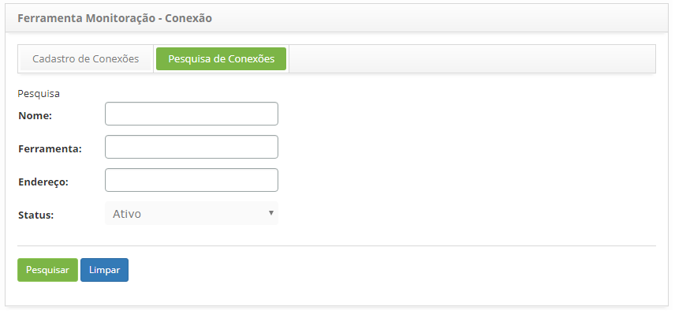
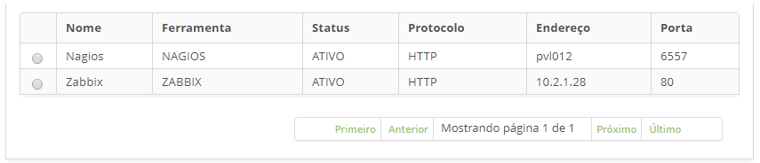
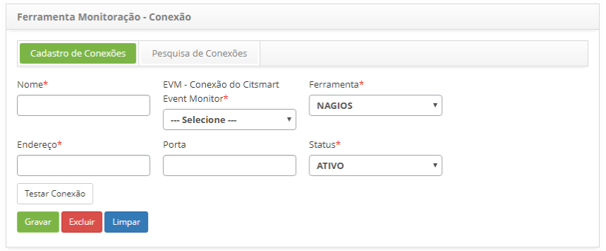

title: Cadastro e pesquisa das ferramentas de monitoração de eventos
Description: Esta funcionalidade tem como objetivo cadastrar as ferramentas que serão vinculadas ao Gerenciamento de Eventos para 
# Cadastro e pesquisa das ferramentas de monitoração de eventos

Esta funcionalidade tem como objetivo cadastrar as ferramentas que serão vinculadas ao Gerenciamento de Eventos para realizar a 
monitoração dos diversos itens de configuração.

Pré-condições
---------------

1. Cadastrar Conexão do CITSmart Event Monitor (ver conhecimento [Conexão CITSmart Event Monitor](/pt-br/citsmart-platform-7/additional-features/add-ons/event-monitor-connection.html)).

Como acessar
---------------

1. Acesse a funcionalidade de ferramenta de monitoração através da navegação no menu principal 
**Processos ITIL > Gerência de Evento > Ferramentas de Monitoração**.

Filtros
---------

1. Os seguintes filtros possibilitam ao usuário restringir a participação de itens na listagem padrão da funcionalidade, 
facilitando a localização dos itens desejados:

    -  Nome;
    - Ferramenta;
    - Endereço;
    - Status.
    
    
    
    **Figura 1 - Tela de pesquisa de conexões**
    
2. Realize a pesquisa de conexão do Citsmart event monitor;

    - Informe os filtros (nome da conexão, ferramenta de monitoração, endereço IP do servidor e/ou status da conexão) conforme 
    sua necessidade e clique no botão "Pesquisar". Após isso, será exibido o registro da conexão da ferramenta de monitoração 
    conforme os dados informados;
    
    - Caso deseje listar todos os registros, basta clicar diretamente no botão "Pesquisar".
    
Listagem de itens
-------------------

1. Os seguintes campos cadastrais estão disponíveis ao usuário para facilitar a identificação dos itens desejados na listagem
padrão da funcionalidade: **Nome, Ferramenta, Status, Protocolo, Endereço** e **Porta**.

    
    
    **Figura 2 - Tela de listagem de conexões**
    
2. Após a pesquisa, selecione o registro desejado. Feito isso, será direcionado para a tela de cadastro exibindo o conteúdo
referente ao registro selecionado e as informações do usuário que realizou o registro e data/hora da criação;

3. Para alterar os dados do registro da conexão da ferramenta de monitoração, basta modificar as informações desejadas e clicar
no botão "Gravar", para confirmar as alterações no banco de dados, em que data, hora e usuário serão armazenados automaticamente 
para uma auditoria futura.

Preenchimento dos campos cadastrais
------------------------------------

1. Será apresentada a tela de **Cadastro de Conexão da Ferramenta de Monitoração**, conforme ilustrada na figura abaixo:

    
    
    **Figura 3 - Tela de cadastro de conexão da ferramenta de monitoração**
    
2. Nesta tela, os campos são autoexplicativos. Basta posicionar o mouse sobre o campo escolhido e será apresentada uma breve
descrição. Portanto serão abordadas somente as informações principais para efetuar o registro da conexão;

    - Informe os dados da conexão;
    - No campo **EVM - Conexão do Citsmart Event Monitor**, selecione a conexão do Citsmart Event Monitor que deseja relacionar 
    a ferramenta de monitoração;
    - Após informar os dados da conexão, clique no botão **Testar Conexão** para testar conexão com a ferramenta de monitoração.
    
!!! tip "About"

    <b>Product/Version:</b> CITSmart | 7.00 &nbsp;&nbsp;
    <b>Updated:</b>07/17/2019 – Larissa Lourenço
