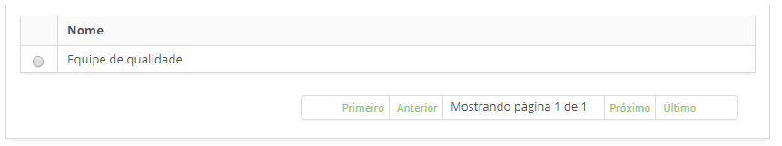
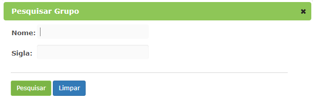

title: Configuração dos destinatários das notificações
Description: Esta funcionalidade tem como objetivo de configurar os destinatários que receberão as notificações. 
# Configuração dos destinatários das notificações

Esta funcionalidade tem como objetivo de configurar os destinatários que receberão as notificações. O destinatário pode ser 
um ou mais colaboradores e/ou grupos.

Como acessar
-------------

1. Acesse a funcionalidade de configuração de destinatário através da navegação no menu principal 
**Processos ITIL > Gerência de Evento > Configuração de Destinatário**. 

Pré-condições
--------------

1. Cadastro de colaborador (ver conhecimento [Cadastro e pesquisa de colaborador](/pt-br/citsmart-platform-7/initial-settings/access-settings/user/group.html));

2. Cadastro de grupo (ver conhecimento [Cadastro e pesquisa de grupo](/pt-br/citsmart-platform-7/initial-settings/access-settings/user/group.html)).

Filtros
---------

1. Os seguintes filtros possibilitam ao usuário restringir a participação de itens na listagem padrão da funcionalidade, 
facilitando a localização dos itens desejados, conforme ilustrado na figura abaixo:

    - Nome.
    
2. Na tela de **Configuração de Destinatário**, clique na aba **Pesquisar**. Será apresentada a tela de pesquisa conforme ilustrada
na figura abaixo:

    
    
    **Figura 1 - Tela de pesquisa de configuração de destinatário**
    
3. Realize a pesquisa de configuração de destinatário;

    - Informe o nome da configuração de destinatário que deseja pesquisar e clique no botão "Pesquisar". Após isso, será exibido o 
    registro conforme o nome informado;
    
    - Caso deseje listar todos os registros de configuração de destinatário, basta clicar diretamente no botão "Pesquisar".
    
Listagem de itens
--------------------

1. O seguinte campo cadastral está disponível ao usuário para facilitar a identificação dos itens desejados na listagem 
padrão da funcionalidade: **Nome**.

    
    
    **Figura 2 - Tela de listagem de configuração de destinatário**
    
2. Após a pesquisa, selecione o registro desejado. Feito isso, será direcionado para a tela de cadastro exibindo o conteúdo
referente ao registro selecionado;

3. Para alterar os dados do registro de configuração de destinatário, basta modificar as informações dos campos desejados e 
clicar no botão "Gravar" para que seja gravada a alteração realizada no registro, onde a data, hora e usuário serão gravados 
automaticamente para uma futura auditoria.

Preenchimento dos campos cadastrais
-------------------------------------

1. Acesse a funcionalidade, após isso, será apresentada a tela de Cadastro de **Configuração de Destinatário**, conforme 
ilustrada na figura abaixo:

    
    
    **Figura 3 - Tela de cadastro de configuração de destinatário**
    
2. Informe os dados para cadastro de configuração de destinatário:

    - **Nome**: informe o nome que desejar para a configuração de destinatário.
    
Vinculando destinatários - colaboradores
------------------------------------------

1. Para adicionar colaborador selecione a aba **Destinatários - Colaboradores**, clique no botão "Adicionar" e será apresentada a 
tela para pesquisar e selecionar colaborador:

**Figura 4 - Tela de pesquisa de colaborador**

Vinculando destinatários - grupos
----------------------------------

1. Para adicionar grupo selecione a aba **Destinatários - Grupos**, clique no botão "Adicionar" e será apresentada a tela para
pesquisar e selecionar grupo:

    
    
    **Figura 5- Tela de pesquisa de grupo**
    
2. Para excluir os colaboradores e grupos adicionados, basta clicar no ícone .

3. Clique no botão "Gravar" para efetuar o registro, onde a data, hora e usuário serão gravados automaticamente para 
uma futura auditoria.

!!! tip "About"

    <b>Product/Version:</b> CITSmart | 7.00 &nbsp;&nbsp;
    <b>Updated:</b>07/18/2019 – Larissa Lourenço
