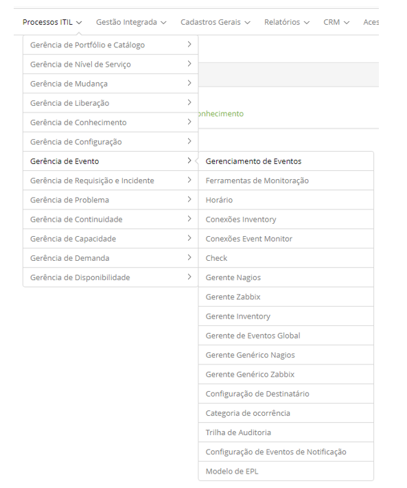

title: Módulo Gerenciamento de Evento
Description: O Gerenciamento de Eventos recebe e filtra os diversos eventos gerados por serviços de TI.
# Módulo Gerenciamento de Evento

Objetivo do módulo
--------------------

O Gerenciamento de Eventos recebe e filtra os diversos eventos gerados por serviços de TI, ICs e ferramentas de monitoração. A 
filtragem destes eventos vai determinar quando é necessário tomar alguma ação. Diversas ações podem ser tomadas, como abrir um 
registro de incidente, problema ou mudança, ou executar algum procedimento manual ou automatizado.

O Gerenciamento de Eventos apoia o processo de Gerenciamento de Incidentes, pois a partir dele é possível detectar com antecedência 
falhas nos serviços e atuar rapidamente para evitar uma indisponibilidade do serviço para o usuário final.

Monitoração e Gerenciamento de Eventos estão intimamente ligados. O Gerenciamento de Eventos se concentra em gerar e detectar 
notificações significativas sobre o status da infraestrutura e serviço de TI e o monitoramento é necessário para detectar e 
acompanhar estas notificações. A monitoração observa várias condições do ambiente e ajuda a detectar eventos e o Gerenciamento 
de Eventos lida com eventos que têm significado.

Onde estão suas funcionalidades
----------------------------------

Acesse o menu principal **Processos ITIL > Gerência de Evento**.

**Figura 1 - Menu do módulo Gerência de Evento**

Principal funcionalidade (em destaque)
---------------------------------------

Na seção "Veja também" é possível acessar a(s) funcionalidade(s) principal(is) deste módulo, desta forma se pode obter um 
conhecimento mais detalhado.

Veja também
------------

- [Gerenciamento de Evento](/pt-br/citsmart-platform-7/processes/event/event-management.html)

!!! tip "About"

    <b>Product/Version:</b> CITSmart | 7.00 &nbsp;&nbsp;
    <b>Updated:</b>07/19/2019 – Larissa Lourenço
