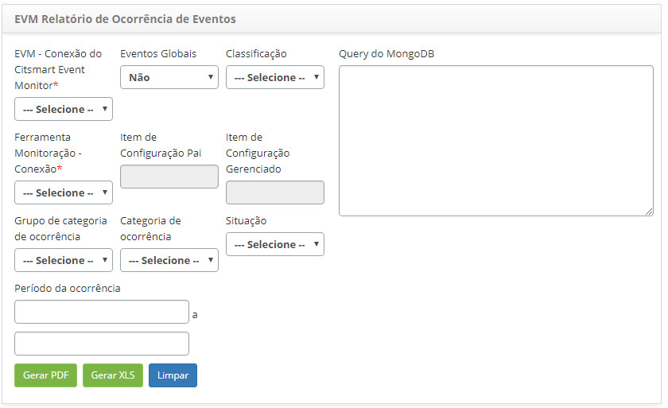

title:  Geração de relatórios - Gerenciamento de Eventos
Description: Este relatório tem o objetivo de apresentar as ocorrências de eventos. 
# Geração de relatórios - Gerenciamento de Eventos

Este relatório tem o objetivo de apresentar as ocorrências de eventos que foram armazenadas no **Banco de Dados de Eventos 
(MongoDB)**.

Como acessar
-----------------

1. Acesse a funcionalidade de Relatório de Ocorrência de Eventos através da navegação no menu principal 
**Relatórios > Gerenciamento de Eventos > Ocorrência de Eventos**.

Pré-condições
----------------

1. Não se aplica.

Filtros
----------

1. Os seguintes filtros possibilitam ao usuário restringir a participação de itens na listagem padrão da funcionalidade,
facilitando a localização dos itens desejados:

    - EVM - Conexão do CITSmart Event Monitor;
    - Eventos Globais;
    - Classificação;
    - Query do MongoDB;
    - Ferramenta Monitoração - Conexão;
    - Item de Configuração Pai;
    - Item de Configuração Gerenciado;
    - Grupo de Categoria de Ocorrência;
    - Categoria de Ocorrência;
    - Situação;
    - Período da Ocorrência.
    
2. Será apresentada a tela de **Geração de Relatório de Ocorrência de Eventos**, conforme ilustrada na figura a seguir:

    
    
    **Figura 1 - Tela de geração de relatório de ocorrência de eventos**
    
3. Informe os filtros de acordo com sua necessidade para geração do relatório de ocorrência de eventos;

4. Clique no botão "Gerar PDF" para gerar o relatório de ocorrência de eventos no formato PDF;

5. Clique no botão "Gerar XLS" para gerar o relatório de ocorrência de eventos no formato Excel.

Listagem de itens
-------------------

1. Não se aplica.

Preenchimento dos campos cadastrais
---------------------------------------

1. Não se aplica.

!!! tip "About"

    <b>Product/Version:</b> CITSmart | 7.00 &nbsp;&nbsp;
    <b>Updated:</b>08/02/2019 - Larissa Lourenço
