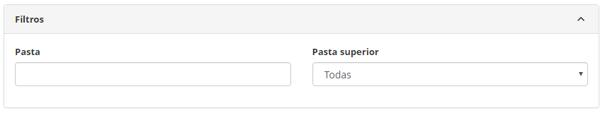
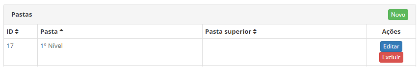
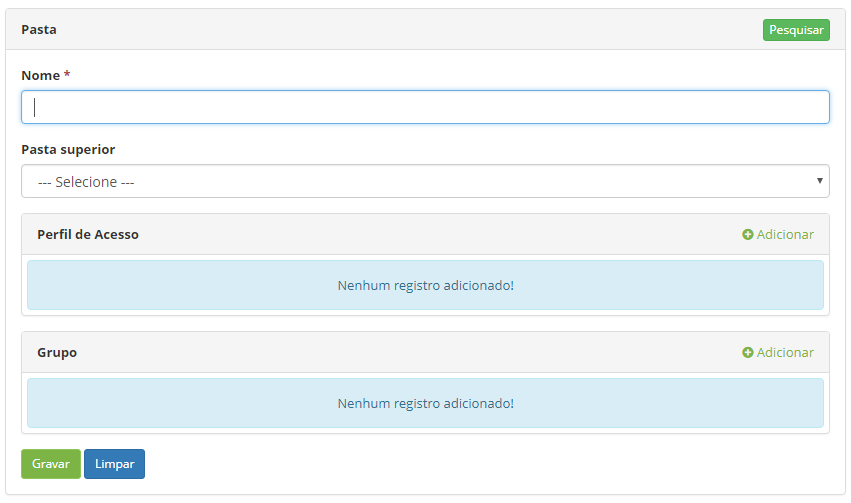

title: Cadastro e pesquisa de pasta

Description:Esta funcionalidade tem por objetivo criar e manter pastas que serão utilizadas para armazenamento e organização dos conhecimentos registrados na base.

# Cadastro e pesquisa de pasta

Esta funcionalidade tem por objetivo criar e manter pastas que serão utilizadas
para armazenamento e organização dos conhecimentos registrados na base.

Como acessar
-----------

1.  Acesse a funcionalidade através da navegação no menu
    principal **Processos ITIL >  Gerência de Conhecimento >  Pasta**.

Pré-condições
-------------

1.  Ter ao menos um perfil cadastrado, um grupo cadastrado ou ambos cenários
    (ver conhecimento [Cadastro e pesquisa de perfil de acesso][1], [Cadastro
    e pesquisa de grupo][2]).

Filtros
------

1.  Os seguintes filtros possibilitam ao usuário restringir a participação de
    itens na listagem padrão da funcionalidade, facilitando a localização dos
    itens desejados:

    -   Pasta

    -   Pasta Superior (escolha única)

**Figura 1 - Tela de pesquisa pasta**

Listagem de itens
----------------

1.  Os seguintes campos cadastrais estão disponíveis ao usuário para facilitar a
    identificação dos itens desejados na listagem padrão da
    funcionalidade: ID, Pasta e Pasta Superior.

2.  Existem botões de ação disponíveis ao usuário em relação a cada item da
    listagem, são eles: *Editar* e *Excluir*.

**Figura 2 - Tela de listagem de pasta**

Preenchimento dos campos cadastrais
---------------------------------

1.  Ao se clicar no botão Novo, a seguinte tela será apresentada:

    

    **Figura 3 - Tela de cadastro de pasta**

1.  Preencha os campos:

    -  **Nome**: define o título usado nas listas de pastas em outras
    funcionalidades

    -  **Pasta Superior**: define a pasta que agrupa esta pasta e outras, quando
    não preenchido significa que não há nenhum nível superior de pastas

    -  **Perfil de Acesso**: permite selecionar os perfis que terão acesso à pasta,
    permitindo configurar:

       -  **Permissão**: define se o perfil pode fazer Leitura ou Leitura/
        Gravação

       -  **Pode publicar**: define se o usuário pode ou não publicar

    -  **Grupo**: seleciona os grupos que terão a pasta, clicando no botão
    Adicionar. Permite a reunião de mais de um perfil/grupo em um só:

       -  **Permissão**: define se o perfil pode fazer Leitura ou Leitura/
        Gravação

       -  **Pode publicar**: define se o usuário pode ou não publicar

!!! info "IMPORTANTE"

     Quando definir o perfil de acesso das pastas por grupo e perfil de acesso,
     prevalecerá aquele com maiores permissões (campos: Permissão e Pode
     Publicar).

!!! tip "About"

    <b>Product/Version:</b> CITSmart | 8.00 &nbsp;&nbsp;
    <b>Updated:</b>07/17/2019 – Anna Martins
    
[1]:/pt-br/citsmart-platform-7/initial-settings/access-settings/profile/user-profile.html
[2]:/pt-br/citsmart-platform-7/initial-settings/access-settings/user/group.html
