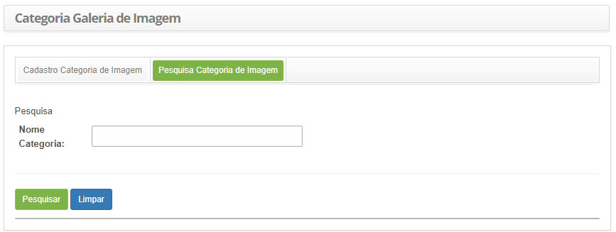
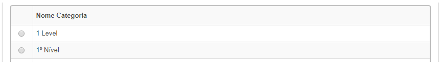
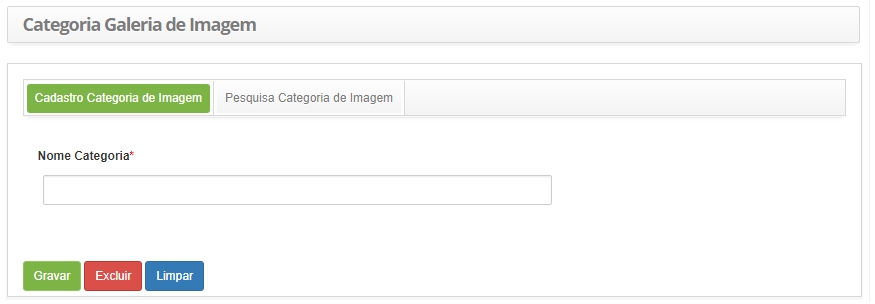

title:Cadastro e pesquisa de categoria de imagem
Description:Esta funcionalidade tem por objetivo de registrar as categorias de imagens para organização das imagens dentro da galeria que o sistema administra e usa.

# Cadastro e pesquisa de categoria de imagem

Esta funcionalidade tem por objetivo de registrar as categorias de imagens para
organização das imagens dentro da galeria que o sistema administra e usa.

Como acessar
------------

1.  Acesse a funcionalidade de Pesquisa de Liberação através da navegação no
    menu principal **Processos ITIL > Gerência de
    Conhecimentos > Categoria Galerias de Imagens**.

Pré-condições
-------------

1.  Não se aplica.

Filtros
--------

1.  O seguinte filtro possibilita ao usuário restringir a participação de itens
    na listagem padrão da funcionalidade, facilitando a localização dos itens
    desejados, conforme ilustrado na figura abaixo:

    -   Nome Categoria.

1.  Na tela de **Categoria Galeria de Imagem**, clique na aba **Pesquisa
    Categoria de Imagem**. Será apresentada a tela de pesquisa conforme
    ilustrada na figura abaixo:

    
   
    **Figura 1 - Tela de pesquisa de categoria de imagem**

1.  Realize a pesquisa de categoria de imagem:

    -   Informe o nome da categoria de imagem que deseja pesquisar e clique no
    botão *Pesquisar*. Após isso, será exibido o registro da categoria de imagem
    conforme o nome informado;

    -   Caso deseje listar todos os registros de categoria de imagem, basta clicar
    diretamente no botão *Pesquisar*.

Listagem de itens
----------------

1.  O seguinte campo cadastral está disponível ao usuário para facilitar a
    identificação dos itens desejados na listagem padrão da
    funcionalidade: **Nome Categoria**.

    

    **Figura 2 - Tela de listagem de categoria de imagem**

1.  Após a pesquisa, selecione o registro desejado. Feito isso, será direcionado
    para a tela de cadastro exibindo o conteúdo referente ao registro
    selecionado;

2.  Para alterar os dados do registro de categoria de imagem, basta modificar as
    informações dos campos desejados e clicar no botão *Gravar* para que seja
    gravada a alteração realizada no registro, onde a data, hora e usuário serão
    gravados automaticamente para uma futura auditoria.

Preenchimento dos campos cadastrais
---------------------------------

1.  Acesse a funcionalidade de categoria de imagem através da navegação no
    menu principal. Após isso, será apresentada a tela de cadastro de categoria
    de imagem, conforme ilustrada na figura abaixo:

    

    **Figura 3 - Tela de cadastro de categoria de imagem**

1.  Preencha os campos conforme orientações abaixo:

-   **Nome Categoria**: informe o nome da categoria de imagem.

!!! tip "About"

    <b>Product/Version:</b> CITSmart | 8.00 &nbsp;&nbsp;
    <b>Updated:</b>07/17/2019 – Anna Martins
