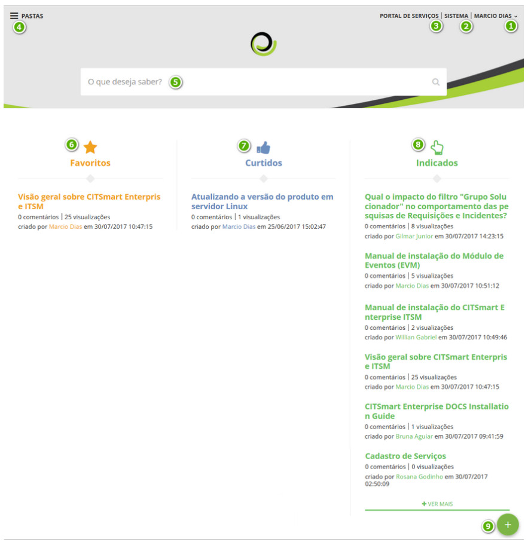
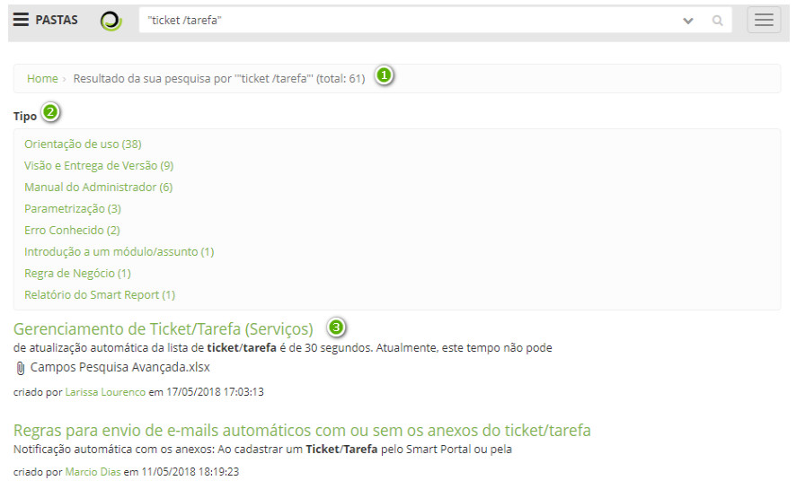
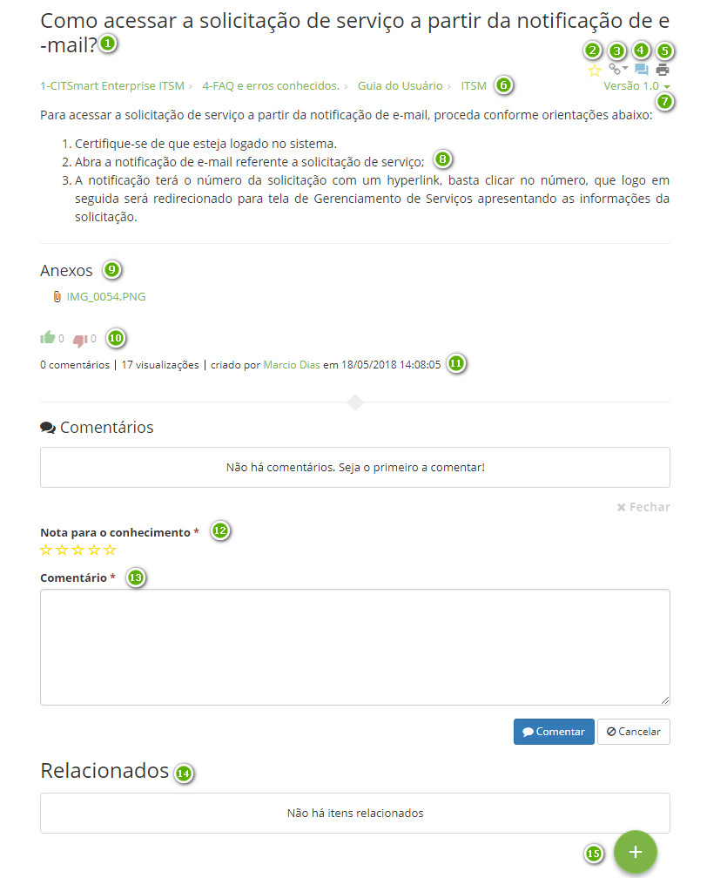

title:  Portal do Conhecimento
Description: O Portal do Conhecimento é uma das telas principais da solução, que visa fornecer informações relevantes. 
# Portal do Conhecimento

O Portal do Conhecimento é uma das telas principais da solução, que visa fornecer informações relevantes que permitam ao 
operador (usuário ou administrador) o entendimento e aplicação de um determinado conhecimento.

Também possibilita que o mesmo registre um novo conhecimento, de modo a tornar o portal dinâmico e atualizado.

**Figura 1- Portal do Conhecimento**

 **Identificação do usuário logado**: ao clicar nesta opção, são exibidas as funções para alterar a senha
de acesso e sair do portal;

 **Sistema**: ao clicar nesta opção, permite entrar no sistema;

 **Portal de Serviços**: ao clicar nesta opção, será apresentada uma das telas principais do produto, o
Portal de Serviços (Smart Portal);

 **Pastas**: exibe as pastas que o usuário logado tem acesso para visualização dos conhecimentos das
mesmas;

 **Campo de pesquisa**: permite a busca por conhecimentos;

 **Favoritos**: conhecimentos que foram marcados como favorito pelo o usuário logado;

 **Curtidos**: conhecimentos que foram curtidos pelo usuário logado;

 **Indicados**: conhecimentos indicados ao usuário, referentes às funcionalidades do sistema mais 
acessadas. Exemplo: o usuário logado acessa sempre a funcionalidade de "Solicitação de Serviço", quando o mesmo entrar no Portal do 
Conhecimento, o sistema irá indicar os conhecimentos referentes à funcionalidade;

 **Adicionar Conhecimento**: permite ao usuário logado registrar um novo conhecimento na Base de 
Conhecimento.

Visualizando o conteúdo de um conhecimento 
---------------------------------------------

1. Após realizar a busca no Campo de pesquisa, será apresentado uma listagem:

    
    
    **Figura 2- Resultado de pesquisa**
    
     Mostra a quantidade de conhecimentos encontrados;
    
     **Tipo**: mostra os tipos de conhecimentos encontrados, sendo possível refinar ainda mais a busca
    inicial ao selecionar uma das opções;
    
     Relação de conhecimentos encontrados.
    
    !!! note "NOTA"
    
        A lista resultante é montada de acordo com determinadas prioridades de comparações (configuráveis). Por default, toda 
        lista resultante será montada comparando o texto procurado com (nesta ordem): (a) conteúdo do conhecimento, (b) título, 
        (c) anexos e (d) palavras-chaves (Tags).
        
2. Após encontrar o conhecimento desejado, clique no título para visualizar o conteúdo:

    
    
    **Figura 3 - Visualizando conhecimento**
    
     Título do conhecimento
    
     Ícone para favoritar o conhecimento para que ele seja relacionado na página principal do Portal
    do Conhecimento
    
     Ícone para visualizar a quais módulos ITIL o conhecimento está vinculado
    
     Ícone para deixar um comentário sobre o conhecimento
    
     Ícone para imprimir o conhecimento
    
     Caminho de pastas e sub-pastas para chegar a este conhecimento (migalha de pão)
    
     Lista para acesso às versões do conhecimento
    
     Lista de arquivos anexados ao conhecimento
    
     Conteúdo do conhecimento
    
     Ícones para registrar um "like" ou "unlike" sobre o conhecimento
    
     Quantidade de comentários, visualizações, nome de quem criou o conhecimento, data e horário de
    sua última modificação
    
     Estratégia de avaliação quantitativa do conhecimento (uma nota), que vai variar de 1 a 5, 
    dependendo da estrela marcada
    
     Local onde o usuário pode registrar seus comentários
    
     Local onde serão listados todos os conhecimentos que tiverem sido relacionados com o 
    conhecimento visualizado
    
     Ícone para contribuir com a gestão de conhecimento da organização, ou seja, a maneira que o 
    usuário tem para criar (propor) um novo conhecimento
    
Veja também
-------------

- [Gerenciamento de Conhecimento](/pt-br/citsmart-platform-7/processes/knowledge/management.html)

- [Dicas sobre como realizar pesquisas no Portal do Conhecimento e Guia do Usuário](/pt-br/citsmart-platform-7/processes/knowledge/tips-search-knowledge.html)

- [Regras de parametrização - Conhecimento](/pt-br/citsmart-platform-7/plataform-administration/parameters-list/parametrization-knowledge.html)

!!! tip "About"

    <b>Product/Version:</b> CITSmart | 7.00 &nbsp;&nbsp;
    <b>Updated:</b>07/29/2019 - Larissa Lourenço
    
