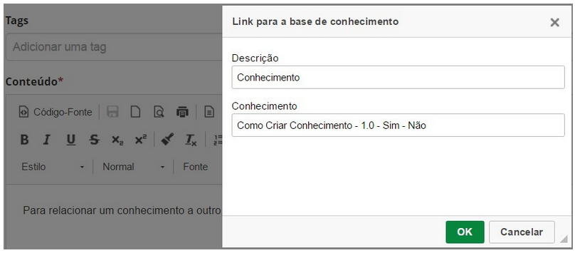

title: Gerenciamento de conhecimento
Description: O Gerenciamento do Conhecimento tem o objetivo de disponibilizar e gerenciar as informações e conhecimentos, de forma confiável e íntegra, que apoiam a execução do serviço.

# Gerenciamento de conhecimento

O Gerenciamento do Conhecimento tem o objetivo de disponibilizar e gerenciar as
informações e conhecimentos, de forma confiável e íntegra, que apoiam a execução
do serviço.

Como acessar
-----------

1.  Acesse o menu principal **Processos ITIL > Gerência de
    Conhecimento > Gerenciamento de Conhecimento**.

Pré-condições
------------

1.  Ter pastas cadastradas para inserção e organização dos conhecimentos (ver
    conhecimento [Cadastro e pesquisa de pasta].

Filtros
------

1.  Os seguintes filtros possibilitam ao usuário restringir a participação de
    itens na listagem padrão da funcionalidade, facilitando a localização dos
    itens desejados:

    -   Título;

    -   Tipo do documento;

    -   Conteúdo;

    -   Publicado;

    -   Situação;

    -   Pasta.

**Figura 1 - Tela de pesquisa de conhecimentos**

Listagem de itens
----------------

1.  Os seguintes campos cadastrais estão disponíveis ao usuário para facilitar a
    identificação dos itens desejados na listagem padrão da
    funcionalidade: ID, Título, Tipo do
    documento, Versão, Publicado, Arquivado e Pasta.

2.  Existem botões de ação disponíveis ao usuário em relação a cada item da
    listagem, são eles: *Editar* e *Excluir*.

**Figura 2 - Tela de listagem de conhecimentos**

Preenchimento dos campos cadastrais
---------------------------------

1.  Será exibida a tela de Gerenciamento de Conhecimento;

2.  Clique no botão de opções  e logo em seguida clique no botão de cadastro  .
    Feito isso, será apresentada a tela de **Cadastro de Conhecimento**,
    conforme ilustrada na figura a seguir:

    

    **Figura 3 - Tela de cadastro de conhecimento**

1.  Preencha os campos conforme orientação abaixo:

    -   **Título**: informe o título do conhecimento;

    -   **Versão**: esse campo é para simples conferencia. Será apresentada o número
    da versão do conhecimento após gravação do mesmo;

    -   **Tipo de documento**: informe o tipo do conhecimento que será registrado;

    -   **Fonte/Referência**: informe a fonte/referência do conhecimento;

    -   **Pasta**: selecione a pasta na qual o conhecimento será armazenado;

    -   **Origem**: informe a origem do conhecimento;

    -   **Situação**: informe a situação do conhecimento;

    -   **Data de Expiração**: informe a data de expiração do conhecimento;

    -   **Justificativa/Observação**: informe as observações referente ao
    conhecimento, se achar necessário;

    -   **Autor**: nesse campo será apresentado o nome do usuário que está
    registrando o conhecimento;

    -   **Publicador**: nesse campo será apresentado o nome do usuário, responsável
    por aprovar e publicar o conhecimento no portal do conhecimento;

    -   **Privacidade**: defina a privacidade do conhecimento:

        -   **Confidencial**: apenas o autor do conhecimento e o administrador da pasta
        terá acesso ao conhecimento;

        -   **Público**: todas as pessoas terão acesso ao conhecimento, mesmo àqueles
        que não têm permissão na pasta;

        -   **Interno**: somente as pessoas que têm permissão na pasta terão acesso ao
        conhecimento.

    !!! warning "ATENÇÃO"

        Deve-se ter muito cuidado ao utilizar a privacidade “Público”, pois corre-se o
        risco de disponibilizar documentos de forma inadequada. Este cenário
        desconsidera a configuração de perfil de acesso e libera o acesso do documento a
        todos os usuários.

    -   **Data de Criação**: esse campo é para simples conferência, pois será
    apresentado a data atual do registro do conhecimento;

    -   **Data de publicação**: será apresentado nesse campo a data de publicação do
    conhecimento no portal do conhecimento;

    -   **Publicar**: caso a pasta informada, permite a publicação do conhecimento,
    será exibido este campo para definir se o conhecimento será publicado no
    portal do conhecimento para pesquisa;

    -   **Tags**: informe as tags para o conhecimento. As tags são palavras-chave
    que servem justamente como uma etiqueta e ajudam na hora de organizar
    informações, agrupando aquelas que receberam a mesma marcação, facilitando
    encontrar outras relacionadas;

    -   **Conteúdo**: descreva o texto do conhecimento;

        -   Para adicionar um link (hiperlink) ao conteúdo do conhecimento, no intuito
        de acessar um link externo, proceda da seguinte forma:

        -   Selecione uma palavra ou frase e clique no ícone  para adição do
        hiperlink. Feito isso, será exibida a tela para informar os dados do
        mesmo, conforme ilustrada na figura abaixo:

    

    **Figura 4 - Registro de informações do hiperlink**

    -   Informe o tipo de hiperlink, o protocolo e a URL do hiperlink. Feito isso,
    clique em *Ok* para efetuar a operação. Após isso, será inserido o hiperlink
    ao conhecimento, conforme exemplo ilustrado na figura abaixo:

    

    **Figura 5 - Hiperlink inserido ao conhecimento**

    -   Para adicionar um link (hiperlink) ao conteúdo do conhecimento, no intuito
    de relacionar um conhecimento a outro conhecimento, proceda da seguinte
    forma:

    -   Clique no ícone  para adição do hiperlink. Feito isso, será exibida a tela
    para informar os dados do mesmo, conforme ilustrada na figura abaixo:

    
    
    **Figura 6 - Registro de informações do hiperlink**

    -   Informe a descrição para o hiperlink, pesquise e selecione o conhecimento
    que deseja relacionar. Feito isso, clique em *Ok* para efetuar a operação.
    Após isso, será inserido o hiperlink ao conhecimento, conforme exemplo
    ilustrado na figura abaixo:

    
    
    **Figura 7 - Hiperlink inserido ao conhecimento**

    -   Para adicionar uma imagem ao conteúdo do conhecimento, basta clicar e
    arrastar a imagem do seu computador para a área de descrição do texto do
    conhecimento;

    -   Para adicionar um vídeo ao conteúdo do conhecimento, proceda da seguinte
    forma:

    -   Clique no ícone  . Feito isso, será exibida a tela upload de vídeo, conforme
    ilustrada na figura abaixo:

    
    
    **Figura 8 - Upload de vídeo do servidor**

    -   Na aba **Vídeo do servidor**, permite inserir um vídeo que está localizado
    no servidor de vídeos ou no seu computador;

    -   Clique no botão *Localizar no Servidor* e após isso, é apresentada a tela de
    vídeos;

    -   Selecione vídeo desejado. Mas caso não tenha o vídeo no servidor, adicione
    um novo vídeo;

    -   Após o vídeo selecionado, defina as configurações do mesmo:

        -   **Responsivo:** significa que o vídeo será renderizado conforme o tamanho da
         tela;

        -   **Mostrar controles**: significa que o vídeo possuirá os botões de executar,
        para etc;

        -   **Início Automático**: significa que o vídeo iniciará sua execução assim que
        a tela do conhecimento se abrir;

        -   **Tamanho**: defina o tamanho que o vídeo irá aparecer na tela;

        -   **Alinhamento**: selecione o alinhamento do vídeo para ser apresentado no
        conhecimento.

     -   Na aba **Embedded**, permite inserir vídeos do YouTube:

         -   Acesse o YouTube, busque pelo vídeo que deseja adicionar no conhecimento;

         -   Clique com o botão direito do mouse sobre o vídeo e logo em seguida clique
         em *Copiar código de incorporação*, conforme indicado na figura abaixo:

     
     
     **Figura 9 - Vídeo do YouTube**

    -   No campo **Código**, cole o código do vídeo do YouTube, conforme exemplo
    ilustrado na figura abaixo:

     
     
     **Figura 10 - Upload de vídeo do YouTube**

     -   Após a inserção do vídeo, clique no botão *Ok* para efetuar a operação.

     -   Para anexar um arquivo no registro de conhecimento, basta clicar no mesmo e
    arrastar para área de anexo.

1.  Após os dados informados, clique no botão de opções  e logo em seguida
    clique no botão gravar   para efetuar o registro, onde a data, hora e
    usuário serão gravados automaticamente para uma futura auditoria.

Relacionando conhecimento
------------------------

1.  Na tela de **Cadastro de Conhecimento**, clique na aba **Documento
    relacionado**. Feito isso, será apresentada a tela de relacionamento de
    conhecimentos;

2.  Busque o conhecimento que deseja relacionar ao conhecimento que está sendo
    cadastrado. Após a busca, basta clicar sobre o mesmo para efetuar o
    relacionamento.

Relacionando categoria de ocorrência de eventos
-----------------------------------------------

1.  Na tela de **Cadastro de Conhecimento**, clique na aba **Categoria de
    ocorrência de evento**. Feito isso, será apresentada a tela de
    relacionamento de categoria de ocorrência;

2.  Busque a categoria de ocorrência de eventos que deseja relacionar ao
    conhecimento que está sendo cadastrado. Após a busca, basta clicar sobre o
    mesmo para efetuar o relacionamento.

!!! info "IMPORTANTE"

    O objetivo do uso desta aba é fazer com que telas do módulo
    Gerenciamento de Eventos mostrem conhecimentos relacionados a uma categoria
    sempre que esta seja selecionada, similar ao que acontece com serviços no módulo
    de Gerenciamento de Portfólio. Portanto é esta aba que permite configurar este
    tipo de ligação entre os dois módulos.

Adicionando as partes interessadas
---------------------------------

É possível associar um conhecimento a um usuário e/ou a um grupo de usuários, o
objetivo desse tipo de vínculo é configurar notificações automáticas para
aqueles com interesse em acompanhar qualquer mudança em um conteúdo específico.

Para realizar este vínculo, basta seguir os seguintes passos:

1.  Na tela de **Cadastro de Conhecimento**, clique na aba **Partes
    Interessadas**. Feito isso, será apresentada a tela para adição das partes
    interessadas;

    

    **Figura 11 - Tela de adição de partes interessadas**

1.  Preencha os campos conforme desejar e clique no botão *Adicionar*.

Configurando as notificações
---------------------------

1.  Na tela de **Cadastro de Conhecimento**, clique na aba **Notificações**.
    Feito isso, será apresentada a tela de configuração de notificações;

    

    **Figura 12 - Tela de configuração de notificação**

1.  Preencha os campos com as informações corretas para a configuração de
    notificação referente ao conhecimento.

Vinculando item de configuração ao conhecimento
-----------------------------------------------

1.  Na tela de **Gerenciamento de Conhecimento**, realize a busca do
    conhecimento desejado e após isso, clique no botão *Editar*. Será
    apresentado o registro do determinado conhecimento;

2.  Clique na aba **Item de Configuração** e após isso, será exibida a tela de
    vínculo de Item de Configuração ao conhecimento;

    

    **Figura 13 - Tela de vínculo de item de configuração**

1.  Busque o Item de Configuração que deseja vincular ao conhecimento. Após a
    busca, basta clicar sobre o mesmo para efetuar o vínculo.

Opções avançadas
---------------

1.  No canto superior direito na tela de cadastro de conhecimento existe o
    botão   que apresentará as seguintes flags:

    

    **Figura 14 - Funcionalidades avançadas**

    -   **Ger. Disponibilidade?**: significa se conhecimento cadastrado é referente
    ao Gerenciamento de Disponibilidade;

    -   **Direitos Autorais**: significa se conhecimento cadastrado é referente a um
    direito autoral;

    -   **Legislação**: significa se conhecimento cadastrado é referente a uma
    legislação.

!!! tip "About"

    <b>Product/Version:</b> CITSmart | 8.00 &nbsp;&nbsp;
    <b>Updated:</b>07/18/2019 – Anna Martins
