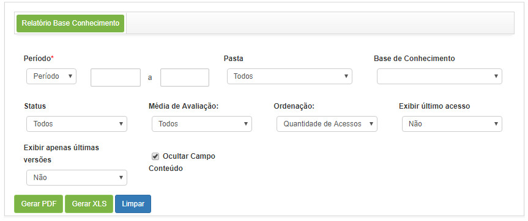
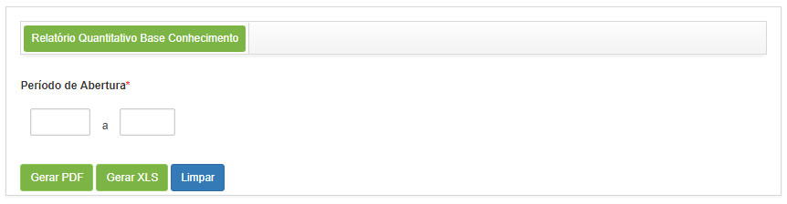
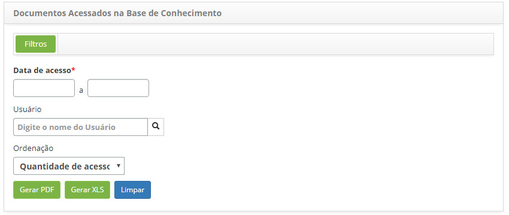
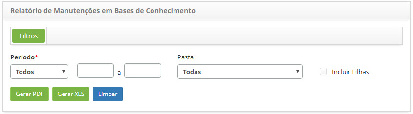

title:  Geração de relatórios - Gerência de Conhecimentos
Description: Esse relatório tem o objetivo de apresentar as informações referentes aos conhecimentos contidos na base de conhecimento. 
# Geração de relatórios - Gerência de Conhecimentos

Gerando relatório de base de conhecimento
--------------------------------------------

Esse relatório tem o objetivo de apresentar as informações referentes aos conhecimentos contidos na base de conhecimento.

*Como Acessar*

1. Acesse a funcionalidade de Relatório de Base de Conhecimento através da navegação no menu principal 
**Relatórios > Gerência de Conhecimentos > Base Conhecimento**.

*Filtros*

1. Os seguintes filtros possibilitam ao usuário restringir a participação de itens na listagem padrão da funcionalidade, 
facilitando a localização dos itens desejados:

    - **Período**: selecione o tipo de período desejado e após isso, informe o período;
    - **Pasta**: selecione a pasta na qual está armazenado o conhecimento;
    - **Base de Conhecimento**: selecione o conhecimento;
    - **Status**: selecione a situação do conhecimento;
    - **Média de Avaliação**: selecione a média de avaliação do conhecimento;
    - **Ordenação**: selecione a ordenação que será apresentada no relatório;
    - **Exibir último acesso**: informe se deseja exibir no relatório os últimos acessos;
    - **Exibir apenas últimas versões**: informe se deseja exibir apenas as últimas versões no relatório;
    - **Ocultar Campo Conteúdo**: marque este campo caso queira ocultar o conteúdo dos conhecimentos para não serem apresentados no
    relatório.
    
2. Será apresentada a tela de **Geração de Relatório de Base de Conhecimento**, conforme ilustrada na figura a seguir:

    
    
    **Figura 1 - Tela de geração de relatório de base de conhecimento**
    
3. Defina os filtros conforme sua necessidade.

!!! note "NOTA"

    É exibido no relatório a quantidade de acessos ao conhecimento, essa quantidade é contabilizada por usuário, sendo contado
    apenas 1 clique por hora.
    
Gerando relatório quantitativo de base de conhecimento
---------------------------------------------------------

Esse relatório tem o objetivo de apresentar a quantidade de conhecimentos, por situação, origem, avaliação, autor e aprovador,
contidos na base de conhecimento.

*Como acessar*

1. Acesse a funcionalidade de Relatório Quantitativo de Base de Conhecimento através da navegação no menu principal 
**Relatórios > Gerência de Conhecimentos > Quantitativo Base Conhecimento**.

*Filtros*

1. O seguinte filtro possibilita ao usuário restringir a participação de itens na listagem padrão da funcionalidade, facilitando 
a localização dos itens desejados:

    - **Período de Abertura**: informe o período desejado.
    
2. Será apresentada a tela de **Geração de Relatório Quantitativo de Base de Conhecimento**, conforme ilustrada na figura a 
seguir:

    
    
    **Figura 2 - Tela de geração de relatório de base de conhecimento**
    
3. Defina os filtros conforme sua necessidade.

Gerando relatório de docmentos acessados na base de conhecimento
-------------------------------------------------------------------

Esse relatório tem o objetivo de apresentar a quantidade de acessos nos documentos da base de conhecimento.

*Como acessar*

1. Acesse a funcionalidade de Relatório de Documentos Acessados na Base de Conhecimento através da navegação no menu principal 
**Relatórios > Gerência de Conhecimentos > Documentos acessados**.

*Filtros*

1. Os seguintes filtros possibilitam ao usuário restringir a participação de itens na listagem padrão da funcionalidade,
facilitando a localização dos itens desejados:

    - **Data de Acesso**: informe o período desejado;
    - **Usuário**: selecione o usuário;
    - **Ordenação**: selecione a ordenação que será apresentada no relatório.
    
2. Será apresentada a tela de Geração de Relatório de Documentos Acessados na Base de Conhecimento, conforme ilustrada na
figura a seguir:

    
    
    **Figura 3 - Tela de geração de relatório de documentos acessados**
    
3. Defina os filtros conforme sua necessidade.

Gerando relatório de manutenções em base de conhecimento
----------------------------------------------------------

Esse relatório tem por objetivo de apresentar as informações referente ao cadastro e/ou alterações de conhecimentos na base de 
conhecimentos.

*Como acessar*

1. Acesse a funcionalidade de Relatório de Manutenção em Base de Conhecimento através da navegação no menu principal
**Relatórios > Gerência de Conhecimentos > Manutenções em Bases de Conhecimento**.

*Filtros*

1. O seguinte filtro possibilita ao usuário restringir a participação de itens na listagem padrão da funcionalidade, facilitando
a localização dos itens desejados:

    - **Período**: selecione o tipo de período desejado e após isso, informe o período;
    - **Pasta**: selecione a pasta de conhecimento;
    - **Incluir Filhas**: caso tenha selecionado uma pasta, marque esse campo para apresentar as informações em nível 
    hierárquico, para que seja possível visualizar a pasta selecionada e todas as suas filhas.
    
2. Será apresentada a tela de **Geração de Relatório de Manutenções em Base de Conhecimento**, conforme ilustrada na figura a 
seguir:

    
    
    **Figura 4 - Tela de geração de relatório**
    
3. Defina os filtros conforme sua necessidade.

!!! tip "About"

    <b>Product/Version:</b> CITSmart | 7.00 &nbsp;&nbsp;
    <b>Updated:</b>02/08/2019 - Larissa Lourenço  

