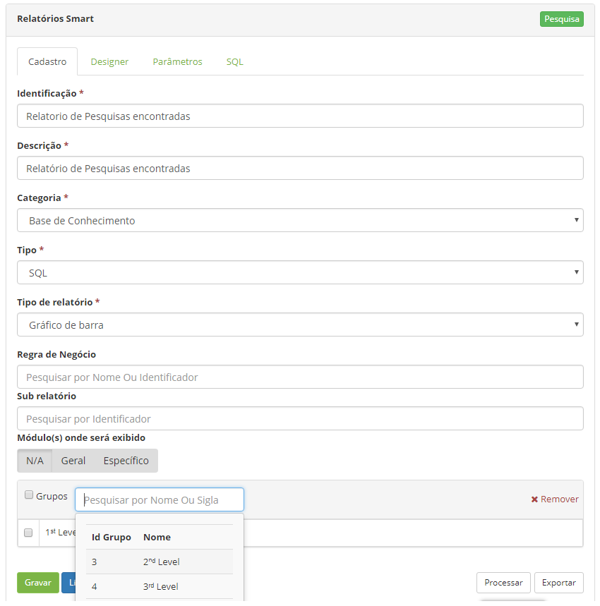
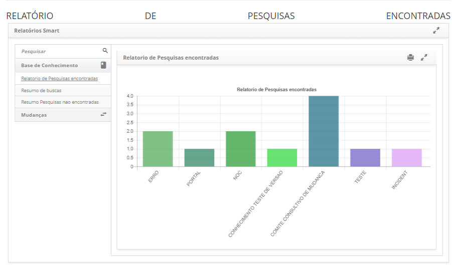
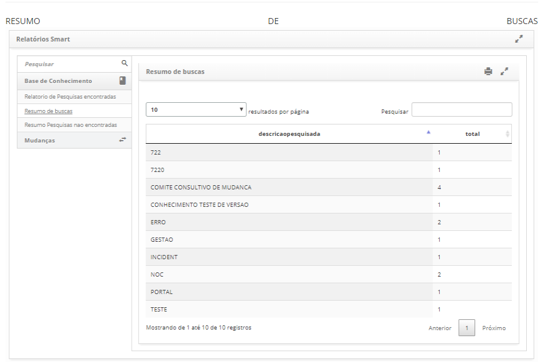

title: Relatório de tópicos ou asusntos encontrados, não encontrados e resumo de
buscas
Description: Esta funcionalidade tem o objetivo de realizar Relatórios de
Tópicos ou Assuntos disponíveis ou não na base de conhecimento que são
pesquisados no Portal do conhecimento.

# Relatório de tópicos ou asusntos encontrados, não encontrados e resumo de
buscas

Esta funcionalidade tem o objetivo de realizar Relatórios de Tópicos ou Assuntos
disponíveis ou não na base de conhecimento que são pesquisados no Portal do
conhecimento.

Pré-condições
------------

1.  O Solr tem que estar configurado e funcionando;

2.  O parâmetro 358 tem que estar configurado para Sim;

3.  O parâmetro 359 tem que estar configurado com o número de dias que o
    usuário quer armazenar os resultados para gerar os relatórios (Ex: 15 dias);

4.  Quando informado o sistema pega esse numero de dias e deleta os resultados
    que ultrapassam. Ex: coloca 1 dia, o sistema irá deletar todos os registros
    de ontem e manterá somente os registros armazenados hoje no banco de dados;

5.  Ter assuntos e tópicos cadastrados no Gerador de Relatórios Smart
    (Relatórios de Pesquisas encontradas, Resumo de Buscas, Resumos de Pesquisas
    não encontradas).

Como acessar
-----------

1.  Acesse o menu principal **Relatórios > Relatórios Smart >  Gerador
    de Relatórios Smart**.

Filtros
-------

O seguinte filtro possibilita ao usuário restringir a participação de itens na
listagem padrão da funcionalidade, facilitando a localização dos itens
desejados:

-   Nome.

    

    **Figura 1 - Tela de pesquisa de relatório**

Listagem de itens
----------------

Os seguintes campos cadastrais estão disponíveis ao usuário para facilitar a
identificação dos itens desejados na listagem padrão da funcionalidade: ID,
Nome, Categoría, Tipo de Consulta, Tipo de relatório, Ações.

**Figura 2 - Tela de lista de relatório smart**

Preenchimento dos campos cadastrais
----------------------------------

1.  Clicar no botão *Importar* e procurar pelos seguintes smart reports:

    -   Relatórios de Pesquisas encontradas;

    -   Resumo de Buscas;

    -   Resumos de Pesquisas não encontradas.

1.  Depois de adicionar os smart reports acima, clicar em *Editar* em cada um
    listado, a seguinte tela será apresentada:

    
    
    **Figura 3 - Tela de edição de relatório smart report**

1.  Incluir o grupo ao assunto em qual o usuário terá acesso e clicar
    em *Gravar.*

Pesquisa de relatórios de assuntos disponíveis ou não na base do conhecimento
-----------------------------------------------------------------------------

### Pré-condições

1.  Fazer pesquisas no portal do conhecimento antes de procurar o resultado do
    Relatório de pesquisas.

### Como acessar

1.  Acesse o menu principal **Relatórios > Relatórios Smart > Relatórios
    Smart**.

### Filtros

O seguinte filtro possibilita ao usuário restringir a participação de itens na
listagem padrão da funcionalidade, facilitando a localização dos itens
desejados:

    -   Nome do relatório.

    

    **Figura 4 - Tela de pesquisa de relatórios de assuntos**

Relatório de pesquisas encontradas
--------------------------------

    

    **Figura 5 - Relatório de pesquisas encontradas**

Gráfico de barras apresenta:

1.  No eixo X (Qualitativo) os assuntos pesquisados e encontrados

2.  No eixo Y (Quantitativo) a quantidade de assuntos pesquisados e encontrados
    em um período de tempo determinado

### Funcionamento

Na tela do portal o usuário informar o que deseja pesquisar, o sistema guarda
aquela descrição. Ao fazer a pesquisa no Solr, ele verifica nos tópicos se
existe alguma descrição igual, após isso, é só configurar um relatório smart
para trazer os dados armazenados, os arquivos para serem importados no
smartReport estão em anexo.

### Resumo pesquisas não encontradas

    

    **Figura 6 - Resumo de Buscas não encontradas**

Gráfico de barras apresenta:

1.  No eixo X (Qualitativo) os assuntos pesquisados e encontrados

2.  No eixo Y (Quantitativo) a quantidade de assuntos pesquisados e encontrados
    em um período de tempo determinado

### Funcionamento

Na tela do portal o usuário informar o que deseja pesquisar, o sistema busca
aquela descrição. Quando encontra, o sistema guarda o assunto referente e salva.
Quando não encontra ele apenas salva a descricão informada pelo usuário.

Após isso, é só configurar um relatório smart para trazer os dados armazenados,
os arquivos para serem importados no smartReport estão em anexo.

### Resumo de buscas

    
    
    **Figura 7 - Resumo de Buscas**

A tabela apresenta um resumo total da quantidade de assuntos pesquisados
(encontrados e não encontrados sem distinção)

### Filtros

Os seguintes filtros possibilitam ao usuário restringir a participação de itens
na listagem padrão da funcionalidade, facilitando a localização dos itens
desejados:

-   Resultados por página

-   Campo Pesquisar

###Funcionamento

Na tela do portal o usuário informa o que deseja pesquisar, o sistema pega
aquela descrição. Ao fazer a pesquisa no Solr, ele verifica nos tópicos se
existe alguma descrição igual. Quando apresenta, o sistema pega o assunto
referente e salva, quando não encontra, ele apenas salva a descrição informada
pelo usuário.

Após isso, é só configurar um relatório smart para trazer os dados armazenados,
os arquivos para serem importados no smartReport que estão em anexo.

Anexos
------

!!! tip "About"

    <b>Product/Version:</b> CITSmart | 8.00 &nbsp;&nbsp;
    <b>Updated:</b>07/18/2019 – Anna Martins
