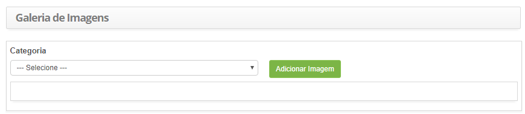
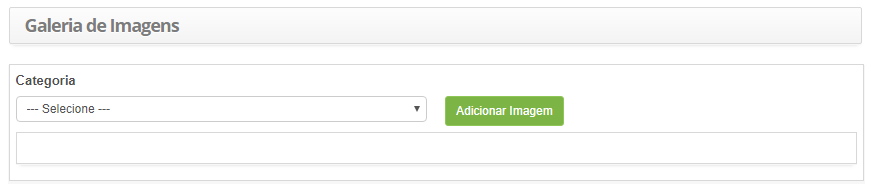
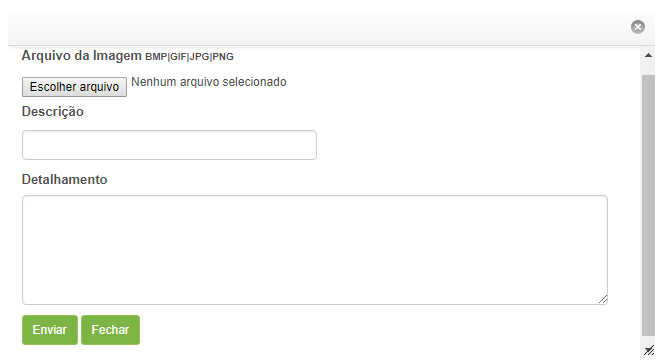

title: Armazenamento de imagens na galeria
Description: Esta funcionalidade tem o objetivo de realizar upload de imagens para serem utilizadas posteriormente no sistema.

# Armazenamento de imagens na galeria

Esta funcionalidade tem o objetivo de realizar upload de imagens para serem
utilizadas posteriormente no sistema.

Como acessar
-----------

1.  Acesse a funcionalidade de Galeria de Imagens através da navegação no menu
    principal **Processos ITIL >  Gerência de Conhecimento >  Galeria de
    Imagens**.

Pré- condições
---------------

1.  Para adição de imagens na galeria é necessário ter realizado o cadastro de
    categoria de imagem (ver conhecimento [Cadastro e pesquisa de categoria de
    imagem].

Filtros
-------

1.  Os seguintes filtros possibilitam ao usuário restringir a participação de
    itens na listagem padrão da funcionalidade, facilitando a localização dos
    itens desejados, conforme ilustrado na figura abaixo:

    -   Categoria

    

    **Figura 1 - Tela de galeria de imagens**

Listagem de itens
---------------

1.  Não se aplica.

Preenchimento dos campos cadastrais
----------------------------------

1.  Não se aplica.

Adicionando imagens na galeria
----------------------------

1.  Após o acesso a funcionalidade, será apresentada a tela de **Galeria de
    Imagens**, conforme ilustrada na figura abaixo:

    

    **Figura 2 - Tela de galeria de imagens**

1.  Selecione a categoria, na qual será adicionada a imagem;

2.  Clique no botão *Adicionar Imagem*. Feito isso, será exibida a janela para
    seleção e adição da imagem, conforme ilustrada na figura abaixo:

    

    **Figura 3 - Adição de imagem**

    -   Clique no botão *Selecionar arquivo*. Selecione a imagem que deseja
    adicionar, informe a descrição da imagem e os detalhes caso seja necessário;

    -   Clique no botão *Enviar*. Após isso, a imagem será adicionada na galeria de
    imagens.

!!! tip "About"

    <b>Product/Version:</b> CITSmart | 8.00 &nbsp;&nbsp;
    <b>Updated:</b>07/17/2019 – Anna Martins
