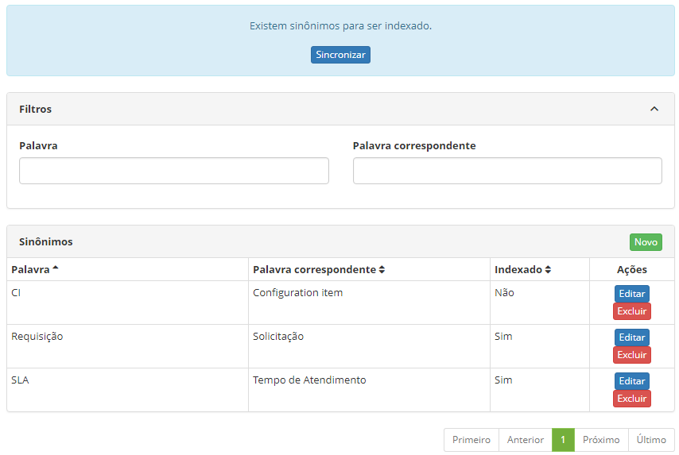
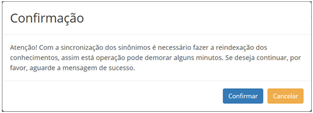
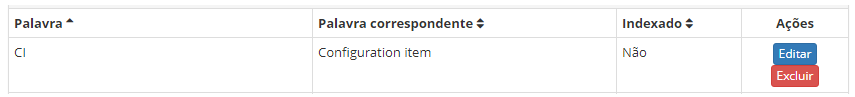
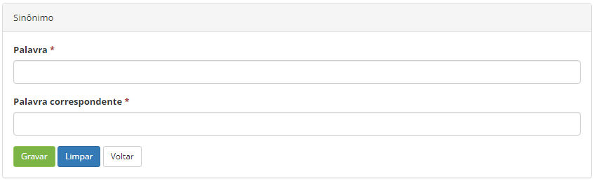

title: Cadastro e pesquisa de sinônimo
Description: Esta funcionalidade tem por objetivo manter o registro de palavras sinônimas para efeitos de pesquisa na base de conhecimento.

# Cadastro e pesquisa de sinônimo

Esta funcionalidade tem por objetivo manter o registro de palavras sinônimas
para efeitos de pesquisa na base de conhecimento.

Como acessar
------------

1.  Acesse a funcionalidade de sinônimo através da navegação no menu
    principal **Processos ITIL >  Gerência de Conhecimento > Sinônimo**.

Pré-condições
------------

1.  Não se aplica.

Filtros
-------

1.  Os seguintes filtros possibilitam ao usuário restringir a participação de
    itens na listagem padrão da funcionalidade, facilitando a localização dos
    itens desejados:

    -   Palavra;

    -   Palavra correspondente.

1.  Na tela de **Sinônimo**, será apresentada a tela de pesquisa conforme
    ilustrada na figura a seguir. Nesta tela, são exibidas as palavras sinônimas
    já registradas e os campos de filtros para realizar a busca de determinados
    registros;

    

    **Figura 1 - Tela de pesquisa de sinônimos**

1.  Para realizar a busca de sinônimos, informe a palavra e/ou palavra
    correspondente. Após isso, será exibido o registro conforme os dados
    informados.

2.  Para alterar os dados do registro de sinônimo, clique no botão *Editar*.
    Feito isso, será direcionado para a tela de cadastro exibindo o conteúdo
    referente ao registro selecionado.

3.  Para indexar um sinônimo, clique no botão *Sincronizar* e será exibido um
    alerta de confirmação:

    

    **Figura 2 - Confirmação de indexação**

-   Clique no botão *Confirmar*.

Listagem de itens
----------------

1.  Os seguintes campos cadastrais estão disponíveis ao usuário para facilitar a
    identificação dos itens desejados na listagem padrão da
    funcionalidade: Palavra, Palavra correspondente e Indexado.

2.  Existem botões de ação disponíveis ao usuário em relação a cada item da
    listagem, são eles: *Editar* e *Excluir*.

    

    **Figura 3 - Tela de itens**

Preenchimento dos campos cadastrais
----------------------------------

1.  Será apresentada a tela de **Sinônimo**;

2.  Clique no botão *Novo*. Feito isso, será apresentada a tela de cadastro de
    palavras sinônimas, conforme ilustrada na figura a seguir:

    

    **Figura 4 - Tela de cadastro de palavras sinônimas**

1.  Preencha os campos conforme orientações abaixo:

    -   **Palavra**: informe a descrição da palavra;

    -   **Palavra correspondente**: informe a descrição da palavra correspondente.

1.  Clique no botão *Gravar* para efetuar o registro, onde a data, hora e
    usuário serão gravados automaticamente para uma futura auditoria;

2.  O botão *Voltar*, retorna para a página de pesquisa de sinônimo.

!!! tip "About"

    <b>Product/Version:</b> CITSmart | 8.00 &nbsp;&nbsp;
    <b>Updated:</b>07/18/2019 – Anna Martins
