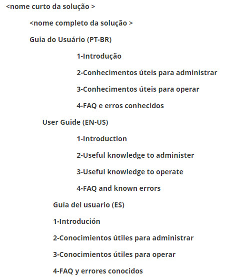

title:  Entendendo como esta solução está documentada na base de conhecimento
Description: Assimilar os conhecimentos básicos sobre o uso e administração das soluções na base de conhecimento
# Entendendo como esta solução está documentada na base de conhecimento

Desde que houve a decisão estratégica de migrar toda a documentação das soluções da CITSmart Corporation para dentro da base do 
conhecimento do CITSmart Enterprise ITSM, surgiu a necessidade de criar um documento esclarecedor sobre como a base de conhecimento
foi estruturada. De posse desta explicação introdutória entendemos que a navegação e as buscas dentro dessa base de conhecimento
passam a ser mais eficientes e eficazes por parte dos colaboradores da empresa, agentes autorizados e usuários finais da solução.

Atualmente identificamos quatro alternativas viáveis para acessar e assimilar os conhecimentos básicos sobre o uso e administração
das soluções na base de conhecimento. Elas são explicadas neste documento.

A estratégia do documento Visão Geral
----------------------------------------

Recomenda-se que todo iniciante nesta solução primeiramente leia o documento chamado “Visão Geral” que fica na pasta “1-Introdução”.
Trata-se de um documento muito proveitoso para os iniciantes porque consegue contextualizar e permitir uma assimilação progressiva 
(top-down) sobre a solução, começando desde os seus objetivos e benefícios, passando pelos principais links que levam a outros 
documentos relevantes e chegando aos manuais de instalação para que o uso da solução possa efetivamente começar.

A partir deste primeiro documento lido, é possível seguir a leitura de outros usando os hyperlinks nele contidos (exemplo: links 
para documentos que explicam cada módulo da solução).

Todas as soluções da CITSmart Corporation têm seu próprio documento “Visão Geral” na base de conhecimento, apenas diferenciados no
título pela sigla ou apelido da solução entre parênteses, exemplo: “Visão Geral (ITSM)”, “Visão Geral (Docs)”, “Visão Geral 
(Builder)”, etc.

Para acessar e ler a Visão Geral desejada basta utilizar a forma descrita na alternativa "A ESTRATÉGIA DO BUSCADOR" (citada 
abaixo neste documento).

A estratégia das pastas
--------------------------

Todas as soluções da CITSmart Corporation têm uma estrutura mínima padronizada de pastas estruturadas para organizar a documentação 
sobre seu uso e administração.

Os nomes dessas pastas são autoexplicativos para facilitar o acesso e a gestão desses conhecimentos no dia-a-dia.

A estrutura padrão mínima é:

**Figura 1 - Estrutura de pastas**

Existem mais pastas além destas acima, porém têm outras finalidades diferentes do uso e administração básicos da solução e são 
visíveis apenas para uso interno da empresa CITSmart Corporation e para seus Agentes Autorizados.

Um exemplo real desta estrutura:

**Figura 2 - Exemplo de uma estrutura de pastas**

Nem todas as soluções são internacionalizadas, portanto elas não apresentam as pastas para documentos traduzidos, somente a 
versão nacional.

Ao clicar numa pasta é montada a lista de todos os conhecimentos desta pasta, logo em seguida, para cada sub-pasta existente 
nessa pasta, são acrescentados na lista resultante os documentos da sub-pasta, isso repetidamente e recursivamente.

**Figura 3 - Lista de documentos de uma pasta**

!!! info "IMPORTANTE"

    Apenas os colaboradores da CITSmart Corporation visualizam as pastas e documentação das soluções em todas as línguas 
    disponíveis, os demais perfis (Agentes Autorizados, Clientes e Prospectos) são direcionados para apenas uma língua 
    específica.
    
A estratégia do Smart Button
-----------------------------

A maioria das telas do CITSmartEnterprise ITSM possui o recurso “Smart Button”. Trata-se de uma aba móvel que mostra links para
conhecimentos escolhidos a dedo para explicar a funcionalidade atualmente aberta pelo usuário final.

**Figura 4 - Aba do Smart Button**

Para que este recurso efetivamente funcione existe um pré-requisito que fica a cargo da equipe que administra a base de 
conhecimento de sua organização, qual seja:

    1. Cada documento que contribuir para a explicação de uma tela/funcionalidade deve ter o campo “Tags” preenchido com uma 
    palavra-chave na opção **Processos ITIL > Gerência de Conhecimento > Gerenciamento de Conhecimento**;
    2. Essa mesma palavra-chave deve ser usada no preenchimento do campo “Tags” do cadastro de cada tela/funcionalidade (opção
    **Cadastros Gerais > Menu** do ITSM) que deve ser vinculada ao conhecimento que a explica.
    
O efeito final desta configuração de Tags é bastante didático e produtivo, porque reduz bastante o desgaste do usuário final que 
sem isso tem que se deslocar para o Portal do Conhecimento para ali realizar navegações e pesquisas adicionais (overhead) para 
somente assim conseguir entender a tela atual.

A estratégia do buscador
--------------------------

O CITSmart Enterprise ITSM, assim como as melhores ferramentas de Gestão de Conhecimento do mercado, disponibiliza um "buscador
de base de conhecimento" para o usuário final, em nosso caso usando a tecnologia SolR, um dos recursos tecnológicos mais 
avançados do mercado.

Na parte central da tela do Portal do Conhecimento localiza-se um campo tipo texto preenchido com a frase “O que deseja saber?”. 
Ao digitar uma palavra neste campo e teclar ENTER, a solução inicia um processo de busca em todos os registros da base de 
conhecimento, incluindo dentro dos arquivos anexados em cada desses registros.

**Figura 5 - Campo de pesquisa do portal do conhecimento**

Esta busca pela palavra desejada leva em consideração algumas questões de segurança de acesso previamente configuradas pelos 
administradores, basicamente ligadas ao cruzamento do perfil de acesso do usuário logado com o conjunto das pastas liberadas a 
esse perfil para acesso de leitura e/ou gravação. Esta estrategia geral de níveis de acesso às publicações na base (para todas as
soluções) está disposta da seguinte forma:

- **Sem restrições (Público)**: nível de acesso amplo no qual as pastas e os documentos/conhecimentos sobre uso e administração 
básicos podem ser acessados sem restrições (basta fazer cadastro simples);
- **Algumas restrições (Agentes Autorizados)**: nível no qual as pastas e os documentos/conhecimentos podem ser acessados somente 
pela empresa CitSmart Corporation e por seus agentes de revenda oficiais;
- **Restrição máxima (interna/restrita/privada/sigilosa)**: nível no qual as pastas e os documentos/conhecimentos podem ser 
acessados somente pela empresa CitSmart Corporation.

Também se leva em consideração como critério de seleção na busca o estado atual de cada conhecimento presente dentro dessas 
pastas, pois conhecimentos registrados como sigilosos, não-publicados, rascunhos, arquivados e expirados (pela data de 
vencimento) não deverão constar da lista resultante.

Na seção "Veja também" é possível encontrar dicas e orientações de pesquisa.

A estratégia do "tipo de documento"
------------------------------------

Os conhecimentos são classificados pelo seu conteúdo e dispostos em sua pasta adequada com a finalidade de otimizar a busca dos
mesmo pelo usuário. São eles:

| **Aplicado em **                             | **Título do “Tipo de Documento”**    | **Significado/Relevância**                                                                                                                                                                                                                                                                              |
|----------------------------------------------|--------------------------------------|---------------------------------------------------------------------------------------------------------------------------------------------------------------------------------------------------------------------------------------------------------------------------------------------------------|
| **Geral**                                    | Documento                            | É um conhecimento criado com tipo genérico, cadastrado sem qualquer preocupação ou interesse na sua categorização, recomenda-se não usar este quando existir o tipo correspondente.                                                                                                                     |
|                                              | FAQ                                  | São os conhecimentos do tipo pergunta-resposta, mais comuns em um ambiente de suporte técnico/operacional.                                                                                                                                                                                              |
| **Guia do Usuário(todos os produtos)**       | Apresentação de um produto           | Tipo de documento que explica de maneira geral o propósito, os benefícios e as características de um produto de software. Deve ser a primeira leitura para quem quer conhecer o produto. Todos os produtos da CITSmart devem ter pelo menos um com o padrão do nome: “Visão Geral (<sigla do produto>)” |
|                                              | Dicionário de Dados                  | Documento gerado pelo Enterprise Architect contendo a lista de todas as tabelas e colunas do produto.                                                                                                                                                                                                   |
|                                              | Erro Conhecido                       | Relato de problema na solução com a correspondente orientação do suporte para trata-lo ou contorna-lo.                                                                                                                                                                                                  |
|                                              | Glossário                            | Lista em ordem alfabética de termos e expressões mais utilizadas no produto com a devida explicação.                                                                                                                                                                                                    |
|                                              | Introdução a um Módulo               | Qualquer tipo de documento usado para introduzir conceitos, características e módulos de um produto. Deve ser a leitura a ser feita logo após a Visão Geral para quem quer conhecer o produto. Todos os produtos da CITSmart devem ter pelo menos um documento para cada módulo.                        |
|                                              | Manual de Administração              | Procedimentos mais técnicos voltados para a administração da solução (instalação, atualização, configuração de infraestrutura, banco de dados, servidor de aplicações e sistema operacional).                                                                                                           |
|                                              | Modelo UML                           | Diagramas usados para documentar a especificação de um software.                                                                                                                                                                                                                                        |
|                                              | Orientação de uso                    | Explicação sobre o preenchimento de uma funcionalidade de cadastro.                                                                                                                                                                                                                                     |
|                                              | Procedimento Operacional Padronizado | POP: documento de processo que explica os passos mínimos necessários para execução com qualidade de cada atividade do fluxo.                                                                                                                                                                            |
|                                              | Programação                          | Qualquer tipo de conhecimento que as equipes de desenvolvedores entendem relevantes para compartilhamento (programação e arquitetura).                                                                                                                                                                  |
|                                              | Regra de Negócio                     | Assertivas que determinam o comportamento das funcionalidades de um produto. São condições que nada têm relação com tecnologia, e sim com o funcionamento do negócio.                                                                                                                                   |
|                                              | Relatório do Smart Report            | Especificação de relatórios dinâmicos e reprogramáveis que existem no produto sem qualquer customização adicional.                                                                                                                                                                                      |
|                                              | Relatório Nativo do Produto          | Especificação de relatórios que existem no produto sem qualquer customização.                                                                                                                                                                                                                           |
|                                              | Visão e Entrega de Versão            | Relação dos entregáveis pretendidos ou presentes numa versão, bem como orientações específicas e os links dos arquivos de deploy e scripts.                                                                                                                                                             |
|                                              | Web Services                         | Application Programming Interface: Interfaces de serviços publicados ou consumidos por produtos de software.                                                                                                                                                                                            |
| **Guia do Usuário(ITSM)**                    | Campos-chave                         | Explicações sobre os campos especiais usados para configurar e-mails e requisições no ITSM.                                                                                                                                                                                                             |
|**Gestão das Equipes**                        | Correspondências Oficiais            | Registro de envio ou recebimento de cartas e encomendas pelo correio.                                                                                                                                                                                                                                   |
|                                              | Documento                            | Tipo genérico para um conhecimento que não tem a classificação adequada.                                                                                                                                                                                                                                |
|                                              | Evidência de Teste                   | Registro de trabalho de testes realizado pela equipe Qualidade.                                                                                                                                                                                                                                         |
|                                              | GCS                                  | Registro de trabalho de gestão da configuração de software realizado pela equipe Qualidade.                                                                                                                                                                                                             |
|                                              | White papers                         | Publicações da empresa CITSmart para divulgar características de seus serviços e produtos.                                                                                                                                                                                                              |
|                                              | Material de Passagem de Conhecimento | Qualquer tipo de conhecimento (Video, Slides, Texto, etc.) usado para passagem de conhecimento entre as equipes CITSmart e Agentes Autorizados.                                                                                                                                                         |
|                                              | Material para Pré-Venda              | Qualquer tipo de conhecimento (Video, Slides, Texto, etc.) usado para apoiar apresentações de interesse comercial dos produtos da CITSmart.                                                                                                                                                             |
|                                              | Minuta de Contratos                  | Modelo de documentos para serem usados como contratos de efeito legal.                                                                                                                                                                                                                                  |
|                                              | OKR                                  | Documentos relacionados com as iniciativas criadas e executadas com a técnica OKR.                                                                                                                                                                                                                      |
|**Metodologias, Consultorias e serviços afins.**| HOW-TO                               | Diretório com os links para visualizar processos gerados pelo BizAgi no formato html.                                                                                                                                                                                                                   |
|                                              | Material para Certificação           | Qualquer tipo de conhecimento (Video, Slides, Texto, etc.) usado para as certificações em produtos da CITSmart.                                                                                                                                                                                         |
|                                              | Material para Implantação            | Qualquer tipo de conhecimento (Video, Slides, Texto, etc.) usado para as implantar os processos presentes em cada produto.                                                                                                                                                                              |
|                                              | Material para Treinamento            | Qualquer tipo de conhecimento (Video, Slides, Texto, etc.) usado para os treinamentos oficiais de produtos da CITSmart.                                                                                                                                                                                 |
|                                              | Material sobre Metodologia           | Qualquer tipo de conhecimento (Video, Slides, Texto, etc.) usado para as explicar metodologias aplicáveis em produtos da CITSmart.                                                                                                                                                                      |
| **Funcionamento dos Processos ITIL**         | Erro conhecido                       | São conhecimentos com tipo atribuído automaticamente pelo módulo de Gerenciamento de Problema                                                                                                                                                                                                           |
|                                              | Evidência de Teste                   | São conhecimentos com tipo atribuído automaticamente pelo módulo de Gerenciamento de Continuidade.                                                                                                                                                                                                      |
|                                              | Medida de recuperação                | Conhecimento utilizado no Gerenciamento de Continuidade dentro do qual deverá existir todas as orientações de recuperação necessárias para um momento de desastre.                                                                                                                                      |
|                                              | Plano de resposta a emergências      | Conhecimento utilizado no Gerenciamento de Continuidade dentro do qual deverá existir todas as orientações necessárias para um momento de emergência.                                                                                                                                                   |
|                                              | Plano de avaliação de danos          | Conhecimento utilizado no Gerenciamento de Continuidade que deverá conter informações sobre possíveis danos causados no momento de desastre.                                                                                                                                                            |
|                                              | Plano de registros vitais            | Conhecimento utilizado no Gerenciamento de Continuidade que deverá conter informações sobre funções vitais para continuidade do negócio.                                                                                                                                                                |
|                                              | Plano de comunicação                 | É o conhecimento que informa quais os caminhos, meios e critérios de comunicação, bem como as pessoas que devem ser comunicadas (Matriz RACI).                                                                                                                                                          |
|                                              | Plano de disponibilidade             | Conhecimento utilizado no Gerenciamento de Disponibilidade que deverá conter os critérios do que é ou não entendido como “disponível”. Ex: qual o percentual de disponibilidade de um servidor.                                                                                                         |

**Tabela 1 - Tipo de documentos**

Veja também
---------------

- [Dicas sobre como realizar pesquisas no Portal do Conhecimento e Guia do Usuário](/pt-br/citsmart-platform-7/processes/knowledge/tips-search-knowledge.html)

!!! tip "About"

    <b>Product/Version:</b> CITSmart | 7.00 &nbsp;&nbsp;
    <b>Updated:</b>07/26/2019 - Larissa Lourenço
