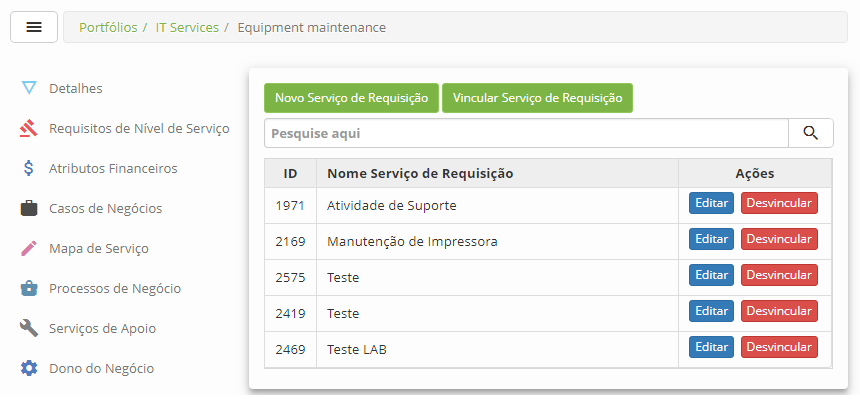

title: Cadastro da atividade de serviço
Description: Esta funcionalidade tem por objetivo registrar as atividades de um
serviço (requisição e/ou incidente).

# Cadastro da atividade de serviço

Esta funcionalidade tem por objetivo registrar as atividades de um serviço
(requisição e/ou incidente).

Pré-condições
------------

1.  Ter o portfólio com os serviços cadastrados (ver conhecimentos [Cadastro de
    portfólio de
    serviços](), [Cadastro
    de
    serviços]();

2.  Ter o grupo cadastrado (ver conhecimento [Cadastro e pesquisa de
    grupo]();

3.  Ter os itens de configuração cadastrados (ver conhecimento [Gerenciamento de
    itens de
    configuração]();

4.  Ter o calendário definido (ver conhecimento [Cadastro e pesquisa de
    calendário]();

5.  Ter o contrato cadastrado (ver conhecimento [Cadastro e pesquisa de
    contrato]().

Registrando atividades de requisição do serviço
---------------------------------------------

### Como acessar

1.  Acesse o menu principal **Processos ITIL > Gerência de Portfólio e
    Catálogo > Gerenciamento de Portfólio e Catálogo**. Após isso, será
    apresentada a tela de Gerenciamento de Portfólio de Serviços;

2.  Acesse o Portfólio de Serviços que deseja, clicando no botão *Avançar* do
    mesmo;

3.  Na guia "Catalogo de Serviço", eleja o serviço almejado e clique
    em *Avançar*;

4.  Feito isso, clique na aba **Requisições.**

### Filtros

1.  O seguinte filtro possibilita ao usuário restringir a participação de itens
    na listagem padrão da funcionalidade, facilitando a localização dos itens
    desejados:

-   Nome do Serviço.

### Listagem de itens

1.  Os seguintes campos cadastrais estão disponíveis ao usuário para facilitar a
    identificação dos itens desejados na listagem padrão da
    funcionalidade: ID e Nome Serviço de Requisição.

2.  Existem botões de ação disponíveis ao usuário em relação a cada item da
    listagem, são eles: *Editar* e *Desvincular*.

    

    **Figura 1 - Tela de atividade de requisição do serviço**

### Preenchimento de campos cadastrais

1.  Clique no botão *Novo Serviço de Requisição*. Feito isso, será apresentada a
    tela de Cadastro da Atividade de Requisição do Serviço, conforme ilustrada
    na figura abaixo:
    
    

    **Figura 2 - Tela de cadastro de atividade de requisição**

1.  Preencha os campos conforme orientações abaixo:

    -   **Nome da Atividade**: defina o nome da atividade de requisição;

    -   **Sigla/Abreviação**: informe a sigla ou abreviação que representará a
    atividade de requisição;

    -   **Situação da Atividade**: selecione a situação da atividade de requisição;

    -   **Tipo de Demanda**: não é necessário o preenchimento deste campo, pois o
    mesmo já vem preenchido automaticamente com o tipo "Requisição";

    -   **Categoria**: informe a categoria da atividade de requisição;

    -   **Data de Implantação**: informe a data da implantação da atividade de
    requisição;

    -   **Template de Visualização**: vinculação da atividade a uma pesquisa de
    satisfação personalizada através de um formulário Neuro.

    -   **Template acompanhamento**: selecione, caso exista, o template de
    acompanhamento da atividade de requisição;

    -   **Template criação**: selecione, caso exista, o template da atividade de
    requisição;

    -   **Detalhamento**: descreva os detalhes sobre como a atividade de requisição
    deverá ser executada;

    -   **Objetivo**: descreva os objetivos da atividade de requisição;

    -   **Tipo de Evento**: selecione quando ocorrerá a atividade de requisição;

    -   **SCRIPT de Orientação (Base de Conhecimento)**: informe, caso exista, o
    script de apoio armazenado na Base de Conhecimento para orientação na
    execução da atividade de requisição;

    -   **Tipo de Atividade**: selecione o tipo da atividade de requisição;

    -   **Importância da Atividade ao Negócio**: selecione a importância da
    atividade de requisição ao negócio;

    -   **Lugar de Execução das Atividades**: selecione o lugar de execução da
    atividade de requisição;

1.  Caso queira disponibilizar a atividade de requisição no Smart Portal e/ou
    Chat para solicitação, clique na aba **Apresentação**;

    

    **Figura 3 - Disponibilização da atividade de requisição no portal e/ou chat**

    -   **Disponível no portal**: selecione a opção "Sim" para disponibilizar a
    atividade de requisição do serviço no portal;

    -   **Disponível via chat**: selecione a opção "Sim" para disponibilizar a
    atividade de requisição do serviço no chat;

    -   **Mostrar campo para selecionar o impacto/urgência**: defina se os campos
    "impacto" e "urgência" serão exibidos no portal, na tela de registro de
    solicitação da atividade;

    -   **Mostrar campo para selecionar um item de configuração**: defina se será
    exibido a funcionalidade de item de configuração no portal, na tela de
    registro de solicitação da atividade, que permite a seleção do item de
    configuração;

    -   **Mostrar campo para descrição**: defina se será exibido o campo de
    "descrição" no portal, na tela de registro de solicitação da atividade, que
    permite descrever com mais detalhes a solicitação;

    -   **Mostrar campo para adicionar um anexo**: defina se o campo de adição de
    anexo será apresentado no portal, na tela de registro de solicitação da
    atividade, que permite adicionar arquivos na solicitação;

    -   **Exibir prioridade**: defina se ao abrir uma solicitação de serviço pelo
    Portal de Serviço será fornecida a informação de Prioridade do chamado;

    -   **Exibir data limite**: defina se ao abrir uma solicitação de serviço pelo
    Portal de Serviço será fornecida a informação de Data e Hora Limite do
    atendimento do chamado;

    !!! note "NOTA"

        Para que ocorra a exibição da data limite é necessário o cadastro de uma SLA
        para a atividade (ver conhecimento **[Configuração dos atributos do contrato do
        serviço]()**,na seção Vinculando atividades de requisição ao contrato). Os parâmetros "Exibir
        prioridade" e "Exibir data limite" possuem seu valor default igual "Sim".

    -   **Nome**: informe o nome da atividade de requisição para exibição no portal
    e/ou chat;

    -   **Descrição**: informe uma breve descrição da atividade de requisição, a
    qual será exibida no portal;

    -   Clique no botão *Selecione uma imagem* e será apresentada uma tela para
    selecionar uma imagem que representará a atividade de requisição:

    
    
    **Figura 4 - Tela de seleção de imagem**

1.  Vincule o grupo executor, o qual terá acesso a atividade de requisição no
    portal e/ou chat:

    !!! note "NOTA"

        A configuração da permissão de acesso do grupo para visualização da atividade
        de requisição no portal, somente será aplicada caso o parâmetro “Habilita
        permissão de acesso para grupos de usuário no portal” esteja habilitado.

    -   Clique na aba **Permissão de Acesso**, será apresentada a tela para vínculo
    dos grupos, conforme ilustrada na figura abaixo:

    

    **Figura 5 - Permissão de acesso por grupo**

    -   Clique no botão *Vincular Grupos*. Será exibida a tela de pesquisa de grupo.
    Realize a pesquisa, selecione os grupos e clique no botão *Enviar* para
    efetuar a operação;

    !!! info "IMPORTANTE"

        Na tela de pesquisa de grupo, serão listados somente os grupos que foram
        vinculados no registro de portfólio de serviço.

    -   Para desvincular o grupo, basta clicar no botão *Desvincular* do mesmo.

1.  Após informar os dados necessários da atividade de requisição, clique no
    botão *Gravar* para efetuar o registro. Feito isso, a atividade de
    requisição será gravada e vinculada ao serviço;

2.  Para alterar os dados da atividade de requisição, clique no
    botão *Editar* da mesma, modifique os dados que desejar e clique
    em *Gravar* para efetuar a alteração, onde a data, hora e usuário serão
    gravados automaticamente para uma futura auditoria;

3.  Para excluir a atividade de requisição, clique no botão *Editar* da mesma e
    logo em seguida clique no botão *Excluir Dados;*

4.  Para desvincular a atividade de requisição do serviço, basta clicar no
    botão *Desvincular*** **da mesma;

5.  Para vincular novamente uma atividade de requisição ao serviço, clique no
    botão *Vincular Serviço de Requisição*. Feito isso, será exibida a tela para
    pesquisa das atividades de requisição que foram desvinculadas do serviço.
    Realize a pesquisa e selecione a atividade de requisição para realizar o
    vínculo com sucesso;

6.  Caso queira disponibilizar a atividade de requisição nas 3 línguas
    disponíveis (Português/Inglês/Espanhol), clique na aba Multi-idiomas
    conforme figura abaixo:

    !!! info "IMPORTANTE"

        O campo Multi-idiomas somente aparecerá no cadastro/edição de atividade de
        requisição se o mesmo estiver com opção SIM na aba Principal do portfólio
        escolhido.

    

    **Figura 6 - Tela de internacionalização de atividade de requisição**

!!! note "NOTA"

     Caso uma das 3 línguas nessa aba ficar em branco, as informações serão
     preenchidas com as que estiver contidas na aba "Apresentação".

Registrando atividades de incidente do serviço
--------------------------------------------

### Como acessar

1.  Acesse o menu principal Processos ITIL \> Gerência de Portfólio e
    Catálogo \> Gerenciamento de Portfólio e Catálogo. Após isso, será
    apresentada a tela de Gerenciamento de Portfólio de Serviços;

2.  Acesse o Portfólio de Serviços que deseja, clicando no botão *Avançar* do
    mesmo;

3.  Na guia "Catalogo de Serviço", eleja o serviço almejado e clique
    em *Avançar* ;

4.  Feito isso, clique na aba **Incidentes**.

### Filtros

1.  O seguinte filtro possibilita ao usuário restringir a participação de itens
    na listagem padrão da funcionalidade, facilitando a localização dos itens
    desejados:

-   Nome Incidente.

### Listagem de itens

1.  Os seguintes campos cadastrais estão disponíveis ao usuário para facilitar a
    identificação dos itens desejados na listagem padrão da
    funcionalidade: ID e Nome Incidente.

2.  Existem botões de ação disponíveis ao usuário em relação a cada item da
    listagem, são eles: *Editar* e *Desvincular*.

    

    **Figura 7 - Tela de atividade de incidente do serviço**

### Preenchimento dos campos cadastrais

1.  Clique no botão *Novo Incidente*. Feito isso, será apresentada a tela
    de **Cadastro de Atividade de Incidente**, conforme ilustrada na figura
    abaixo:

    

    **Figura 8 - Tela de cadastro de atividade de incidente**

1.  Preencha os campos conforme orientações abaixo:

    -   **Nome do Atividade**: defina o nome da atividade de incidente;

    -   **Sigla/Abreviação**: informe a sigla ou abreviação que representará a
    atividade de incidente;

    -   **Situação da Atividade**: selecione a situação da atividade de incidente;

    -   **Data de Implantação**: informe a data da implantação da atividade de
    incidente;

    -   **Tipo de Demanda**: não é necessário o preenchimento deste campo, pois o
    mesmo já vem preenchido automaticamente com o tipo "Incidente";

    -   **Categoria**: informe a categoria da atividade de incidente;

    -   **Template acompanhamento**: selecione, caso exista, o template de
    acompanhamento da atividade de incidente;

    -   **Template criação**: selecione, caso exista, o template da atividade de
    incidente;

    -   **Detalhamento**: descreva os detalhes sobre como a atividade de incidente
    deverá ser executada;

    -   **Objetivo**: descreva o objetivo da atividade de incidente;

    -   **Tipo de Evento**: selecione quando ocorrerá a atividade de incidente;

    -   **SCRIPT de Orientação (Base de Conhecimento)**: informe, caso exista, o
    script de apoio armazenado na Base de Conhecimento para orientação na
    execução da atividade de incidente;

    -   **Crítico**: informe se a atividade de incidente é para resolução de
    “incidente crítico";

    -   **Tipo de Atividade**: selecione o tipo da atividade de incidente;

    -   **Importância da Atividade ao Negócio**: selecione a importância da
    atividade de incidente ao negócio;

    -   **Lugar de Execução das Atividades**: selecione o local de execução da
    atividade de incidente.

1.  Caso queira disponibilizar a atividade de incidente no Portal Smart e/ou
    Chat para solicitação, clique na aba **Apresentação**;

    

    **Figura 9 - Disponibilização da atividade de incidente no portal e/ou chat**

    -   **Disponível no portal**: selecione a opção "Sim" para disponibilizar a
    atividade de incidente no portal;

    -   **Disponível via chat**: selecione a opção "Sim" para disponibilizar a
    atividade de incidente no chat;

    -   **Mostrar campo para selecionar o impacto/urgência**: defina se os campos
    "impacto" e "urgência" serão exibidos no portal, na tela de registro de
    solicitação da atividade de incidente;

    -   **Mostrar campo para selecionar um item de configuração**: defina se será
    exibido a funcionalidade de item de configuração no portal, na tela de
    registro de solicitação da atividade de incidente, que permite a seleção do
    item de configuração;

    -   **Mostrar campo para descrição**: defina se será exibido o campo de
    "descrição" no portal, na tela de registro de solicitação da atividade de
    incidente, que permite descrever com mais detalhes a solicitação;

    -   **Mostrar campo para adicionar um anexo**: defina se o campo de adição de
    anexo será apresentado no portal, na tela de registro de solicitação da
    atividade de incidente, que permite adicionar arquivos na solicitação;

    -   **Exibir prioridade**: defina se ao abrir uma solicitação de serviço de pelo
    Portal de Serviço será fornecida a informação de Prioridade do chamado;

    -   **Exibir data limite**: defina se ao abrir uma solicitação de serviço pelo
    Portal de Serviço será fornecida a informação de Data e Hora Limite do
    atendimento do chamado;

    **!!! note "NOTA"**

          Para que ocorra a exibição da data limite é necessário o cadastro de uma
          SLA para a atividade (ver conhecimento [Configuração dos atributos do
          contrato do serviço](), na seção Vinculando atividades de requisição ao contrato). Os parâmetros
          "Exibir prioridade" e "Exibir data limite" possuem seu valor default igual
          "Sim".

    -   **Nome**: informe o nome da atividade de incidente para exibição no portal
    e/ou chat;

    -   **Descrição**: informe uma breve descrição da atividade de incidente, a qual
    será exibida no portal;

    -   Clique no botão *Selecione uma imagem* e será apresentada uma tela para
    selecionar uma imagem que representará a atividade de incidente:

    

    **Figura 10- Tela de seleção de imagem**

1.  Vincule o grupo executor, o qual terá acesso a atividade de incidente no
    portal e/ou chat:

    !!! note "NOTA"

        A configuração da permissão de acesso do grupo para visualização da
        atividade de serviço no portal, somente será aplicada caso o parâmetro
        “Habilita permissão de acesso para grupos de usuário no portal” esteja
        habilitado.

    -   Clique na aba **Permissão de Acesso**, será apresentada a tela para vínculo
    dos grupos, conforme ilustrada na figura abaixo:

    

    **Figura 11 - Permissão de acesso por grupo**

    -   Clique no botão *Vincular Grupos*. Será exibida a tela de pesquisa de grupo.
    Realize a pesquisa, selecione os grupos e clique no botão *Enviar* para
    efetuar a operação;

    !!! info "IMPORTANTE"

        Na tela de pesquisa de grupo, serão listados somente os grupos que foram
        vinculados no registro de portfólio de serviço.

1.  Após informar os dados necessários da atividade de incidente, clique no
    botão *Gravar* para efetuar o registro. Feito isso, a atividade de incidente
    será gravada e vinculada ao serviço;

2.  Para alterar os dados da atividade de incidente, clique no botão *Editar* da
    mesma, modifique os dados que desejar e clique em *Gravar* para efetuar a
    alteração, onde a data, hora e usuário serão gravados automaticamente para
    uma futura auditoria;

3.  Para excluir a atividade de incidente, clique no botão *Editar* da mesma e
    logo em seguida clique no botão *Excluir;*

4.  Para desvincular a atividade de incidente, basta clicar no
    botão *Desvincular*** **da mesma;

5.  Para vincular novamente uma atividade de incidente ao serviço, clique no
    botão *Vincular Incidente*. Feito isso, será exibida a tela para pesquisa
    das atividades de incidente que foram desvinculadas do serviço. Realize a
    pesquisa e selecione a atividade de incidente para realizar o vínculo com
    sucesso.

!!! tip "About"

    <b>Product/Version:</b> CITSmart | 8.00 &nbsp;&nbsp;
    <b>Updated:</b>07/16/2019 – Anna Martins
